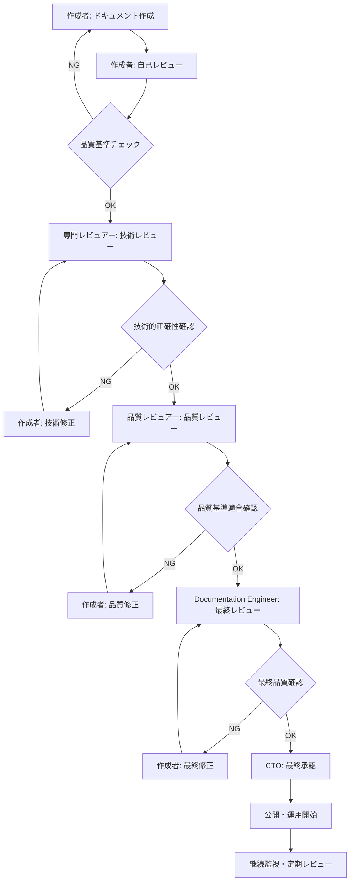
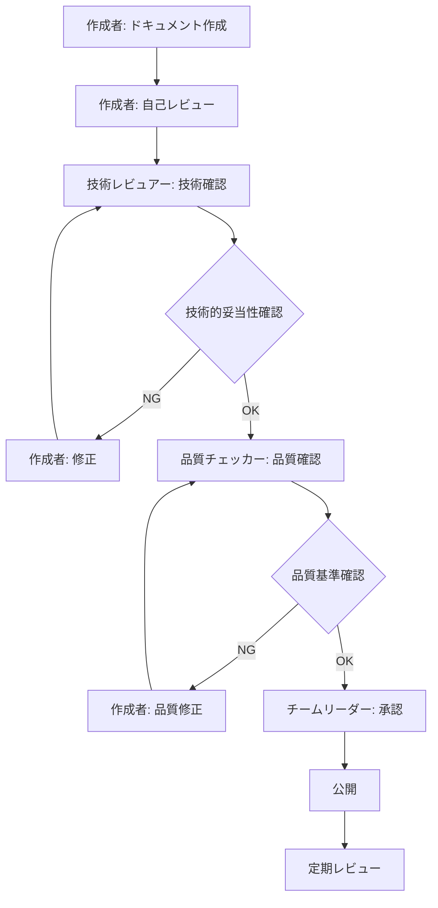
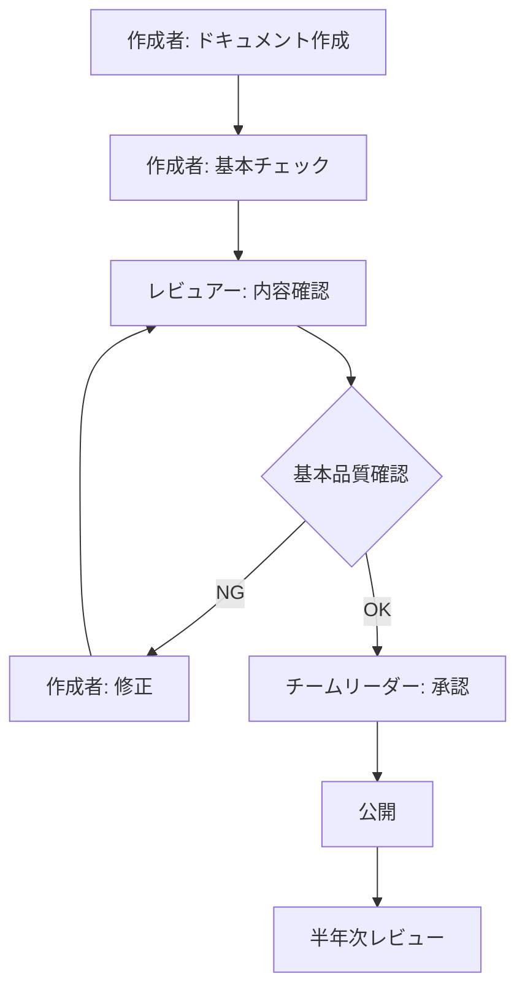

# ドキュメントレビュープロセス

**品質レベル**: ⭐⭐⭐⭐⭐ エンタープライズ級  
**対象者**: 全レビュアー・作成者  
**適用範囲**: 全ドキュメント  
**最終更新**: 2025-07-22  
**承認者**: CTO・Documentation Architecture Engineer  

---

## 📋 レビュープロセス概要

Microsoft 365管理ツールの全ドキュメントに対する標準的なレビュープロセス。品質レベル別に最適化されたレビューフローにより、効率的かつ確実な品質保証を実現する。

---

## 🔄 レビューフロー体系

### 🏆 エンタープライズ級（⭐⭐⭐⭐⭐）レビューフロー



#### レビューステージ詳細

**Stage 1: 自己レビュー**
- **実施者**: 作成者
- **所要時間**: 30分-1時間
- **チェック項目**: [自己レビューチェックリスト](#自己レビューチェックリスト)

**Stage 2: 専門技術レビュー**
- **実施者**: 技術専門家（PowerShell/Python/Microsoft 365）
- **所要時間**: 1-2時間
- **チェック項目**: [技術レビューチェックリスト](#技術レビューチェックリスト)

**Stage 3: 品質レビュー**
- **実施者**: Documentation Quality Reviewer
- **所要時間**: 1-1.5時間
- **チェック項目**: [品質レビューチェックリスト](#品質レビューチェックリスト)

**Stage 4: 最終レビュー**
- **実施者**: Documentation Architecture Engineer
- **所要時間**: 30分-1時間
- **チェック項目**: [最終レビューチェックリスト](#最終レビューチェックリスト)

**Stage 5: 最終承認**
- **実施者**: CTO・部門責任者
- **所要時間**: 15-30分
- **チェック項目**: [承認チェックリスト](#承認チェックリスト)

---

### 🥇 プロフェッショナル級（⭐⭐⭐⭐）レビューフロー



**レビュー期間**: 3-5営業日

---

### 🥈 実用級（⭐⭐⭐）レビューフロー



**レビュー期間**: 1-3営業日

---

## 📋 レビューチェックリスト

### 自己レビューチェックリスト

#### 内容チェック
- [ ] **目的明確**: ドキュメントの目的と対象者が明確に記載されている
- [ ] **構成論理**: 情報の流れが論理的で理解しやすい
- [ ] **完全性**: 必要な情報が漏れなく記載されている
- [ ] **正確性**: 記載内容に明らかな誤りがない
- [ ] **実用性**: 実際の業務で活用可能な内容である

#### 技術チェック
- [ ] **手順確認**: すべての手順を実際に実行して動作確認済み
- [ ] **コード検証**: サンプルコードが正常に動作することを確認
- [ ] **前提条件**: 必要な前提条件がすべて明記されている
- [ ] **エラー処理**: 想定されるエラーと対処法が記載されている

#### 表記チェック
- [ ] **文体統一**: 文書全体で文体が統一されている
- [ ] **用語統一**: 専門用語が一貫して使用されている
- [ ] **表記規則**: 会社の表記規則に準拠している
- [ ] **誤字脱字**: 誤字・脱字がない

#### 構造チェック
- [ ] **見出し階層**: 見出しの階層が適切である
- [ ] **リンク確認**: すべての内部リンクが正しく動作する
- [ ] **図表配置**: 図表が効果的に配置されている
- [ ] **メタ情報**: ヘッダー・フッター情報が完備されている

---

### 技術レビューチェックリスト

#### PowerShell技術レビュー
- [ ] **構文正確性**: PowerShellコードの構文が正しい
- [ ] **実行可能性**: コードが実際の環境で正常実行される
- [ ] **エラーハンドリング**: 適切なエラーハンドリングが実装されている
- [ ] **セキュリティ**: セキュリティ上の問題がない
- [ ] **パフォーマンス**: パフォーマンス上の問題がない
- [ ] **ベストプラクティス**: PowerShellのベストプラクティスに準拠

#### Microsoft 365技術レビュー
- [ ] **API正確性**: Microsoft Graph API の使用方法が正しい
- [ ] **権限要件**: 必要な権限が正確に記載されている
- [ ] **認証方式**: 認証方式の説明が正確である
- [ ] **制限事項**: APIの制限事項が適切に記載されている
- [ ] **更新対応**: Microsoft 365の最新仕様に対応している

#### Python技術レビュー
- [ ] **構文正確性**: Pythonコードの構文が正しい
- [ ] **依存関係**: 必要なライブラリが正確に記載されている
- [ ] **実行環境**: Python環境の要件が明確
- [ ] **例外処理**: 適切な例外処理が実装されている
- [ ] **PEP準拠**: Python PEP規約に準拠している

---

### 品質レビューチェックリスト

#### 文書品質
- [ ] **読みやすさ**: 文章が読みやすく理解しやすい
- [ ] **一貫性**: 文書全体で表記・構成が一貫している
- [ ] **完全性**: 対象読者に必要な情報が網羅されている
- [ ] **正確性**: 技術的内容に誤りがない
- [ ] **最新性**: 情報が最新に保たれている

#### 利用者体験
- [ ] **ナビゲーション**: 目的の情報にアクセスしやすい
- [ ] **検索性**: キーワードでの検索に対応している
- [ ] **段階的学習**: 初心者から上級者まで段階的に対応
- [ ] **実用例**: 具体的で実用的な例が含まれている
- [ ] **トラブル対応**: よくある問題の解決方法を記載

#### 標準準拠
- [ ] **テンプレート準拠**: 指定されたテンプレートに準拠
- [ ] **品質基準**: 該当品質レベルの基準を満たしている
- [ ] **表記統一**: 表記ガイドラインに準拠
- [ ] **メタデータ**: 必要なメタデータが完備されている

---

### 最終レビューチェックリスト

#### アーキテクチャ適合性
- [ ] **体系整合**: 全体ドキュメント体系との整合性
- [ ] **相互参照**: 関連文書との適切な相互参照
- [ ] **重複回避**: 他文書との不必要な重複がない
- [ ] **補完性**: 既存文書を適切に補完している

#### 戦略的適合性
- [ ] **ビジョン整合**: 組織のドキュメント戦略に適合
- [ ] **利用者ニーズ**: 利用者のニーズに適切に対応
- [ ] **投資効果**: 作成・維持コストに見合う価値
- [ ] **将来対応**: 将来の変更・拡張に対応可能

---

### 承認チェックリスト

#### 経営判断項目
- [ ] **戦略適合**: 組織戦略・IT戦略に適合
- [ ] **リスク評価**: セキュリティ・コンプライアンスリスクなし
- [ ] **投資妥当性**: 投資対効果が妥当
- [ ] **リソース確保**: 維持・更新に必要なリソース確保可能

#### 最終品質確認
- [ ] **品質基準達成**: 設定された品質レベルを達成
- [ ] **利用者価値**: 利用者に明確な価値を提供
- [ ] **保守計画**: 継続的な保守・更新計画が存在
- [ ] **測定可能性**: 成果測定・評価が可能

---

## ⏰ レビュー期間・スケジュール

### 品質レベル別標準期間

| 品質レベル | 作成期間 | レビュー期間 | 総期間 | 緊急時短縮 |
|-----------|----------|-------------|--------|-----------|
| **⭐⭐⭐⭐⭐** | 5-10営業日 | 7-10営業日 | 12-20営業日 | 5営業日 |
| **⭐⭐⭐⭐** | 3-7営業日 | 3-5営業日 | 6-12営業日 | 3営業日 |
| **⭐⭐⭐** | 1-3営業日 | 1-3営業日 | 2-6営業日 | 1営業日 |

### レビューステージ別所要時間

#### エンタープライズ級（⭐⭐⭐⭐⭐）
| ステージ | 所要時間 | 並行可能 |
|---------|----------|----------|
| **自己レビュー** | 1-2時間 | - |
| **技術レビュー** | 2-4時間 | ❌ |
| **品質レビュー** | 2-3時間 | ❌ |
| **最終レビュー** | 1-2時間 | ❌ |
| **承認** | 30-60分 | ❌ |

#### プロフェッショナル級（⭐⭐⭐⭐）
| ステージ | 所要時間 | 並行可能 |
|---------|----------|----------|
| **自己レビュー** | 30-60分 | - |
| **技術レビュー** | 1-2時間 | ✅ |
| **品質レビュー** | 1-1.5時間 | ✅ |
| **承認** | 15-30分 | ❌ |

---

## 👥 レビューアー体制

### レビューアーの役割分担

#### Documentation Architecture Engineer
- **対象**: エンタープライズ級の最終レビュー
- **責任範囲**: アーキテクチャ整合性、戦略適合性、品質基準
- **権限**: 品質基準の解釈・調整、レビュープロセス改善

#### 技術専門レビュアー

**PowerShell専門レビュアー**
- **対象**: PowerShell関連技術内容
- **責任範囲**: コード正確性、セキュリティ、パフォーマンス
- **必要スキル**: PowerShell Expert レベル

**Microsoft 365専門レビュアー**
- **対象**: Microsoft 365関連技術内容
- **責任範囲**: API仕様、権限設定、最新情報対応
- **必要スキル**: Microsoft 365 認定専門家レベル

**Python専門レビュアー**
- **対象**: Python関連技術内容
- **責任範囲**: コード品質、ライブラリ依存、ベストプラクティス
- **必要スキル**: Python Professional レベル

#### 品質レビュアー
- **対象**: 文書品質・利用者体験
- **責任範囲**: 可読性、一貫性、完全性、実用性
- **必要スキル**: Technical Writing経験、品質管理知識

#### チームリーダー・承認者
- **対象**: 最終承認判断
- **責任範囲**: 戦略適合性、投資妥当性、リソース確保
- **権限**: 最終承認・却下決定

---

## 📝 レビュー記録・フィードバック

### レビュー記録フォーマット

#### レビュー結果記録
```markdown
## レビュー結果記録

**文書名**: [ドキュメント名]
**レビュアー**: [名前・役職]
**レビュー日**: [YYYY-MM-DD]
**レビュータイプ**: [技術/品質/最終/承認]
**判定**: [承認/条件付き承認/要修正/却下]

### チェック結果
- [チェック項目1]: ✅ 合格 / ❌ 要修正
- [チェック項目2]: ✅ 合格 / ❌ 要修正

### 修正要求事項
1. **[重要度: 高/中/低]** [修正内容詳細]
   - **修正箇所**: [具体的な場所]
   - **修正理由**: [修正が必要な理由]
   - **修正方法**: [推奨される修正方法]

### 推奨改善事項
1. [改善提案1]
2. [改善提案2]

### 総合評価
**強み**: [文書の優れている点]
**改善点**: [今後の改善点]
**次回レビューポイント**: [次回重点的に確認すべき点]
```

#### フィードバック提供ガイドライン

**建設的フィードバック**
- ❌ "この部分が分かりにくい"
- ✅ "この手順では、前提条件として○○が必要である旨を追記することで、読者の理解が深まると思います"

**具体的指摘**
- ❌ "コードに問題がある"
- ✅ "15行目のPowerShellコマンドで、-Force パラメータを使用する際のリスクについて注意書きを追加してください"

**優先度明示**
- **必須修正**: 公開前に必ず修正が必要
- **推奨修正**: 可能であれば修正を推奨
- **将来改善**: 次回更新時の改善提案

---

## 🚀 レビュー効率化・自動化

### 自動チェックツール

#### Markdownリンクチェック
```bash
# 内部リンク自動チェック
npm install -g markdown-link-check
find . -name "*.md" -exec markdown-link-check {} \;
```

#### 文書構造チェック
```bash
# Markdownlint による構造チェック
npm install -g markdownlint-cli
markdownlint **/*.md
```

#### 用語統一チェック
```bash
# 用語辞書による表記統一チェック
npm install -g textlint
textlint --config .textlintrc **/*.md
```

### レビュー支援システム

#### GitHub Pull Request レビュー
- **機能**: 差分表示、コメント機能、承認フロー
- **利点**: 変更履歴管理、並行レビュー、自動化統合
- **活用**: プルリクエストベースのレビューワークフロー

#### 品質チェックリスト自動化
```yaml
# GitHub Actions による自動品質チェック
name: Documentation Quality Check
on: [pull_request]
jobs:
  quality-check:
    runs-on: ubuntu-latest
    steps:
      - uses: actions/checkout@v2
      - name: Markdown Link Check
        uses: gaurav-nelson/github-action-markdown-link-check@v1
      - name: Markdownlint
        uses: articulate/actions-markdownlint@v1
```

---

## 🔄 継続的改善

### レビュープロセス改善サイクル

#### 月次レビュー効果測定
- **レビュー時間**: 平均レビュー時間の推移
- **発見問題数**: レビューステージ別の問題発見数
- **修正サイクル**: 修正依頼から完了までの期間
- **レビュアー負荷**: レビュアー別の作業負荷分析

#### 四半期プロセス見直し
- **効率化機会**: プロセス改善の機会特定
- **自動化拡張**: 新たな自動化可能領域の探索  
- **レビュアー育成**: スキル向上・新任レビュアー育成
- **ツール改善**: レビュー支援ツールの機能拡張

#### 年次戦略見直し
- **品質基準更新**: 市場・技術変化に対応した基準見直し
- **プロセス最適化**: 全体的なプロセス構造の最適化
- **組織体制見直し**: レビュー体制・役割分担の見直し

---

## 📞 レビュー支援・相談

### レビューサポート体制

#### Documentation Architecture Engineer
- **相談内容**: プロセス解釈、品質基準、技術的相談
- **連絡方法**: [連絡先情報]
- **対応時間**: 営業時間内・緊急時は随時

#### 品質レビューチーム
- **相談内容**: レビュー手法、チェックリスト、改善提案
- **連絡方法**: [連絡先情報]
- **対応時間**: 営業時間内

#### 技術専門家ネットワーク
- **相談内容**: 技術的詳細、最新技術動向、ベストプラクティス
- **連絡方法**: [各専門領域の連絡先]
- **対応時間**: 事前調整による

### レビュアー育成・研修

#### 新任レビュアー研修
- **基礎研修**: レビュープロセス、品質基準、ツール使用方法
- **実践研修**: メンターとの合同レビュー、フィードバック方法
- **継続学習**: 定期的な技術アップデート、ベストプラクティス共有

#### レビュアースキル向上
- **専門知識**: 技術分野別の専門研修・資格取得支援
- **レビュー技術**: 効果的なレビュー手法、コミュニケーション技術
- **品質管理**: 品質管理手法、継続的改善手法

---

## 📝 文書情報

**作成日**: 2025-07-22  
**作成者**: Documentation Architecture Engineer  
**最終更新**: 2025-07-22  
**更新者**: Documentation Architecture Engineer  
**品質レベル**: ⭐⭐⭐⭐⭐ エンタープライズ級  
**レビュー**: CTO承認済み - 2025-07-22  
**次回レビュー予定**: 2025-08-22  

### 変更履歴
| 日付 | バージョン | 変更内容 | 変更者 | 承認者 |
|------|------------|----------|--------|--------|
| 2025-07-22 | v1.0 | 初版作成・プロセス確立 | Documentation Architecture Engineer | CTO |

---

**Documentation Architecture Engineer**  
**Microsoft 365管理ツール - ドキュメントレビュープロセス**  
**品質基準**: ⭐⭐⭐⭐⭐ エンタープライズ級