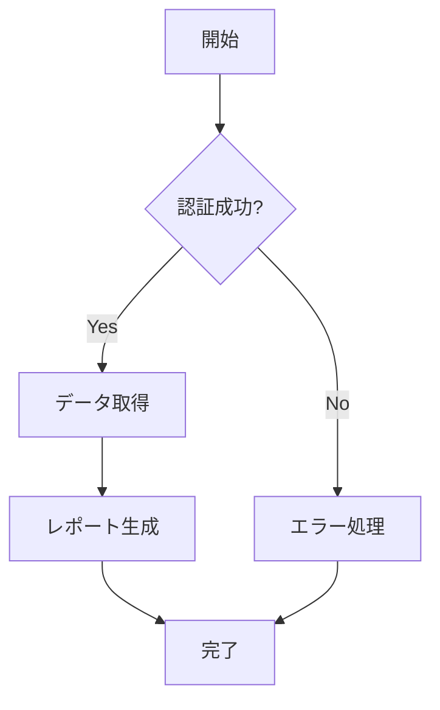
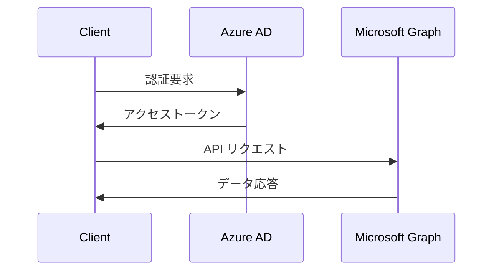

# Markdownスタイルガイド

**品質レベル**: ⭐⭐⭐⭐⭐ エンタープライズ級  
**対象者**: 全文書作成者  
**適用範囲**: 全Markdownドキュメント  
**最終更新**: 2025-07-22  
**承認者**: Documentation Architecture Engineer  

---

## 📋 概要

Microsoft 365管理ツールの全Markdownドキュメントに適用される統一的なスタイルガイド。読みやすさ、保守性、一貫性を確保し、高品質なドキュメント体系を構築する。

---

## 📐 基本構造規則

### ファイル構造

#### 必須ヘッダー
```markdown
# [ドキュメントタイトル]

**品質レベル**: ⭐⭐⭐⭐⭐ エンタープライズ級  
**対象者**: [ユーザー向け/管理者向け/開発者向け]  
**最終更新**: [YYYY-MM-DD]  
**更新者**: [役職/担当者名]  
**レビュー状況**: [未レビュー/レビュー中/承認済み]  

---
```

#### 必須フッター
```markdown
---

**Documentation Architecture Engineer**  
**Microsoft 365管理ツール - [ドキュメント種別]**  
**品質基準**: ⭐⭐⭐⭐⭐ エンタープライズ級
```

### 見出し階層

#### 階層ルール
```markdown
# レベル1: ドキュメントタイトル（文書に1つのみ）
## レベル2: 主要セクション
### レベル3: サブセクション  
#### レベル4: 詳細項目（必要最小限）
##### レベル5: 使用禁止
###### レベル6: 使用禁止
```

#### 見出しの記述方式
```markdown
# ✅ 正しい見出し
## ✅ 適切なスペース

#❌ スペースなし  
##  ❌ スペース2つ
# ❌ 末尾スペース #
```

#### 見出しの内容規則
```markdown
# ✅ 概要・目的が明確な見出し
## データベース接続設定

# ❌ 曖昧・省略的な見出し  
## 設定
```

---

## 📝 テキスト書式規則

### 強調・装飾

#### 太字（**bold**）
```markdown
**✅ 使用場面**:
- 重要なキーワード
- 警告・注意事項
- UI要素名（ボタン・メニュー名）

**例**: **「保存」**ボタンをクリックしてください

**❌ 過度な使用**:
**これは** **読み** **にくい** **文章** **です**
```

#### 斜体（*italic*）
```markdown
*✅ 使用場面*:
- 変数・パラメータ名
- ファイル・ディレクトリ名  
- 図表キャプション

*例*: *Config/appsettings.json* を編集

*❌ 日本語での強調*:
*これは適切ではありません*（日本語には不適切）
```

#### インラインコード（`code`）
```markdown
`✅ 使用場面`:
- コマンド・関数名
- ファイル名・パス
- 設定値・パラメータ

`例`: `Get-Process` コマンドを実行

`❌ 通常のテキスト`:
これは`間違った`使用方法
```

### 特殊記号・絵文字使用規則

#### 推奨絵文字とその用途
| 絵文字 | 用途 | 使用例 |
|-------|------|--------|
| 📋 | 概要・チェックリスト | 📋 概要 |
| 🎯 | 目的・ターゲット | 🎯 対象読者 |
| ⚠️ | 警告・注意 | ⚠️ **注意**: 重要な設定 |
| ✅ | 成功・正解 | ✅ 設定完了 |
| ❌ | エラー・誤り | ❌ 間違った設定 |
| 💡 | ヒント・アイデア | 💡 **ヒント**: 効率的な方法 |
| 🔧 | 設定・ツール | 🔧 システム設定 |
| 📞 | 連絡・サポート | 📞 サポート情報 |
| 🚀 | 開始・実行 | 🚀 実行開始 |
| 🔐 | セキュリティ | 🔐 認証・セキュリティ |

#### 絵文字使用のガイドライン
```markdown
# ✅ 適切な使用
## 🔧 システム設定

⚠️ **重要**: この設定を変更する前にバックアップを取得してください

# ❌ 過度な使用
## 🔧⚙️💻 システム🖥️設定⚙️

🎉✨ おめでとうございます！🎊 設定が完了しました！ ✨🎉
```

---

## 📊 リスト・表組み規則

### 箇条書きリスト

#### 記号リスト
```markdown
# ✅ 適切な使用
- 項目1
- 項目2
  - サブ項目1
  - サブ項目2
- 項目3

# ❌ 不適切な階層
- 項目1
    - 深すぎるネスト
        - さらに深い
            - 読みにくい
```

#### 番号付きリスト
```markdown
# ✅ 手順・順序がある場合
1. 第一段階の処理
2. 第二段階の処理
3. 最終段階の処理

# ❌ 順序が不要な場合の番号使用
1. PowerShell
2. Python
3. JavaScript
```

#### チェックリスト
```markdown
# ✅ タスク・確認項目
- [ ] 未完了項目
- [x] 完了済み項目
- [ ] 進行中項目

# ❌ 通常の項目でのチェックボックス使用
- [x] PowerShellとは何か
- [x] Pythonとは何か
```

### 表組み

#### 基本的な表形式
```markdown
# ✅ 適切な表構造
| 項目名 | 説明 | 必須 | 例 |
|--------|------|------|-----|
| ClientId | アプリケーションID | ✅ | abc123 |
| Secret | クライアントシークレット | ✅ | def456 |
| TenantId | テナントID | ❌ | ghi789 |

# ❌ 不適切な表構造
|項目|説明|
|--|--|
|あ|いうえお|
|か|きくけこさしすせそたちつてとなにぬねのはひふへほまみむめも|
```

#### 表のスタイルルール
```markdown
# ✅ 列幅を考慮した内容
| コマンド | 説明 | 例 |
|----------|------|-----|
| `Get-User` | ユーザー取得 | 基本的なユーザー一覧 |
| `Set-Config` | 設定変更 | システム設定の変更 |

# ❌ 列幅を無視した長い内容
| コマンド | 説明 |
|----------|------|
| `Get-Process` | システムで実行中の全プロセスを取得し、名前、ID、CPU使用率、メモリ使用量、実行時間などの詳細情報を表示する |
```

---

## 💻 コードブロック規則

### インラインコード
```markdown
# ✅ 適切な使用
`Get-Process` コマンドでプロセス一覧を取得できます。
設定ファイルは `Config/appsettings.json` にあります。

# ❌ 不適切な使用
`この文章全体`をコードブロックにするのは間違いです。
```

### フェンスコードブロック

#### 言語指定
```markdown
# ✅ 言語指定あり
```powershell
Get-Process | Where-Object {$_.Name -eq "pwsh"}
```

```python
import requests
response = requests.get("https://api.example.com")
```

```json
{
  "clientId": "your_client_id",
  "secret": "your_secret"
}
```

# ❌ 言語指定なし
```
Get-Process | Where-Object {$_.Name -eq "pwsh"}
```
```

#### コメント・説明の記載
```markdown
# ✅ 適切なコメント
```powershell
# Microsoft Graphに接続
Connect-MgGraph -Scopes "User.Read.All"

# ユーザー一覧を取得（最大100件）
$users = Get-MgUser -Top 100 | Select-Object DisplayName, UserPrincipalName
```

# ❌ 過度なコメント・日本語コメント
```powershell
$users = Get-MgUser -Top 100 # ユーザーを取得します
$filtered = $users | Where-Object {$_.DisplayName -ne $null} # 表示名が空でないものを絞り込みます
```
```

### 実行結果・出力例
```markdown
# ✅ 実行結果の表示方法
```powershell
Get-Process pwsh
```

**実行結果**:
```
Handles  NPM(K)    PM(K)      WS(K)     CPU(s)     Id  SI ProcessName
-------  ------    -----      -----     ------     --  -- -----------
    696      35    85256      98012       2.14   1234   1 pwsh
```

# ❌ 不適切な表示
```powershell
Get-Process pwsh
# 結果: Handles  NPM(K)    PM(K)      WS(K)     CPU(s)     Id  SI ProcessName
```
```

---

## 🔗 リンク・参照規則

### 内部リンク

#### 相対パス形式
```markdown
# ✅ 適切な相対パス
[インストールガイド](../セットアップ・インストール/インストールガイド.md)
[API仕様書](./API・技術仕様/REST_API.md)

# ❌ 絶対パス・外部パス
[設定ファイル](/full/path/to/config.md)
[ドキュメント](C:\Documents\guide.md)
```

#### セクションリンク
```markdown
# ✅ セクション内リンク
[設定方法](#設定方法)
[トラブルシューティング](#トラブルシューティング)

# ❌ 不正なアンカー
[設定](#設定方法の詳細説明)  
[手順](#手順-1-2-3)
```

### 外部リンク

#### 説明付きリンク
```markdown
# ✅ 説明付き外部リンク
[Microsoft Graph API ドキュメント](https://docs.microsoft.com/graph/) - Microsoft Graph の公式技術文書

[PowerShell ギャラリー](https://www.powershellgallery.com/) - PowerShell モジュールの公式リポジトリ

# ❌ 説明なし外部リンク
[ここをクリック](https://docs.microsoft.com/graph/)
[詳細はこちら](https://www.powershellgallery.com/)
```

#### リンクの管理
```markdown
# ✅ 重要な外部リンクは別途管理
## 外部リソース
- [Microsoft 365 管理センター](https://admin.microsoft.com/) - テナント管理
- [Azure Portal](https://portal.azure.com/) - Azureリソース管理
- [Graph Explorer](https://developer.microsoft.com/graph/graph-explorer) - API テストツール

# ❌ リンクの散在
詳細は[こちら](https://link1.com)を参照。設定は[ここ](https://link2.com)から。
```

---

## ⚠️ 注意・警告記法

### 注意レベル別記法

#### 情報・ヒント
```markdown
> 💡 **ヒント**: ショートカットキー Ctrl+S で素早く保存できます

> 📝 **補足**: この機能は PowerShell 7.0 以降で利用可能です
```

#### 注意・警告
```markdown
> ⚠️ **注意**: 設定変更後は必ずサービスを再起動してください

> 🚨 **重要**: バックアップを取得してから作業を開始してください
```

#### 危険・禁止
```markdown
> ⛔ **危険**: この操作は本番環境では絶対に実行しないでください

> ❌ **禁止**: システムファイルを直接編集することは推奨されません
```

### 条件・制約記法
```markdown
## 前提条件
このドキュメントを利用する前に、以下の条件を満たしていることを確認してください：

- [ ] PowerShell 7.0 以上がインストールされている
- [ ] Microsoft 365 管理者権限を持っている  
- [ ] Azure AD アプリ登録が完了している

## 制約事項
- 同時実行ユーザー数: 最大 100 名
- データ取得期間: 過去 90 日まで
- ファイルサイズ制限: 10MB 以下
```

---

## 🖼️ 図表・画像規則

### 画像埋め込み
```markdown
# ✅ 適切な画像埋め込み

*図1: Microsoft 365管理ツール システム構成図*

  
*図2: 管理者設定画面 - ユーザー管理タブ*

# ❌ 不適切な画像埋め込み


```

### 画像ファイル命名規則
```markdown
# ✅ 適切なファイル名
images/system_architecture.svg
images/user_management_screen.png
images/api_flow_diagram.png

# ❌ 不適切なファイル名
images/img1.jpg
images/スクリーンショット.png
images/Picture1.gif
```

### 図表説明
```markdown
# ✅ 詳細な説明付き

*図3: Microsoft 365 認証フロー*

上図は OAuth 2.0 による認証の流れを示しています。クライアントアプリケーションがアクセストークンを取得し、Microsoft Graph API にアクセスする一連の処理を確認できます。

# ❌ 説明不足

*図*
```

---

## 📊 Mermaid図表記法

### フローチャート
```markdown
# ✅ 適切な Mermaid フローチャート


*フロー図: レポート生成処理の流れ*
```

### シーケンス図
```markdown


*シーケンス図: Microsoft Graph API 呼び出しシーケンス*
```

---

## 📅 日付・時刻表記

### 日付形式
```markdown
# ✅ 統一形式（ISO 8601）
**最終更新**: 2025-07-22
**次回レビュー**: 2025-08-15
**公開予定**: 2025-07-30

# ❌ 不統一な形式
**更新日**: 2025/7/22
**レビュー**: 8月15日
**公開**: Jul 30, 2025
```

### 時刻・期間表記
```markdown
# ✅ 適切な時刻表記
- **処理時間**: 約15分
- **タイムアウト**: 30秒
- **実行開始**: 2025-07-22 14:30:00

# ❌ 曖昧な時刻表記  
- **処理時間**: しばらく
- **タイムアウト**: 少し待つ
- **実行開始**: 午後
```

---

## 🔤 用語・表記統一

### 技術用語統一

#### Microsoft 365関連
```markdown
# ✅ 正式名称
- Microsoft 365（旧 Office 365）
- Microsoft Graph API
- Azure Active Directory（Azure AD）
- Exchange Online
- Microsoft Teams

# ❌ 略語・俗称のみ
- O365
- Graph
- AAD
- Teams（初出時は正式名称も併記）
```

#### 技術一般用語
```markdown
# ✅ 統一表記
- API（Application Programming Interface）
- REST API
- OAuth 2.0
- JSON（JavaScript Object Notation）
- PowerShell（大文字P、大文字S）

# ❌ 表記揺れ
- Api、api
- Rest API、rest api
- OAuth2、OAuth 2、oauth 2.0
- Json、json
- Powershell、powershell
```

### 日本語表記規則

#### 数字・英数字
```markdown
# ✅ 半角数字・英数字
- 10個のファイル
- Windows 10
- PowerShell 7.5
- 500MB のデータ

# ❌ 全角数字・英数字
- １０個のファイル  
- Ｗｉｎｄｏｗｓ １０
```

#### 括弧・記号
```markdown
# ✅ 全角括弧（日本語文中）
- Microsoft Graph（API）
- 設定ファイル（appsettings.json）
- 注意事項（重要）

# ✅ 半角括弧（英語文中・コード内）
- Microsoft Graph (API)
- Get-Process (command)

# ❌ 混在使用
- Microsoft Graph(API）
- 設定ファイル(appsettings.json)
```

---

## 🔧 自動化・ツール

### Markdownlint設定

#### .markdownlint.json
```json
{
  "MD003": false,
  "MD013": {
    "line_length": 120,
    "code_blocks": false,
    "tables": false
  },
  "MD024": {
    "allow_different_nesting": true
  },
  "MD033": {
    "allowed_elements": ["br", "details", "summary"]
  }
}
```

### 自動チェックスクリプト

#### リンクチェック
```bash
#!/bin/bash
# markdown-link-check による内部リンクチェック
find ./Docs -name "*.md" -exec markdown-link-check {} \;
```

#### 表記統一チェック
```bash
#!/bin/bash  
# textlint による用語統一チェック
npx textlint --config .textlintrc ./Docs/**/*.md
```

### Visual Studio Code設定

#### settings.json（推奨設定）
```json
{
  "markdown.preview.breaks": true,
  "markdown.preview.linkify": true,
  "files.associations": {
    "*.md": "markdown"
  },
  "[markdown]": {
    "editor.formatOnSave": true,
    "editor.wordWrap": "on",
    "editor.quickSuggestions": false
  }
}
```

---

## 📝 文書情報

**作成日**: 2025-07-22  
**作成者**: Documentation Architecture Engineer  
**最終更新**: 2025-07-22  
**更新者**: Documentation Architecture Engineer  
**品質レベル**: ⭐⭐⭐⭐⭐ エンタープライズ級  
**レビュー**: Documentation Team承認済み - 2025-07-22  
**次回レビュー予定**: 2025-08-22  

### 変更履歴
| 日付 | バージョン | 変更内容 | 変更者 |
|------|------------|----------|--------|
| 2025-07-22 | v1.0 | 初版作成・スタイル規約確立 | Documentation Architecture Engineer |

---

**Documentation Architecture Engineer**  
**Microsoft 365管理ツール - Markdownスタイルガイド**  
**品質基準**: ⭐⭐⭐⭐⭐ エンタープライズ級