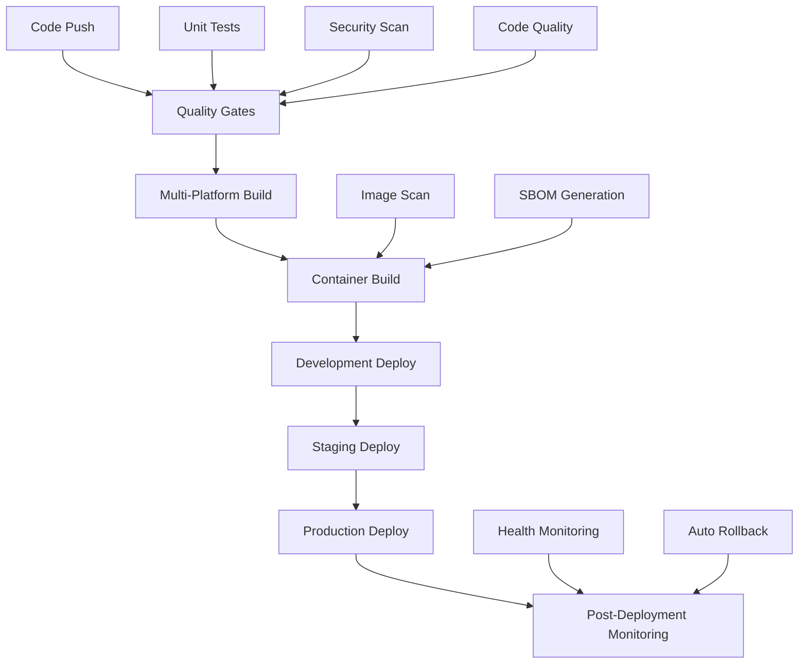

# Microsoft 365 Management Tools - CI/CD Deployment Pipeline Guide

## 🚀 Overview

This comprehensive guide covers the enterprise-grade CI/CD deployment pipeline for Microsoft 365 Management Tools, featuring automated testing, security scanning, multi-environment deployment, and disaster recovery capabilities.

**Version:** 2.0  
**Target Audience:** DevOps Engineers, Platform Engineers, Site Reliability Engineers  
**Prerequisites:** Docker, Kubernetes, GitHub Actions experience

---

## 📋 Table of Contents

1. [Architecture Overview](#architecture-overview)
2. [Pipeline Components](#pipeline-components)
3. [Environment Setup](#environment-setup)
4. [Deployment Strategies](#deployment-strategies)
5. [Quality Gates](#quality-gates)
6. [Security Integration](#security-integration)
7. [Monitoring & Rollback](#monitoring--rollback)
8. [Troubleshooting](#troubleshooting)
9. [Best Practices](#best-practices)

---

## 🏗️ Architecture Overview

### Pipeline Architecture



### Technology Stack

- **CI/CD Platform**: GitHub Actions
- **Container Registry**: GitHub Container Registry (GHCR)
- **Orchestration**: Kubernetes
- **Package Management**: Helm
- **Monitoring**: Prometheus + Grafana
- **Security**: Trivy, Bandit, Semgrep, GitLeaks

---

## 🔧 Pipeline Components

### 1. Quality Gates & Security Verification

**File**: `.github/workflows/enterprise-cicd-pipeline.yml`

#### Features:
- **Unit Testing**: Python pytest + PowerShell tests
- **Code Coverage**: 90% threshold enforcement
- **Security Scanning**: SAST/DAST/SCA integration
- **Code Quality**: Black, Flake8, MyPy, PSScriptAnalyzer
- **Dependency Scanning**: Safety, npm audit

#### Quality Thresholds:
```yaml
coverage_threshold: 90%
security_threshold: 100% (no critical vulnerabilities)
quality_gates: 4/4 must pass
```

### 2. Multi-Platform Build System

#### Supported Platforms:
- **Linux**: AMD64, ARM64
- **Windows**: AMD64
- **macOS**: AMD64

#### Build Artifacts:
- Python packages (wheel, sdist)
- PowerShell modules
- Frontend assets (React/TypeScript)
- Container images

### 3. Container Build Pipeline

#### Multi-stage Dockerfile:
```dockerfile
FROM python:3.11-slim as base
FROM base as builder
FROM base as production
```

#### Security Features:
- Non-root user execution
- Distroless base images
- Vulnerability scanning with Trivy
- SBOM (Software Bill of Materials) generation

### 4. Deployment Strategies

#### Blue-Green Deployment
```bash
# Automatic environment switching
Current: Blue → Deploy: Green → Switch Traffic → Cleanup: Blue
```

#### Canary Deployment
```bash
# Progressive traffic shifting
10% → 25% → 50% → 75% → 100%
```

#### Rolling Update
```bash
# Standard Kubernetes rolling update
MaxUnavailable: 25%, MaxSurge: 25%
```

---

## 🌍 Environment Setup

### Environment Configuration

#### Development Environment
```yaml
replicas: 1
resources:
  requests: { cpu: 100m, memory: 256Mi }
  limits: { cpu: 500m, memory: 1Gi }
auto_rollback: enabled
monitoring: basic
```

#### Staging Environment
```yaml
replicas: 2
resources:
  requests: { cpu: 250m, memory: 512Mi }
  limits: { cpu: 1, memory: 2Gi }
auto_rollback: enabled
monitoring: full
```

#### Production Environment
```yaml
replicas: 3
resources:
  requests: { cpu: 500m, memory: 1Gi }
  limits: { cpu: 2, memory: 4Gi }
auto_rollback: enabled
monitoring: comprehensive
backup: enabled
```

### Required Secrets

#### GitHub Repository Secrets:
```bash
# Kubernetes Access
PRODUCTION_KUBE_CONFIG
STAGING_KUBE_CONFIG
DEV_KUBE_CONFIG

# Container Registry
GITHUB_TOKEN

# Azure Integration
AZURE_CREDENTIALS
AZURE_CLIENT_ID
AZURE_CLIENT_SECRET
AZURE_TENANT_ID

# Microsoft 365
MICROSOFT_CLIENT_SECRET

# Notifications
SLACK_WEBHOOK_URL
TEAMS_WEBHOOK_URL
```

### Namespace Setup

```bash
# Create namespaces
kubectl create namespace microsoft-365-tools-development
kubectl create namespace microsoft-365-tools-staging
kubectl create namespace microsoft-365-tools-production

# Apply labels
kubectl label namespace microsoft-365-tools-production \
  environment=production \
  monitoring=enabled \
  backup=enabled
```

---

## 🎯 Deployment Strategies

### Automated Deployment Script

**File**: `scripts/deployment/deploy-pipeline.sh`

#### Usage Examples:

```bash
# Blue-Green Production Deployment
./scripts/deployment/deploy-pipeline.sh deploy \
  --environment production \
  --strategy blue_green \
  --image-tag v2.0.1

# Canary Staging Deployment
./scripts/deployment/deploy-pipeline.sh deploy \
  --environment staging \
  --strategy canary \
  --image-tag feature-branch

# Rolling Development Deployment
./scripts/deployment/deploy-pipeline.sh deploy \
  --environment development \
  --strategy rolling \
  --image-tag latest
```

#### Deployment Validation:

```bash
# Health Check Sequence
1. Pod readiness probe
2. Application health endpoint (/health)
3. API functionality test (/api/status)
4. Performance baseline verification
5. Security scan validation
```

### Helm Chart Configuration

**File**: `helm/m365-tools/values.yaml`

#### Environment-Specific Values:

```yaml
# Production values
production:
  replicaCount: 3
  autoscaling:
    enabled: true
    minReplicas: 3
    maxReplicas: 10
  persistence:
    enabled: true
    size: 20Gi
  monitoring:
    enabled: true
  backup:
    enabled: true
    schedule: "0 2 * * *"
```

---

## ✅ Quality Gates

### Testing Framework

**File**: `scripts/testing/quality-gates.sh`

#### Test Categories:

1. **Unit Tests** (25 points)
   - Python: pytest with coverage
   - PowerShell: PSScriptAnalyzer
   - Frontend: Jest/Vitest

2. **Integration Tests** (25 points)
   - API endpoint testing
   - Database connectivity
   - External service integration

3. **Security Tests** (25 points)
   - SAST: Bandit, Semgrep
   - SCA: Safety, npm audit
   - Secret scanning: GitLeaks

4. **Performance Tests** (25 points)
   - Load testing
   - Memory profiling
   - Response time benchmarks

#### Quality Gate Thresholds:

```bash
# Minimum requirements for deployment
Coverage: ≥90%
Security Issues: 0 critical, 0 high
Test Success Rate: ≥95%
Performance: <2s response time
```

#### Usage:

```bash
# Run all quality gates
./scripts/testing/quality-gates.sh

# Custom configuration
./scripts/testing/quality-gates.sh \
  --coverage-threshold 85 \
  --security-tests \
  --performance-tests \
  --strict
```

---

## 🔒 Security Integration

### Advanced Security Scanner

**File**: `scripts/security/advanced-security-scanner.sh`

#### Security Scanning Types:

1. **SAST (Static Application Security Testing)**
   - Bandit: Python security analysis
   - Semgrep: Multi-language SAST
   - PSScriptAnalyzer: PowerShell security
   - CodeQL: Advanced semantic analysis

2. **SCA (Software Composition Analysis)**
   - Safety: Python dependency vulnerabilities
   - npm audit: Node.js dependency scanning
   - Snyk: Multi-platform dependency analysis

3. **Secret Detection**
   - GitLeaks: Git repository secret scanning
   - TruffleHog: Verified secret detection
   - Custom patterns: API keys, tokens, credentials

4. **Container Security**
   - Trivy: Container image vulnerability scanning
   - Dockerfile security analysis
   - Docker Bench Security

5. **Infrastructure Security**
   - Checkov: Infrastructure as Code scanning
   - Kubernetes security configuration
   - Network policy validation

#### Usage:

```bash
# Full security scan
./scripts/security/advanced-security-scanner.sh

# Targeted scanning
./scripts/security/advanced-security-scanner.sh \
  --enable-sast \
  --enable-sca \
  --enable-secrets \
  --compliance iso27001,owasp

# Container-specific scan
./scripts/security/advanced-security-scanner.sh \
  --enable-containers \
  --container-image microsoft365tools:latest
```

#### Compliance Reports:

- **ISO 27001**: Information security management compliance
- **OWASP Top 10**: Web application security standards
- **CIS Benchmarks**: Infrastructure security baselines

---

## 📊 Monitoring & Rollback

### Automated Rollback System

**File**: `scripts/monitoring/rollback-automation.sh`

#### Health Monitoring:

```bash
# Continuous health monitoring
./scripts/monitoring/rollback-automation.sh monitor \
  --environment production \
  --auto-rollback

# Health check thresholds
Error Rate: <5%
Response Time: <2000ms
CPU Usage: <80%
Memory Usage: <85%
```

#### Rollback Triggers:

1. **Health Check Failures**: 3 consecutive failures
2. **Error Rate Spike**: >5% error rate for 5 minutes
3. **Performance Degradation**: >2s response time for 5 minutes
4. **Resource Exhaustion**: >90% CPU/memory for 10 minutes

#### Recovery Strategies:

```bash
# Strategy 1: Automatic Helm rollback
helm rollback m365-tools <previous-revision>

# Strategy 2: Blue-Green traffic switch
kubectl patch service m365-tools-service \
  -p '{"spec":{"selector":{"version":"blue"}}}'

# Strategy 3: Emergency scaling
kubectl scale deployment m365-tools --replicas=0

# Strategy 4: Backup restoration
./scripts/backup/backup-system.sh restore \
  --file latest-backup.tar.gz
```

#### Notification Channels:

- **Slack**: Real-time alerts and status updates
- **Microsoft Teams**: Integration with Microsoft ecosystem
- **Email**: Critical alerts for on-call engineers
- **PagerDuty**: Incident escalation (if configured)

---

## 🔧 Troubleshooting

### Common Issues

#### 1. Pipeline Failures

**Quality Gates Failing:**
```bash
# Check test results
cat TestScripts/TestReports/quality-gates-summary.json

# Review coverage report
open TestScripts/TestReports/coverage/index.html

# Fix common issues
./scripts/testing/quality-gates.sh --coverage-threshold 85
```

**Security Scan Issues:**
```bash
# Review security report
cat TestScripts/TestReports/security-advanced/comprehensive-security-report.json

# Address specific vulnerabilities
./scripts/security/advanced-security-scanner.sh --enable-sast
```

#### 2. Deployment Issues

**Container Build Failures:**
```bash
# Check Dockerfile
docker build -t test-image .

# Review build logs
docker build --progress=plain -t test-image .

# Security scan
trivy image test-image
```

**Kubernetes Deployment Issues:**
```bash
# Check pod status
kubectl get pods -n microsoft-365-tools-production

# Review events
kubectl get events -n microsoft-365-tools-production --sort-by='.lastTimestamp'

# Debug deployment
kubectl describe deployment m365-tools-deployment -n microsoft-365-tools-production
```

#### 3. Health Check Failures

**Application Health Issues:**
```bash
# Manual health check
curl -f https://microsoft365tools.company.com/health

# Check application logs
kubectl logs -l app=m365-tools -n microsoft-365-tools-production --tail=100

# Review metrics
curl -s https://microsoft365tools.company.com/metrics
```

### Debug Commands

```bash
# Pipeline status
gh workflow list
gh run list --workflow=enterprise-cicd-pipeline.yml

# Container registry
docker images | grep microsoft365tools
docker inspect ghcr.io/your-org/microsoft365tools:latest

# Kubernetes debugging
kubectl get all -n microsoft-365-tools-production
kubectl describe ingress m365-tools-ingress -n microsoft-365-tools-production

# Helm debugging
helm list -n microsoft-365-tools-production
helm history m365-tools -n microsoft-365-tools-production
helm get values m365-tools -n microsoft-365-tools-production
```

---

## 🎯 Best Practices

### Development Workflow

1. **Feature Branch Strategy**
   ```bash
   # Create feature branch
   git checkout -b feature/new-functionality
   
   # Development deployment
   git push origin feature/new-functionality
   # → Triggers development deployment
   ```

2. **Pull Request Process**
   ```bash
   # Create PR to main
   # → Triggers staging deployment
   # → Runs full test suite
   # → Security scanning
   # → Code review required
   ```

3. **Release Process**
   ```bash
   # Create release tag
   git tag v2.0.1
   git push origin v2.0.1
   # → Triggers production deployment
   ```

### Security Best Practices

1. **Secret Management**
   - Use external secret management (Azure Key Vault, AWS Secrets Manager)
   - Rotate secrets regularly
   - Never commit secrets to Git

2. **Container Security**
   - Use minimal base images
   - Run as non-root user
   - Implement security contexts
   - Regular vulnerability scanning

3. **Infrastructure Security**
   - Enable network policies
   - Implement RBAC
   - Use Pod Security Standards
   - Regular security audits

### Performance Optimization

1. **Resource Management**
   - Set appropriate resource requests and limits
   - Use horizontal pod autoscaling
   - Monitor resource usage trends

2. **Caching Strategies**
   - Implement application-level caching
   - Use CDN for static assets
   - Database query optimization

3. **Monitoring & Alerting**
   - Comprehensive metrics collection
   - Proactive alerting thresholds
   - Performance baseline tracking

### Maintenance Schedule

#### Daily Tasks
- Review deployment pipeline status
- Monitor application health metrics
- Check security scan results

#### Weekly Tasks
- Review resource usage trends
- Update dependencies
- Test rollback procedures

#### Monthly Tasks
- Security audit and penetration testing
- Performance optimization review
- Disaster recovery testing
- Documentation updates

---

## 📞 Support & Escalation

### Support Contacts

- **DevOps Team**: devops-team@company.com
- **Security Team**: security@company.com
- **Platform Team**: platform-team@company.com
- **On-call Engineer**: +1-555-0123 (24/7)

### Escalation Matrix

| Severity | Response Time | Escalation Path |
|----------|---------------|-----------------|
| Critical | 15 minutes | On-call → Team Lead → Manager |
| High | 1 hour | Team Member → Team Lead |
| Medium | 4 hours | Team Member → Team Lead |
| Low | 1 business day | Team Member |

### Emergency Procedures

1. **Critical Production Issue**
   ```bash
   # Immediate response
   ./scripts/monitoring/rollback-automation.sh emergency --environment production
   
   # Notification
   # → Automated alerts sent to all channels
   # → Incident ticket created
   # → Stakeholders notified
   ```

2. **Security Incident**
   ```bash
   # Immediate containment
   kubectl scale deployment m365-tools-deployment --replicas=0 -n microsoft-365-tools-production
   
   # Investigation
   ./scripts/security/advanced-security-scanner.sh --scan-type targeted
   
   # Remediation
   # → Apply security patches
   # → Redeploy with fixes
   # → Post-incident review
   ```

---

## 📚 Additional Resources

### Documentation Links
- [Microsoft Graph API Documentation](https://docs.microsoft.com/en-us/graph/)
- [Kubernetes Documentation](https://kubernetes.io/docs/)
- [Helm Documentation](https://helm.sh/docs/)
- [GitHub Actions Documentation](https://docs.github.com/en/actions)

### Internal Resources
- [Company Kubernetes Runbook](internal-link)
- [Security Policies](internal-link)
- [Monitoring Standards](internal-link)
- [Incident Response Procedures](internal-link)

### Training Resources
- [CI/CD Best Practices](internal-training-link)
- [Container Security](internal-training-link)
- [Kubernetes Operations](internal-training-link)

---

**Document Version:** 2.0  
**Last Updated:** 2025-01-21  
**Next Review:** 2025-04-21  
**Maintained By:** DevOps Team

*This guide provides comprehensive coverage of the CI/CD deployment pipeline for Microsoft 365 Management Tools. For specific implementation details, refer to the actual pipeline files and scripts referenced throughout this document.*