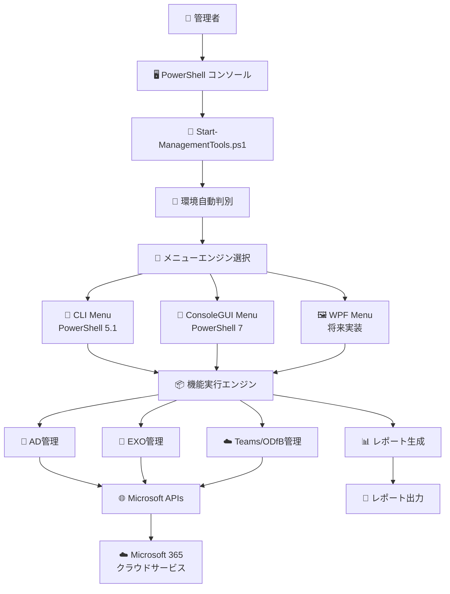
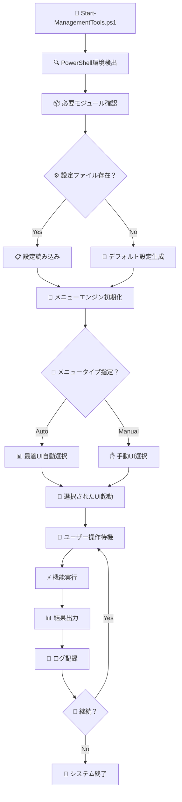
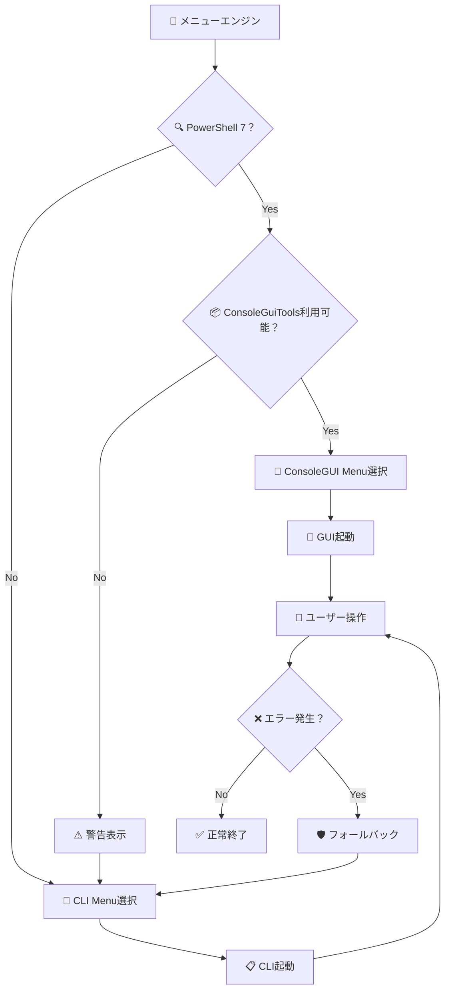
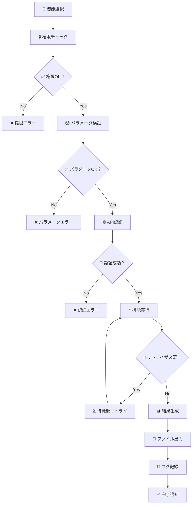

# 🏗️ Microsoft 365統合管理ツール システム構成書

## 📋 アーキテクチャ概要

### 🎯 設計思想
Microsoft 365統合管理ツールは、**モジュラー設計**・**拡張性**・**保守性**を重視したPowerShellベースの統合管理システムです。PowerShellバージョン間の互換性を保ちながら、最新技術の恩恵を受けられるハイブリッドアーキテクチャを採用しています。

### 🏢 システム全体構成



---

## 📁 ディレクトリ構成

### 🗂️ 物理ファイル構造

```
MicrosoftProductManagementTools/
├── 📄 Start-ManagementTools.ps1          # 🚀 メインエントリーポイント
├── 📄 Start-ManagementTools-Legacy.ps1   # 🔙 レガシーシステム（バックアップ）
├── 📄 README.md                          # 📖 プロジェクト概要
│
├── 📁 Config/                            # ⚙️ 設定管理
│   ├── appsettings.json                  # 🔧 メイン設定ファイル
│   ├── menu-config.json                  # 🎯 メニュー設定
│   └── security-config.json              # 🔒 セキュリティ設定
│
├── 📁 Scripts/                           # 💻 スクリプト群
│   ├── 📁 UI/                            # 🎨 ユーザーインターフェース層
│   │   ├── MenuEngine.psm1               # 🤖 メニューエンジン基盤
│   │   ├── CLIMenu.psm1                  # 🔧 CLI メニューシステム
│   │   ├── ConsoleGUIMenu.psm1           # 🎯 ConsoleGUI メニューシステム
│   │   └── EncodingManager.psm1          # 🔤 文字エンコーディング管理
│   │
│   ├── 📁 Common/                        # 🛠️ 共通機能層
│   │   ├── VersionDetection.psm1         # 🔍 PowerShell環境検出
│   │   ├── MenuConfig.psm1               # 📋 設定ベースメニュー管理
│   │   ├── Logging.psm1                  # 📝 ログ管理システム
│   │   ├── ErrorHandling.psm1            # ⚠️ エラーハンドリング
│   │   ├── Authentication.psm1           # 🔐 認証統合管理
│   │   ├── ReportGenerator.psm1          # 📊 レポート生成エンジン
│   │   └── ScheduledReports.ps1          # 📅 定期レポート実行
│   │
│   ├── 📁 AD/                            # 🏢 Active Directory管理
│   │   ├── Test-ADSync.ps1               # 🔄 AD同期状況確認
│   │   ├── Get-ADUsers.ps1               # 👥 ユーザー管理
│   │   ├── Get-ADGroups.ps1              # 🏢 グループ管理
│   │   └── Analyze-ADHealth.ps1          # 🩺 AD健全性分析
│   │
│   ├── 📁 EXO/                           # 📧 Exchange Online管理
│   │   ├── Get-MailboxUsage.ps1          # 📦 メールボックス容量監視
│   │   ├── Analyze-Attachments.ps1       # 📎 添付ファイル分析
│   │   ├── Analyze-SpamFilter.ps1        # 🛡️ スパムフィルター分析
│   │   └── Get-MailflowStatistics.ps1    # 📈 メールフロー統計
│   │
│   └── 📁 EntraID/                       # 🆔 Entra ID・Teams・OneDrive管理
│       ├── Get-ODTeamsUsage.ps1          # ☁️ OneDrive・Teams使用状況
│       ├── Analyze-TeamsUsage.ps1        # 👥 Teams利用分析
│       ├── Analyze-LicenseUsage.ps1      # 🎫 ライセンス使用状況分析
│       ├── Analyze-MFA.ps1               # 🔐 多要素認証分析
│       └── YearlyConsumptionAlert.ps1    # 💰 年間消費傾向アラート
│
├── 📁 Reports/                           # 📊 レポート出力
│   ├── Daily/                            # 🌅 日次レポート
│   ├── Weekly/                           # 📅 週次レポート
│   ├── Monthly/                          # 📆 月次レポート
│   └── Yearly/                           # 📈 年次レポート
│
├── 📁 Logs/                              # 📝 ログファイル
│   ├── System/                           # 🖥️ システムログ
│   ├── Security/                         # 🔒 セキュリティログ
│   └── Audit/                            # 📋 監査ログ
│
└── 📁 Docs/                              # 📚 ドキュメント
    ├── Microsoft365統合管理ツール操作手順書.md
    ├── Microsoft365統合管理ツールシステム概要.md
    ├── Microsoft365統合管理ツールシステム構成.md
    ├── Microsoft365API仕様書.md
    ├── Microsoft365統合管理ツールシステム管理者向け運用マニュアル.md
    ├── Microsoft365統合管理ツール開発者向けガイド.md
    └── Microsoft365統合管理ツール実装状況レポート.md
```

---

## 🔧 技術レイヤー構成

### 🏗️ 4層アーキテクチャ

#### 1️⃣ プレゼンテーション層（UI Layer）
```
🎨 ユーザーインターフェース
├── 🔧 CLI Menu（PowerShell 5.1対応）
│   ├── 📋 テキストベースメニュー
│   ├── 🔤 文字化け対策済み表示
│   ├── 🗺️ ブレッドクラムナビゲーション
│   └── ⌨️ キーボード操作対応
│
├── 🎯 ConsoleGUI Menu（PowerShell 7対応）
│   ├── 🖱️ インタラクティブGUI
│   ├── 🔍 検索・フィルタリング機能
│   ├── 📊 リアルタイムプレビュー
│   └── ⚡ 高速レスポンス
│
└── 🖼️ WPF Menu（将来実装）
    ├── 🎨 モダンGUIデザイン
    ├── 📊 ダッシュボード形式
    ├── 📱 レスポンシブレイアウト
    └── 🖱️ マウス操作最適化
```

#### 2️⃣ ビジネスロジック層（Business Logic Layer）
```
🧠 処理制御・業務ロジック
├── 🤖 メニューエンジン
│   ├── 🔍 環境自動判別
│   ├── 🎯 最適UI選択
│   ├── 🛡️ フォールバック制御
│   └── 🔄 動的メニュー生成
│
├── ⚙️ 設定管理システム
│   ├── 📋 JSON設定読み込み
│   ├── 🔧 動的設定変更
│   ├── ✅ 設定値検証
│   └── 🔄 設定同期
│
├── 📊 レポート生成エンジン
│   ├── 🌐 HTML出力
│   ├── 📄 CSV出力
│   ├── 📋 JSON出力
│   └── 📈 グラフ生成
│
└── 🔐 セキュリティ制御
    ├── 🎫 認証管理
    ├── 🔒 権限チェック
    ├── 📝 監査ログ
    └── 🛡️ アクセス制御
```

#### 3️⃣ データアクセス層（Data Access Layer）
```
🌐 外部システム連携
├── 📡 Microsoft Graph API
│   ├── 👥 ユーザー・グループ情報
│   ├── 📧 Exchange Online データ
│   ├── ☁️ OneDrive使用状況
│   ├── 👥 Teams活動データ
│   └── 🎫 ライセンス情報
│
├── 🛠️ PowerShell管理モジュール
│   ├── 📧 ExchangeOnlineManagement
│   ├── 🆔 Microsoft.Graph
│   ├── 🏢 ActiveDirectory
│   └── ☁️ SharePointPnPPowerShellOnline
│
└── 💾 ローカルデータストレージ
    ├── 📊 レポートファイル
    ├── 📝 ログファイル
    ├── ⚙️ 設定ファイル
    └── 🗄️ キャッシュデータ
```

#### 4️⃣ インフラストラクチャ層（Infrastructure Layer）
```
🖥️ システム基盤・ユーティリティ
├── 🔍 環境検出システム
│   ├── 💻 PowerShellバージョン判定
│   ├── 🌐 OS・プラットフォーム検出
│   ├── 📦 モジュール可用性確認
│   └── 🔤 文字エンコーディング対応
│
├── 📝 ログ管理システム
│   ├── 🎯 レベル別ログ出力
│   ├── 📁 ファイルローテーション
│   ├── 🔍 構造化ログ
│   └── 📊 ログ分析支援
│
├── ⚠️ エラーハンドリング
│   ├── 🔄 自動リトライ機能
│   ├── 🛡️ グレースフルデグラデーション
│   ├── 📧 エラー通知
│   └── 🔧 自動復旧
│
└── 🔤 文字化け対策
    ├── 🌐 UTF-8自動設定
    ├── 📝 ASCII代替文字
    ├── ✅ 表示テスト機能
    └── 🔧 動的切り替え
```

---

## 🔄 処理フロー設計

### 🚀 システム起動フロー



### 🎯 メニュー選択フロー



### 📊 機能実行フロー



---

## 🔐 セキュリティアーキテクチャ

### 🛡️ セキュリティレイヤー

#### 1️⃣ 認証・認可層
```
🔐 認証システム
├── 🎫 Azure AD認証
│   ├── 📱 多要素認証（MFA）
│   ├── 🔑 条件付きアクセス
│   ├── 🕐 セッション管理
│   └── 🔄 トークンリフレッシュ
│
├── 📜 証明書ベース認証
│   ├── 🔒 クライアント証明書
│   ├── 🏢 企業CA発行証明書
│   ├── 🔄 証明書ローテーション
│   └── 📊 証明書監視
│
└── 👥 権限管理
    ├── 🎯 最小権限原則
    ├── 📋 ロールベースアクセス制御
    ├── ⏰ 時限付きアクセス
    └── 📊 権限監査
```

#### 2️⃣ データ保護層
```
🔒 データセキュリティ
├── 🌐 通信暗号化
│   ├── 🔐 TLS 1.3
│   ├── 📜 証明書ピニング
│   ├── 🛡️ HSTS対応
│   └── 🔍 通信監視
│
├── 💾 データ暗号化
│   ├── 🗃️ 保存時暗号化
│   ├── 🚀 転送時暗号化
│   ├── 🔑 キー管理
│   └── 🔄 キーローテーション
│
└── 📝 監査・ログ
    ├── 📊 アクセスログ
    ├── 🔒 セキュリティログ
    ├── 📋 操作履歴
    └── 🚨 異常検知
```

#### 3️⃣ 運用セキュリティ層
```
🛡️ 運用保護
├── 🚨 監視・アラート
│   ├── 🔍 リアルタイム監視
│   ├── 🎯 異常パターン検知
│   ├── 📧 アラート通知
│   └── 🤖 自動対応
│
├── 🔄 バックアップ・復旧
│   ├── 📁 設定バックアップ
│   ├── 📊 データバックアップ
│   ├── ⚡ 高速復旧
│   └── 🧪 復旧テスト
│
└── 📋 コンプライアンス
    ├── 🏅 ISO27001対応
    ├── 📊 ISO27002準拠
    ├── 🛡️ GDPR対応
    └── 📝 監査証跡
```

---

## 📊 パフォーマンス設計

### ⚡ 性能要件

#### 🚀 応答性能
```
📈 レスポンス目標値
├── メニュー表示: < 1秒
├── 機能実行開始: < 2秒
├── 小規模レポート: < 30秒
├── 大規模レポート: < 2分
└── システム起動: < 5秒
```

#### 💾 リソース使用量
```
🖥️ システムリソース
├── メモリ使用量: < 200MB
├── CPU使用率: < 30%（通常時）
├── ディスク使用量: < 1GB（ログ含む）
└── ネットワーク: 必要時のみ
```

### 🔧 最適化戦略

#### 📦 モジュール最適化
- 🔄 **遅延読み込み**: 必要時のみモジュールインポート
- 📋 **キャッシュ活用**: 設定・認証情報のメモリキャッシュ
- 🎯 **選択的実行**: 必要機能のみロード
- 🛡️ **エラー最小化**: 事前検証による失敗回避

#### 🌐 API最適化
- 📊 **バッチ処理**: 複数API呼び出しの一括実行
- ⏰ **並列処理**: 非同期処理による高速化
- 🔄 **キャッシュ戦略**: APIレスポンスの適切なキャッシュ
- 🎯 **フィルタリング**: 必要データのみ取得

---

## 🔄 拡張性・保守性設計

### 🧩 モジュラー設計

#### 📦 コンポーネント分離
```
🔧 独立性確保
├── UI層: 表示ロジックの分離
├── ビジネス層: 業務ロジックの集約
├── データ層: データアクセスの統一
└── インフラ層: 共通機能の提供
```

#### 🔌 プラグイン機能
```
🔗 拡張性設計
├── 新機能追加: 設定ファイルで動的追加
├── UI拡張: 新しいメニュータイプ追加可能
├── レポート拡張: カスタムレポート形式追加
└── 連携拡張: 外部システム連携の追加
```

### 🛠️ 保守性確保

#### 📝 コード品質
- 📋 **統一規約**: PowerShell Style Guide準拠
- 📊 **ドキュメント**: 包括的な技術文書
- 🧪 **テスト**: ユニットテスト・統合テスト
- 🔍 **コードレビュー**: 品質チェック体制

#### 🔄 バージョン管理
- 📋 **セマンティックバージョニング**: 明確なバージョン体系
- 🔄 **後方互換性**: 既存機能の継続動作保証
- 📊 **移行支援**: アップグレードパスの提供
- 🛡️ **安全な更新**: 段階的アップデート機能

---

**🎯 堅牢で拡張性の高いシステム構成により、長期的な運用と継続的な改善を実現します！**

---

*📅 最終更新: 2025年6月 | 🏗️ システム構成 v2.0*