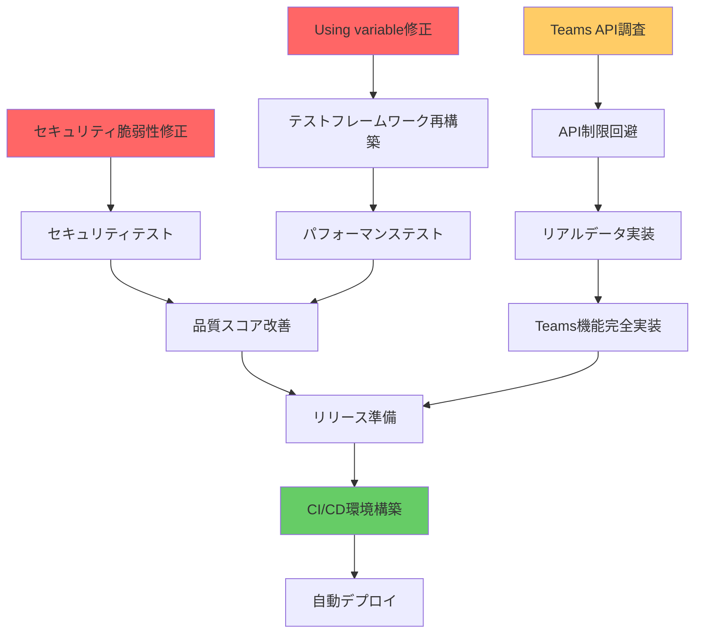

# Microsoft 365 統合管理ツール - プロジェクト管理・実装スケジュール

**作成日:** 2025年7月17日  
**作成者:** Project Manager  
**更新頻度:** 週次  

## 📊 プロジェクト現状サマリー

### 実装状況
- **総機能数:** 26機能
- **完全実装:** 25機能 (96.2%)
- **部分実装:** 1機能 (3.8%) - Teams使用状況（API制限）
- **未実装:** 0機能 (0%)

### 品質状況
- **品質スコア:** 0/100（緊急対応必要）
- **セキュリティ脆弱性:** 35件（High: 25件）
- **テストカバレッジ:** 改善必要

## 🔴 緊急対応タスク（1週間以内）

### Week 1 (2025/7/17 - 7/24)

#### セキュリティ脆弱性対応（最優先）
| タスク | 担当 | 期限 | 依存関係 | ステータス |
|--------|------|------|----------|-----------|
| PowerShellインジェクション対策（21件） | Dev1 | 7/19 | なし | 未着手 |
| 重要ファイルアクセス権限修正（3件） | Dev2 | 7/18 | なし | 未着手 |
| ログ機密情報マスキング実装 | Dev3 | 7/20 | なし | 未着手 |
| セキュリティ修正のテスト | QA | 7/21 | 上記3タスク | 未着手 |

#### パフォーマンステスト修正
| タスク | 担当 | 期限 | 依存関係 | ステータス |
|--------|------|------|----------|-----------|
| Using variable エラー修正 | Dev1 | 7/22 | なし | 未着手 |
| テストフレームワーク再構築 | Dev2 | 7/23 | エラー修正 | 未着手 |
| パフォーマンステスト再実行 | QA | 7/24 | フレームワーク修正 | 未着手 |

## 🟡 短期実装計画（2-4週間）

### Week 2-3 (2025/7/25 - 8/7)

#### Teams API完全実装
| タスク | 担当 | 期限 | 依存関係 | ステータス |
|--------|------|------|----------|-----------|
| Teams Graph API調査 | Dev3 | 7/26 | なし | 未着手 |
| API制限回避策の実装 | Dev3 | 7/30 | API調査 | 未着手 |
| リアルデータ取得実装 | Dev3 | 8/2 | 回避策実装 | 未着手 |
| 統合テスト | QA | 8/5 | データ取得実装 | 未着手 |

#### テストカバレッジ向上
| タスク | 担当 | 期限 | 依存関係 | ステータス |
|--------|------|------|----------|-----------|
| 単体テスト追加（目標: 80%） | Dev1,2 | 8/7 | なし | 未着手 |
| 統合テスト強化 | Dev3 | 8/7 | 単体テスト | 未着手 |
| E2Eテスト自動化 | QA | 8/7 | 統合テスト | 未着手 |

## 🟢 中期開発計画（1-2ヶ月）

### Phase 1: CI/CD環境構築 (8/8 - 8/21)
| タスク | 担当 | 期限 | 依存関係 |
|--------|------|------|----------|
| GitHub Actions設定 | DevOps | 8/14 | なし |
| 自動テストパイプライン | DevOps | 8/21 | Actions設定 |
| デプロイメント自動化 | DevOps | 8/21 | パイプライン |

### Phase 2: 監視・運用機能 (8/22 - 9/4)
| タスク | 担当 | 期限 | 依存関係 |
|--------|------|------|----------|
| リアルタイム監視ダッシュボード | Dev1 | 8/28 | なし |
| アラート機能実装 | Dev2 | 9/4 | ダッシュボード |
| 運用ドキュメント作成 | Tech Writer | 9/4 | 機能実装 |

## 📋 依存関係マップ

## 📊 リソース配分計画

### 開発チーム配分
- **Dev1:** セキュリティ修正（40%）、テスト作成（30%）、監視機能（30%）
- **Dev2:** テスト修正（40%）、テスト作成（30%）、アラート機能（30%）
- **Dev3:** Teams API（60%）、統合テスト（40%）
- **QA:** テスト実行（50%）、自動化（50%）
- **DevOps:** CI/CD構築（100%）

## 🎯 マイルストーン

1. **M1 - セキュリティ修正完了** (7/24)
   - 全脆弱性修正
   - セキュリティテスト合格
   
2. **M2 - 品質基準達成** (8/7)
   - 品質スコア 80/100以上
   - テストカバレッジ 80%以上
   
3. **M3 - 全機能完全実装** (8/7)
   - Teams機能の実データ対応
   - 全26機能の完全動作確認
   
4. **M4 - 自動化環境完成** (8/21)
   - CI/CDパイプライン稼働
   - 自動テスト・デプロイ実現

## 📈 進捗トラッキング

### KPI（週次測定）
- セキュリティ脆弱性数
- テストカバレッジ率
- 品質スコア
- 自動化率
- バグ修正率

### レポート体制
- **日次:** スタンドアップ（進捗共有）
- **週次:** PM進捗レポート
- **月次:** ステークホルダー報告

## 🚨 リスク管理

### 識別されたリスク
1. **高:** セキュリティ修正の遅延 → 緩和策: 追加リソース投入
2. **中:** Teams API制限 → 緩和策: MSサポート問い合わせ
3. **低:** CI/CD構築の複雑性 → 緩和策: 段階的導入

### エスカレーション基準
- 1日以上の遅延 → PM報告
- 3日以上の遅延 → ステークホルダー報告
- ブロッカー発生 → 即時エスカレーション

---

**次回更新予定:** 2025年7月24日（週次レビュー後）