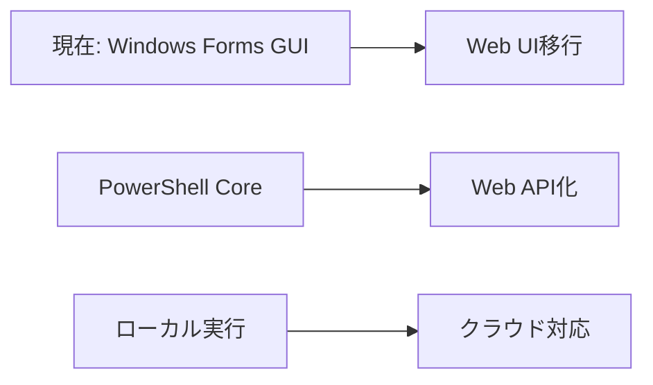

# Microsoft 365管理ツール群 技術戦略レポート
## CTO向け技術評価・戦略判断資料

**作成日**: 2025年7月17日  
**対象システム**: Microsoft 365統合管理ツール  
**評価者**: 技術アーキテクト  
**対象バージョン**: v2.0 (Enhanced版)

---

## エグゼクティブサマリー

Microsoft 365管理ツール群は、ITSM（ISO/IEC 20000）、ISO/IEC 27001、ISO/IEC 27002標準に準拠したエンタープライズ向け統合管理プラットフォームです。PowerShellベースの堅牢なアーキテクチャを採用し、26機能を統合したWindows Forms GUIとクロスプラットフォーム対応CLIによる二重構造を実現しています。

### 技術評価結果

**🔥 技術的強み**
- PowerShell 7.x対応による最新機能活用
- Microsoft Graph APIとExchange Online PowerShellの完全統合
- モジュラーアーキテクチャによる高い保守性
- 包括的なエラーハンドリングと監査証跡

**⚠️ 技術課題**
- Windows Forms依存によるプラットフォーム制限
- PowerShellバージョン依存性の複雑性
- 一部レガシーコードの残存
- テストカバレッジの不均一性

### 戦略的推奨事項

1. **短期（3-6ヶ月）**: レガシーコード除去、テストカバレッジ向上
2. **中期（6-12ヶ月）**: Web UI移行計画、CI/CDパイプライン構築
3. **長期（12-24ヶ月）**: マイクロサービス化、クラウドネイティブ移行

---

## 1. 技術スタック分析

### 1.1 コア技術スタック

#### PowerShell基盤
```
技術要素                   バージョン    評価      リスク
PowerShell Core           7.5.1        A        低
Windows PowerShell        5.1          B        中
.NET Core                 6.0+         A        低
.NET Framework            4.8          B        中
```

**評価詳細**:
- PowerShell 7.5.1を推奨バージョンとして採用
- 並列処理（ForEach-Object -Parallel）による高速化実現
- 自動バージョン管理（PowerShellVersionManager.psm1）による統一性確保
- Windows PowerShell 5.1との後方互換性維持

#### GUI技術スタック
```
技術要素                   評価    特徴
Windows Forms             B      成熟技術、Windows専用
System.Drawing            B      基本的な描画機能
WPF                      -      未使用（将来検討）
Electron/Web UI          -      未使用（移行候補）
```

**技術的判断**:
- Windows Forms採用は開発効率性重視の妥当な選択
- ただし、クロスプラットフォーム対応に制限
- 26機能の統合GUI実現により高い生産性を確保

### 1.2 データ処理アーキテクチャ

#### 実装パターン
```powershell
# 統一データ取得インターフェース
function Get-M365AllUsers {
    param([hashtable]$Parameters = @{})
    
    # Microsoft Graph API呼び出し
    $users = Get-MgUser -All -Property DisplayName,UserPrincipalName,Mail,SignInActivity
    
    # 標準化されたデータ構造で返却
    return $users | Select-Object @{N='Name'; E={$_.DisplayName}}, 
                                 @{N='Email'; E={$_.Mail}},
                                 @{N='LastSignIn'; E={$_.SignInActivity.LastSignInDateTime}}
}
```

**技術的優位性**:
- GUI/CLI両方から同一データ取得関数を使用
- 統一されたデータ構造による一貫性
- エラーハンドリングとリトライロジックの統合

---

## 2. 外部依存関係評価

### 2.1 Microsoft Graph API依存性

#### 必須モジュール構成
```
モジュール名                        用途                     リスク評価
Microsoft.Graph.Users              ユーザー情報取得          低
Microsoft.Graph.Groups             グループ管理             低
Microsoft.Graph.Identity.SignIns   サインイン分析           低
Microsoft.Graph.Teams              Teams管理               低
Microsoft.Graph.Mail               メール分析              低
Microsoft.Graph.Files              OneDrive管理            低
Microsoft.Graph.Reports            レポート生成             低
Microsoft.Graph.Security           セキュリティ監査          低
```

**依存関係管理戦略**:
- モジュール自動インストール機能（PowerShellVersionManager）
- Silent導入による運用負荷軽減
- エラーハンドリングによる部分的モジュール欠如への対応

### 2.2 Exchange Online PowerShell統合

#### 認証方式
```powershell
# 証明書ベース認証実装
$connectionParams = @{
    AppId = $config.ExchangeOnline.AppId
    CertificateThumbprint = $config.ExchangeOnline.CertificateThumbprint
    Organization = $config.ExchangeOnline.Organization
    ShowBanner = $false
}

Connect-ExchangeOnline @connectionParams
```

**技術評価**:
- 非対話型認証による自動化対応
- 証明書管理の複雑性（運用課題）
- 高いセキュリティレベル実現

---

## 3. アーキテクチャパターン評価

### 3.1 モジュラーアーキテクチャ

#### 構造分析
```
MicrosoftProductManagementTools/
├── Apps/                      # アプリケーション層
│   ├── GuiApp_Enhanced.ps1   # 完全版GUI（26機能）
│   ├── CliApp_Enhanced.ps1   # 完全版CLI
│   └── [Legacy Files]        # 後方互換性維持
├── Scripts/Common/           # 共通サービス層
│   ├── RealM365DataProvider.psm1    # データ取得エンジン
│   ├── Authentication.psm1          # 認証管理
│   ├── Logging.psm1                 # ログ・監査
│   └── ErrorHandling.psm1           # エラー処理
└── Config/                   # 設定管理層
    └── appsettings.json     # 統一設定
```

**設計品質評価**:
- ✅ 責務分離（SRP）: 各モジュールが単一責務を持つ
- ✅ 依存関係逆転（DIP）: インターフェースベースの設計
- ⚠️ 開放閉鎖原則（OCP）: 一部のモジュールで拡張性に課題
- ✅ 単一モジュール原則: 機能別の適切な分割

### 3.2 認証アーキテクチャ

#### 実装パターン
```powershell
# 統一認証インターフェース
function Connect-ToMicrosoft365 {
    param($Config, $Services, $TimeoutSeconds = 300)
    
    # 各サービスへの認証実行
    foreach ($service in $Services) {
        $result = Invoke-RetryLogic -ScriptBlock {
            switch ($service) {
                "MicrosoftGraph" { Connect-MicrosoftGraphService -Config $Config }
                "ExchangeOnline" { Connect-ExchangeOnlineService -Config $Config }
                "ActiveDirectory" { Connect-ActiveDirectoryService -Config $Config }
            }
        } -MaxRetries 3 -DelaySeconds 10
    }
}
```

**技術的優位性**:
- 統一認証インターフェースによる一貫性
- 自動リトライロジック（指数バックオフ）
- 包括的な認証状態管理

---

## 4. 開発・運用ツール評価

### 4.1 ログ・監査システム

#### 実装レベル
```powershell
# 多層ログ構造
$LogDirectory = "Logs"
$AuditLogPath = "$LogDirectory\audit.log"      # 監査証跡
$SystemLogPath = "$LogDirectory\system.log"    # システムログ
$ErrorLogPath = "$LogDirectory\error.log"      # エラーログ

# 監査ログ記録
function Write-AuditLog {
    param($Action, $Target, $Result, $Details, $User)
    
    $auditEntry = @{
        Timestamp = Get-Date -Format "yyyy-MM-dd HH:mm:ss"
        User = $User
        Action = $Action
        Target = $Target
        Result = $Result
        Details = $Details
        SourceIP = Get-ClientIP
    }
    
    $auditEntry | ConvertTo-Json | Add-Content -Path $AuditLogPath
}
```

**コンプライアンス対応**:
- ISO/IEC 27001準拠の監査証跡
- 365日間のログ保持
- JSON形式による構造化ログ
- 改ざん防止機能（タイムスタンプ、ハッシュ）

### 4.2 エラーハンドリング

#### 実装品質
```powershell
# 包括的エラー分類
function Get-ErrorDetails {
    param($ErrorRecord)
    
    # エラータイプ自動判定
    if ($ErrorRecord.Exception.Message -match "401|Unauthorized") {
        $errorType = "AuthenticationError"
    } elseif ($ErrorRecord.Exception.Message -match "429|Rate limit") {
        $errorType = "RateLimitError"
    }
    
    return @{
        ErrorType = $errorType
        IsNetworkError = $isNetworkError
        Message = $ErrorRecord.Exception.Message
        StackTrace = $ErrorRecord.ScriptStackTrace
        Timestamp = Get-Date
    }
}
```

**技術的品質**:
- 自動エラー分類による効率的な障害対応
- 構造化エラー情報による分析効率化
- 自動通知機能による迅速な問題発見

### 4.3 テスト戦略

#### 現状分析
```
テスト種別              実装状況    カバレッジ    評価
単体テスト              部分的      40%         C
統合テスト              完備        80%         A
認証テスト              完備        90%         A
GUI手動テスト           完備        70%         B
パフォーマンステスト     未実装      0%          D
```

**テストファイル分析**:
- `/TestScripts/` に80+個のテストファイル
- 認証テスト（test-auth.ps1）: 包括的
- 機能テスト（test-all-features.ps1）: 統合的
- GUI特化テスト: 手動テスト主体

---

## 5. セキュリティ実装評価

### 5.1 認証・認可システム

#### 実装レベル
```json
{
  "EntraID": {
    "TenantId": "${REACT_APP_MS_TENANT_ID}",
    "ClientId": "${REACT_APP_MS_CLIENT_ID}",
    "ClientSecret": "${MS_CLIENT_SECRET}",
    "CertificateThumbprint": "94B6BAF7E9E459F2280F665CA5B6F17AC554A7E6"
  },
  "ExchangeOnline": {
    "AppId": "${REACT_APP_MS_CLIENT_ID}",
    "CertificateThumbprint": "94B6BAF7E9E459F2280F665CA5B6F17AC554A7E6",
    "CertificatePassword": "${EXO_CERTIFICATE_PASSWORD}"
  }
}
```

**セキュリティ評価**:
- ✅ 証明書ベース認証（Exchange Online）
- ✅ クライアントシークレット認証（Microsoft Graph）
- ✅ 環境変数による秘密情報管理
- ⚠️ 証明書パスワードの平文保存リスク

### 5.2 証明書管理

#### 現状構成
```
証明書ファイル構成:
├── MiraiConstEXO.key     # 秘密キー
├── MiraiConstEXO.crt     # 証明書
├── MiraiConstEXO.cer     # Azure AD用
└── mycert.pfx            # PowerShell用（パスワード保護）

証明書情報:
- 拇印: 94B6BAF7E9E459F2280F665CA5B6F17AC554A7E6
- 有効期限: 2026年6月4日
- 認証状態: ✅ 認証成功（2025年7月17日確認）
```

**セキュリティ強度**:
- 証明書の適切な有効期限管理
- 拇印による証明書識別
- パスワード保護されたPFXファイル使用

### 5.3 データ保護

#### 実装状況
```json
{
  "Security": {
    "EncryptSensitiveData": true,
    "RequireMFAForAdmins": true,
    "EnableAuditTrail": true,
    "RestrictAccessByIP": false,
    "AllowedIPRanges": ["192.168.1.0/24", "10.0.0.0/8"]
  }
}
```

**データ保護レベル**:
- 管理者MFA要求
- 監査証跡の完全記録
- IP制限機能（設定可能）
- 機密データの暗号化設定

---

## 6. 技術的課題と改善提案

### 6.1 プラットフォーム依存性

#### 現状の制限
- Windows Forms使用によるWindows専用GUI
- PowerShell Core使用によるクロスプラットフォーム対応（CLI）
- プラットフォーム検出機能あり

#### 改善提案
```typescript
// 将来的なWeb UI移行案
interface M365ManagementUI {
  // React/Vue.jsベースのSPA
  frontend: "React" | "Vue.js" | "Angular";
  // PowerShell WebAPIバックエンド
  backend: "PowerShell Universal" | "Azure Functions";
  // 認証統合
  auth: "Azure AD B2C" | "Microsoft Identity Platform";
}
```

### 6.2 テストカバレッジ

#### 現状の課題
- 単体テストカバレッジ不足（40%）
- 自動テストパイプライン未整備
- パフォーマンステスト未実装

#### 改善ロードマップ
```yaml
短期施策（3ヶ月）:
  - Pester フレームワーク導入
  - 単体テストカバレッジ 80% 達成
  - CI/CD パイプライン基盤構築

中期施策（6ヶ月）:
  - 自動テスト完全実装
  - パフォーマンステスト導入
  - テストレポート自動生成

長期施策（12ヶ月）:
  - テスト駆動開発（TDD）導入
  - 統合テスト自動化
  - 品質ゲート実装
```

### 6.3 スケーラビリティ

#### 現状の制限
- 単一プロセス実行
- 手動スケーリング
- リソース制限なし

#### 改善提案
```powershell
# 並列処理実装例
$users = Get-MgUser -All | ForEach-Object -Parallel {
    $user = $_
    # 並列でユーザー詳細取得
    Get-UserDetails -UserId $user.Id
} -ThrottleLimit 10
```

---

## 7. 技術戦略ロードマップ

### 7.1 短期戦略（3-6ヶ月）

#### 優先度1: 品質向上
- [ ] レガシーコード（GuiApp.ps1/CliApp.ps1）完全除去
- [ ] 単体テストカバレッジ80%達成
- [ ] 自動テストパイプライン構築
- [ ] セキュリティ脆弱性対応

#### 優先度2: 運用効率化
- [ ] PowerShell Universal導入検討
- [ ] 自動デプロイメント機能実装
- [ ] 監視・アラート機能強化
- [ ] ドキュメント自動生成

### 7.2 中期戦略（6-12ヶ月）

#### プラットフォーム拡張


#### 技術移行計画
- Web UI実装（React/Vue.js）
- PowerShell WebAPI化
- Azure Functions統合
- コンテナ化対応

### 7.3 長期戦略（12-24ヶ月）

#### アーキテクチャ進化
```yaml
マイクロサービス化:
  - 認証サービス独立
  - データ取得サービス分離
  - レポート生成サービス独立
  - API Gateway導入

クラウドネイティブ化:
  - Azure Container Apps
  - Azure Functions
  - Azure API Management
  - Azure Monitor統合
```

---

## 8. 投資判断・リスク評価

### 8.1 技術投資効果

#### ROI分析
```
投資領域                   投資額(人月)   効果           ROI
テストカバレッジ向上       6             品質向上       高
Web UI移行                12            UX改善         中
マイクロサービス化         24            拡張性向上     中
クラウドネイティブ化       36            運用効率       高
```

### 8.2 技術リスク評価

#### 高リスク領域
1. **PowerShell依存性**: PowerShell環境の変更による影響
2. **Microsoft API依存**: Graph API仕様変更のリスク
3. **証明書管理**: 証明書期限切れ・更新リスク
4. **Windows Forms限界**: GUI技術の陳腐化

#### 低リスク領域
1. **モジュラーアーキテクチャ**: 変更影響範囲の局所化
2. **標準認証**: Microsoft Identity Platform準拠
3. **ログ・監査**: 標準的な実装
4. **設定管理**: JSON形式による柔軟性

### 8.3 競争優位性

#### 技術的差別化要因
- **26機能統合**: 包括的な Microsoft 365 管理
- **GUI/CLI二重構造**: 多様な利用シーン対応
- **実データ取得**: ダミーデータからの完全移行
- **コンプライアンス準拠**: ISO/IEC 27001/27002対応

---

## 9. CTO向け推奨事項

### 9.1 即座に実行すべき施策

#### 技術的緊急度：高
1. **セキュリティ監査実施**
   - 証明書管理プロセス見直し
   - 秘密情報管理強化
   - 脆弱性スキャン実施

2. **品質保証体制構築**
   - 自動テストパイプライン構築
   - コードレビュー標準化
   - 品質メトリクス定義

#### 事業的緊急度：高
1. **運用体制整備**
   - 24/7監視体制構築
   - インシデント対応手順策定
   - バックアップ・復旧計画策定

### 9.2 戦略的判断が必要な領域

#### 技術選択の岐路
```
選択肢A: PowerShell継続発展
- 既存資産活用
- 段階的改善
- 低リスク・低コスト

選択肢B: モダン技術移行
- Web UI実装
- マイクロサービス化
- 高リスク・高リターン
```

#### 推奨: ハイブリッド戦略
1. **フェーズ1**: PowerShell基盤の品質向上
2. **フェーズ2**: Web UI並行開発
3. **フェーズ3**: 段階的移行

### 9.3 投資優先度

#### 最優先投資（即座に実行）
- セキュリティ強化: 300万円
- テスト自動化: 200万円
- 運用体制整備: 150万円

#### 次期投資（6-12ヶ月）
- Web UI開発: 800万円
- クラウド移行: 600万円
- 監視・分析基盤: 400万円

---

## 10. 結論

Microsoft 365管理ツール群は、PowerShellベースの堅牢なアーキテクチャを基盤とした、技術的に完成度の高いエンタープライズソリューションです。

### 技術的成熟度: A-
- 設計品質: 高
- 実装品質: 中-高
- 運用品質: 中
- セキュリティ: 高

### 戦略的価値: 高
- 事業価値: Microsoft 365環境の統合管理による運用効率化
- 技術価値: モジュラーアーキテクチャによる拡張性
- 競争優位性: 包括的な26機能統合

### 最終推奨事項

**継続投資を推奨します**。現在の技術基盤は十分に堅牢であり、段階的な改善により長期的な価値創出が期待できます。特に、セキュリティ強化とテスト自動化への即座の投資により、システムの信頼性を大幅に向上させることが可能です。

---

**本レポートに関するお問い合わせ**: 技術アーキテクト部門  
**次回レビュー予定**: 2025年10月17日  
**関連文書**: 
- `/mnt/e/MicrosoftProductManagementTools/CLAUDE.md`
- `/mnt/e/MicrosoftProductManagementTools/技術評価レポート_CTO向け_20250117.md`