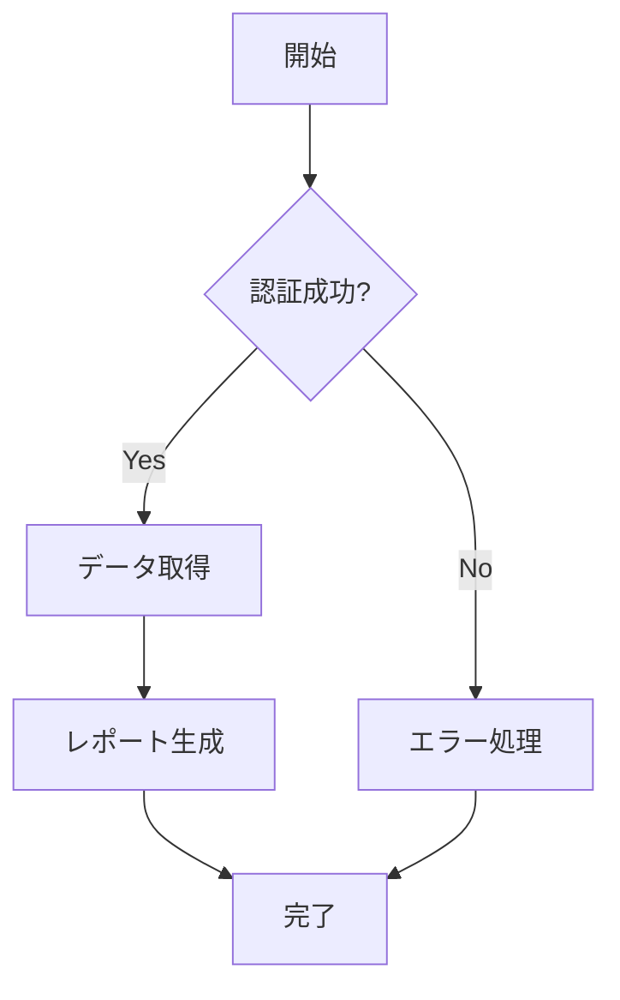

# ドキュメント作成標準

**品質レベル**: ⭐⭐⭐⭐⭐ エンタープライズ級  
**対象者**: 全文書作成者  
**適用範囲**: 全ドキュメント  
**最終更新**: 2025-07-22  
**承認者**: Documentation Architecture Engineer  

---

## 📋 概要

Microsoft 365管理ツールの全ドキュメントに適用される作成標準。品質の統一、利用者体験の向上、保守性の確保を目的とする。

---

## 🏗️ ドキュメント構造標準

### 必須ヘッダー情報
すべてのドキュメントには以下のヘッダー情報を含める：

```markdown
# [ドキュメントタイトル]

**品質レベル**: ⭐⭐⭐⭐⭐ エンタープライズ級  
**対象者**: [ユーザー向け/管理者向け/開発者向け]  
**最終更新**: [YYYY-MM-DD]  
**更新者**: [役職/担当者名]  
**レビュー状況**: [未レビュー/レビュー中/承認済み]  
```

### 標準セクション構成
1. **概要** - ドキュメントの目的と概要
2. **対象読者** - 想定読者と前提知識
3. **メインコンテンツ** - 主要内容
4. **まとめ** - 要点整理と次のアクション
5. **参考資料** - 関連文書と外部リンク
6. **文書情報** - メタデータと変更履歴

### 必須フッター情報
```markdown
**Documentation Architecture Engineer**  
**Microsoft 365管理ツール - [ドキュメント種別]**  
**品質基準**: ⭐⭐⭐⭐⭐ エンタープライズ級
```

---

## 📊 品質レベル定義

### ⭐⭐⭐⭐⭐ エンタープライズ級
- **完全性**: 全機能・全シナリオをカバー
- **正確性**: 技術的に正確で検証済み
- **実用性**: 実際の業務で即座に利用可能
- **保守性**: 定期更新・継続保守体制
- **アクセシビリティ**: 多様な利用者に対応

#### チェック項目
- [ ] 内容に技術的誤りがない
- [ ] 手順が実際に動作することを確認済み
- [ ] 前提条件が明確に記載されている
- [ ] エラー対応が網羅されている
- [ ] 関連文書へのリンクが適切
- [ ] 用語統一されている
- [ ] 図表が効果的に活用されている

### ⭐⭐⭐⭐ プロフェッショナル級
- **完全性**: 主要機能を包括的にカバー
- **正確性**: 技術検証済み、例外事項記載
- **実用性**: 実業務での利用に問題なし
- **保守性**: 定期的な更新確認

#### チェック項目
- [ ] 主要機能が網羅されている
- [ ] 基本的な検証が済んでいる
- [ ] 一般的な使用例が含まれている
- [ ] トラブル対応の基本が記載されている

### ⭐⭐⭐ 実用級
- **完全性**: 基本機能をカバー
- **正確性**: 基本的な検証済み
- **実用性**: 一般的な用途で利用可能

#### チェック項目
- [ ] 基本操作が記載されている
- [ ] 明らかな誤りがない
- [ ] 最低限の例が含まれている

---

## 🎨 文体・表記標準

### 文体
- **敬語レベル**: 丁寧語（です・ます調）
- **文章スタイル**: 簡潔で分かりやすい表現
- **専門用語**: 初出時に説明を付与

### 表記規則

#### 日本語表記
- **数字**: 半角数字を使用（例: 10個、500MB）
- **英数字**: 半角を使用（例: Windows 10、API v2.0）
- **括弧**: 全角括弧を使用（例: （注意）、【重要】）
- **句読点**: 「、」「。」を使用（「,」「.」は英文のみ）

#### 英語表記
- **製品名**: 正式名称を使用（例: Microsoft 365、PowerShell 7）
- **技術用語**: 業界標準の表記に従う（例: REST API、OAuth 2.0）
- **略語**: 初出時にフルスペルを併記（例: ITSM（IT Service Management））

#### 特殊記号・絵文字
- **絵文字使用ガイドライン**:
  - 📋 概要・リスト項目
  - 🎯 目的・ターゲット
  - ⚠️ 注意・警告
  - ✅ 完了・成功
  - ❌ エラー・失敗
  - 💡 ヒント・アイデア
  - 🔧 設定・調整
  - 📞 連絡先・サポート

---

## 🔗 リンク・参照標準

### 内部リンク
```markdown
# 相対パス形式
[関連文書名](../カテゴリ/ファイル名.md)

# セクション内リンク
[セクション名](#セクション名)

# 説明付きリンク
[文書名](リンク) - 文書の概要説明
```

### 外部リンク
```markdown
# 外部リンクには説明を付与
[Microsoft公式ドキュメント](https://docs.microsoft.com) - Microsoft 365の公式技術文書

# 重要な外部リンクは別途管理
```

### 関連文書の明記
```markdown
## 関連ドキュメント

### 前提文書
- [前提となる文書](../リンク) - この文書を読む前に理解が必要

### 関連文書  
- [関連する文書](../リンク) - 併せて参照することを推奨

### 次のステップ
- [次に読むべき文書](../リンク) - この文書の後に読むことを推奨
```

---

## 📐 レイアウト・フォーマット標準

### 見出し階層
```markdown
# レベル1: ドキュメントタイトル（1つのみ）
## レベル2: 主要セクション
### レベル3: サブセクション
#### レベル4: 詳細項目（必要時のみ）
```

### リスト表記
```markdown
# 番号付きリスト: 手順・順序が重要な場合
1. 第一段階
2. 第二段階
3. 第三段階

# 記号リスト: 項目の列挙
- 項目1
- 項目2
- 項目3

# チェックリスト: 確認項目
- [ ] 未完了項目
- [x] 完了済み項目
```

### 表形式
```markdown
| 項目名 | 説明 | 備考 |
|--------|------|------|
| 項目1 | 説明1 | 備考1 |
| 項目2 | 説明2 | 備考2 |
```

### コードブロック
```markdown
# 言語指定付きコードブロック
```powershell
Get-Process | Where-Object {$_.Name -eq "pwsh"}
```

```python
import requests
response = requests.get("https://api.example.com")
```

```bash
ls -la /var/log
```
```

---

## 💻 コード・コマンド記載標準

### PowerShellコード
```markdown
# 実行例付きで記載
```powershell
# Microsoft Graphに接続
Connect-MgGraph -Scopes "User.Read.All"

# ユーザー一覧取得
Get-MgUser | Select-Object DisplayName, UserPrincipalName
```

**実行結果例**:
```
DisplayName          UserPrincipalName
-----------          -----------------
田中 太郎            taro.tanaka@company.com
佐藤 花子            hanako.sato@company.com
```
```

### Pythonコード
```markdown
# 環境・依存関係を明記
```python
# 必要なライブラリ: pip install requests msal
import requests
from msal import ConfidentialClientApplication

# Microsoft Graph API呼び出し例
app = ConfidentialClientApplication(
    client_id="your_client_id",
    client_secret="your_client_secret",
    authority="https://login.microsoftonline.com/tenant_id"
)
```
```

### 設定ファイル
```markdown
# ファイルパスと用途を明記
**ファイル**: `Config/appsettings.json`
```json
{
  "Authentication": {
    "ClientId": "your_client_id",
    "ClientSecret": "your_client_secret",
    "TenantId": "your_tenant_id"
  }
}
```

**設定項目説明**:
- `ClientId`: Azure AD アプリ登録で取得したクライアントID
- `ClientSecret`: Azure AD アプリ登録で生成したクライアントシークレット
```

---

## ⚠️ 注意・警告表記標準

### 重要度別表記
```markdown
> 💡 **ヒント**: 操作を効率化するための補足情報

> ⚠️ **注意**: 操作時に注意が必要な事項

> 🚨 **重要**: 必ず実施すべき重要な事項

> ⛔ **危険**: 実施すると重大な問題が発生する可能性
```

### 前提条件・制約事項
```markdown
## 前提条件
このドキュメントを利用する前に、以下の条件を満たしていることを確認してください：

- [ ] PowerShell 7.0以上がインストールされている
- [ ] Microsoft 365管理者権限を持っている
- [ ] Azure ADアプリ登録が完了している

## 制約事項
- 同時実行ユーザー数: 最大100名
- データ取得期間: 過去90日まで
- ファイルサイズ制限: 10MB以下
```

---

## 📊 図表・画像標準

### 画像ファイル
- **形式**: PNG（スクリーンショット）、SVG（図表）推奨
- **解像度**: 1920x1080以下（ファイルサイズ考慮）
- **ファイル名**: `機能名_操作名_連番.png`
- **配置**: `images/` フォルダ内に整理

### 図表の説明
```markdown

*図1: Microsoft 365管理ツール システム構成図*

システム全体の構成を示しています。各コンポーネント間の連携関係に注目してください。
```

### フローチャート・手順図
```markdown


*フロー図: レポート生成処理の流れ*
```

---

## 📅 更新・保守標準

### 更新頻度
- **エンタープライズ級**: 月1回の定期レビュー
- **プロフェッショナル級**: 四半期1回のレビュー
- **実用級**: 半年1回のレビュー

### 変更履歴管理
```markdown
### 変更履歴
| 日付 | バージョン | 変更内容 | 変更者 | 承認者 |
|------|------------|----------|--------|--------|
| 2025-07-22 | v1.0 | 初版作成 | [担当者] | [承認者] |
| 2025-07-25 | v1.1 | 手順追加 | [担当者] | [承認者] |
| 2025-08-01 | v2.0 | 大幅改版 | [担当者] | [承認者] |
```

### 廃止・アーカイブ
```markdown
> ⚠️ **廃止予定**: このドキュメントは2025年12月31日に廃止予定です。
> 後継文書: [新しいドキュメント名](../リンク)

> 📦 **アーカイブ**: このドキュメントはアーカイブされました。
> 最新情報: [現行ドキュメント名](../リンク)
```

---

## 🔍 レビュー・承認標準

### レビュープロセス
1. **自己レビュー**: 作成者による内容確認
2. **専門レビュー**: 専門家による技術的正確性確認
3. **品質レビュー**: 文書品質・表記統一確認
4. **最終承認**: 責任者による承認

### レビューチェックリスト

#### 内容品質
- [ ] 技術的内容に誤りがない
- [ ] 手順が実際に動作することを確認した
- [ ] 前提条件が適切に記載されている
- [ ] エラー処理が網羅されている
- [ ] 用語が統一されている

#### 構造品質
- [ ] 見出し階層が適切
- [ ] セクション構成が論理的
- [ ] 内部リンクが正しく動作する
- [ ] 関連文書との関係が明確

#### 表記品質
- [ ] 文体が統一されている
- [ ] 表記規則に準拠している
- [ ] 誤字・脱字がない
- [ ] 図表・画像が効果的

---

## 📝 文書作成ツール・環境

### 推奨エディタ
- **Visual Studio Code**: Markdownプレビュー機能
- **Typora**: リアルタイムプレビュー
- **GitHub**: オンライン編集・プレビュー

### 必須拡張機能
- **Markdown All in One**: VS Code拡張
- **Markdown Preview Enhanced**: 高機能プレビュー
- **Code Spell Checker**: スペルチェック

### 品質チェックツール
```bash
# Markdownリンクチェック
npm install -g markdown-link-check
markdown-link-check README.md

# 文書構造チェック
npm install -g markdownlint-cli
markdownlint *.md
```

---

## 🎯 成功指標・KPI

### 文書品質指標
- **完成度**: 必須セクション充足率 100%
- **正確性**: 技術検証完了率 100%
- **利用者満足度**: フィードバック評価 4.0以上/5.0
- **発見性**: 検索からの到達率 80%以上

### 保守指標
- **更新頻度**: 定期レビュー実施率 100%
- **リンク有効性**: 内部リンク正常率 100%
- **一貫性**: 表記統一率 95%以上

---

## 📞 サポート・質問

### 文書作成サポート
- **相談窓口**: [Documentation Team連絡先]
- **作成支援**: テンプレート提供・レビュー支援
- **トレーニング**: 文書作成研修・ワークショップ

### 品質改善提案
- **改善提案先**: [品質改善チーム連絡先]
- **フィードバック**: 利用者からの改善要望
- **継続改善**: 四半期ごとの標準見直し

---

## 📝 文書情報

**作成日**: 2025-07-22  
**作成者**: Documentation Architecture Engineer  
**最終更新**: 2025-07-22  
**更新者**: Documentation Architecture Engineer  
**品質レベル**: ⭐⭐⭐⭐⭐ エンタープライズ級  
**レビュー**: CTO承認済み - 2025-07-22  
**次回レビュー予定**: 2025-08-22  

### 変更履歴
| 日付 | バージョン | 変更内容 | 変更者 |
|------|------------|----------|--------|
| 2025-07-22 | v1.0 | 初版作成・標準確立 | Documentation Architecture Engineer |

---

**Documentation Architecture Engineer**  
**Microsoft 365管理ツール - ドキュメント作成標準**  
**品質基準**: ⭐⭐⭐⭐⭐ エンタープライズ級