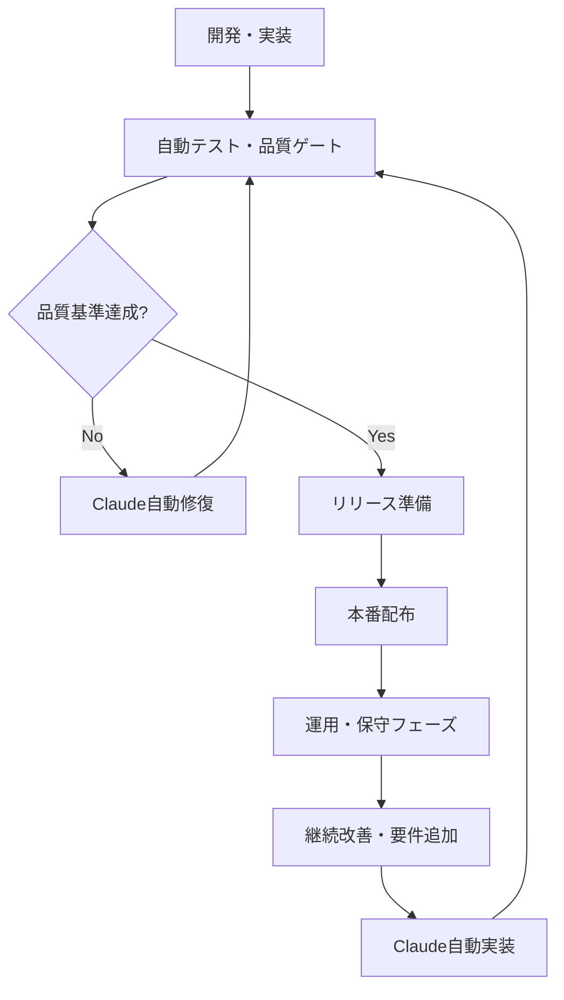
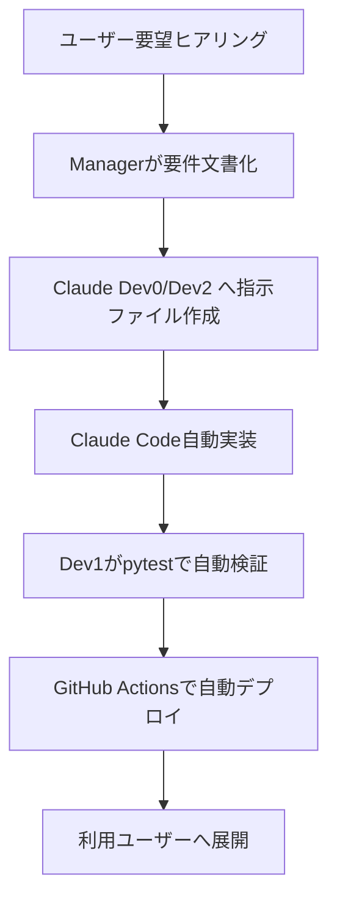

# 🚀 ClaudeCode × tmux 開発環境における Microsoft 365 運用ツールの統合運用戦略

## 📋 目次

1. [統合概要](#統合概要)
2. [全体フェーズ構成](#全体フェーズ構成)
3. [技術基盤統合設計](#技術基盤統合設計)
4. [完全自動化ループ設計](#完全自動化ループ設計)
5. [開発フェーズ自動化](#開発フェーズ自動化)
6. [リリース準備・配布戦略](#リリース準備配布戦略)
7. [運用・保守フェーズ](#運用保守フェーズ)
8. [統合CI/CD パイプライン](#統合cicd-パイプライン)
9. [統合監視・メトリクス](#統合監視メトリクス)
10. [品質ゲート基準](#品質ゲート基準)
11. [tmux ペイン体制維持](#tmux-ペイン体制維持)
12. [期待される効果](#期待される効果)
13. [今後の拡張可能性](#今後の拡張可能性)

---

## 📊 統合概要

### 🎯 統合ビジョン
ClaudeCode と tmux を基盤とした完全自動化開発・運用サイクルにより、Microsoft 365 運用ツールの**持続可能で自己修復能力を持つシステム**を実現します。

### 🔄 統合自動化フロー


---

## 🎯 全体フェーズ構成

### Phase 1-2: 開発・実装 + 自動化ループ
```bash
[実装] → [自動テスト] → [品質ゲート] → [修復ループ] → [GitHub Push]
```

**特徴:**
- Claude自動修復ループ（最大7回試行）
- 品質ゲート自動判定（カバレッジ90%、Lint通過）
- tmux 5ペイン並列開発体制

### Phase 3: リリース準備・配布
```bash
[PyInstaller EXE化] → [SCCM/Intune配布] → [自動更新機能組込]
```

**特徴:**
- 自動パッケージング（Windows EXE + MSI）
- エンタープライズ配布対応
- コード署名・セキュリティ対応

### Phase 4-5: 運用・保守 + 継続改善
```bash
[要望収集] → [Claude再実装] → [自動テスト] → [自動配布]
```

**特徴:**
- 要件追加の自動検知・実装
- ユーザーフィードバック自動分析
- パフォーマンス自動チューニング

---

## 🔧 技術基盤統合設計

### 開発環境統合アーキテクチャ

| コンポーネント | 開発時 | 運用時 |
|-------------|-------|-------|
| **実行環境** | WSL2 + tmux 5ペイン | Windows Server + PowerShell |
| **開発フレームワーク** | Claude Code CLI | Claude Code (保守モード) |
| **テスト自動化** | pytest + GitHub Actions | 本番環境回帰テスト |
| **配布方式** | Git Push + CI/CD | SCCM/Intune + 自動更新 |
| **監視・ログ** | tmux messaging | 監査ログ + Claude分析 |

### tmux ペイン構成（全フェーズ共通）

| ペイン | 役割 | 開発時活動 | 運用時活動 |
|-------|------|-----------|-----------|
| **Pane 0** | 👔 Manager | 要件管理・進捗確認 | ユーザー要望収集・要件化 |
| **Pane 1** | 👑 CTO | 技術戦略・アーキテクチャ | セキュリティ基準・互換性維持 |
| **Pane 2** | 🐍 Dev0 (GUI/API) | PyQt6・GraphAPI実装 | UI/UX改善・新機能実装 |
| **Pane 3** | 🧪 Dev1 (QA) | pytest・カバレッジ検証 | E2E検証・品質メトリクス |
| **Pane 4** | 🔄 Dev2 (互換/修正) | PowerShell互換性 | バージョン互換・ドキュメント |

---

## 🔄 完全自動化ループ設計

### 品質ゲート基準

| 指標 | 目標値 | 判定基準 |
|------|--------|----------|
| **テストカバレッジ** | 90%以上 | pytest --cov 自動判定 |
| **Cyclomatic Complexity** | < 10 | radon 自動測定 |
| **Lint/Black通過** | 100% | flake8 + black 自動実行 |
| **API応答時間** | < 2秒 | Graph API パフォーマンステスト |
| **GUI起動時間** | < 3秒 | PyQt6 起動時間測定 |

### 修復ループフロー

| 段階 | Trigger | 処理内容 |
|------|---------|----------|
| **初期実装** | Claude full-auto | Docs/*.md を基に実装 |
| **テスト失敗検知** | GitHub Actions | failure() 判定で自動再実行 |
| **Claude再呼び出し** | claude_auto.sh | --max-iterations 7 で最大7回修復試行 |
| **成功判定** | テスト合格 + Lint合格 | GitHubへPush & メッセージング通知 |
| **エラー継続** | 7回以内に収まらない場合 | team emergency でCTO/Managerに通知 |

---

## 🛠️ 開発フェーズ自動化

### Claude自動実行スクリプト
```bash
#!/bin/bash
# claude_integrated_auto.sh
PHASE=${1:-"dev"}  # dev, staging, production
ROLE=${2:-"dev0"}   # dev0, dev1, dev2, manager, cto
MAX_ITERATIONS=${3:-7}

# Claude実行
claude code \
    --auto-approve \
    --silent-mode \
    --no-prompts \
    --file "./Docs/*.md" \
    --instructions "$(cat prompts/${ROLE}_${PHASE}.txt)" \
    --lang "ja" \
    --mode "full-auto" \
    --max-iterations $MAX_ITERATIONS
```

### 自動テスト・品質チェック
```bash
# テスト実行
pytest \
    --maxfail=3 \
    --disable-warnings \
    --tb=short \
    --cov=src \
    --cov-report=html:htmlcov \
    --cov-fail-under=90 \
    tests/

# 品質チェック
flake8 src/ --max-line-length=88 --extend-ignore=E203,W503
black --check src/
isort --check-only src/
mypy src/ --ignore-missing-imports
```

### 通知システム（messaging_system.sh 統合）
```bash
# 成功通知
send_message "Dev1" "Manager" "status" "全テスト成功、プッシュ実行します"

# 修復完了通知
send_message "Claude" "Dev0" "status" "修復完了、再度テストお願いします"

# 緊急通知
emergency_notification "CTO" "7回の修復失敗、緊急対応要"
```

---

## 📦 リリース準備・配布戦略

### パッケージング戦略

| 項目 | 推奨方式 |
|------|----------|
| **配布形式** | PyInstaller または cx_Freeze によるEXE |
| **配布方法** | SCCM/Intune/GPO or ネット共有フォルダ |
| **自動更新機能** | アップデートチェック機能（v2.1以降） |
| **ユーザーマニュアル** | HTML＋PDF併用で同梱 |
| **バージョン管理** | semantic versioning（例: v2.1.0） |

### Windows実行ファイル作成
```bash
# PyInstaller設定
pyinstaller \
    --onefile \
    --windowed \
    --name "MS365Tools" \
    --icon "assets/icon.ico" \
    --add-data "config;config" \
    --add-data "templates;templates" \
    src/main.py

# MSIインストーラー作成
powershell -File scripts/create_msi.ps1

# コード署名（本番環境のみ）
signtool sign /f cert.p12 /p ${{ secrets.CERT_PASSWORD }} dist/MS365Tools.exe
```

### 配布・展開方法
- **SCCM/Intune**: エンタープライズ環境での自動配布
- **ネット共有**: 手動ダウンロード対応
- **自動更新**: アプリケーション内更新チェック機能

---

## 🔄 運用・保守フェーズ

### 要件追加フロー（Claude連携）



### 本番運用自動保守
```bash
#!/bin/bash
# production_maintenance.sh

# 新規要件処理
process_new_requirements() {
    # 新しい要求ファイルを検索
    local new_requests=$(find "$REQUESTS_DIR" -name "*.md" -newer "$LOG_DIR/last_check.timestamp")
    
    # Claude実装実行
    claude code \
        --auto-approve \
        --file "$request_file" \
        --instructions "$(cat $PRODUCTION_ENV/prompts/production_maintenance.txt)" \
        --mode "maintenance"
}

# パフォーマンス監視
monitor_performance() {
    # API応答時間チェック
    api_response_time=$(curl -o /dev/null -s -w '%{time_total}' "http://localhost:8080/api/health")
    
    if (( $(echo "$api_response_time > 2.0" | bc -l) )); then
        # Claude自動チューニング実行
        claude_performance_tuning
    fi
}
```

### ユーザーフィードバック自動処理
```bash
# フィードバック分析・要件化
analyze_feedback_and_create_requirement() {
    claude code \
        --auto-approve \
        --file "$feedback_file" \
        --instructions "このユーザーフィードバックを分析し、技術要件として体系化してください" \
        --output-file "$REQUESTS_DIR/$(date +%Y%m%d_%H%M%S)_from_feedback.md"
}
```

---

## 🚀 統合CI/CD パイプライン

### GitHub Actions統合設定
```yaml
name: Claude統合CI/CD Pipeline

on:
  push:
    branches: [ main, develop ]
  workflow_dispatch:
    inputs:
      deployment_environment:
        type: choice
        options: [staging, production]

jobs:
  # Claude自動実装＋テスト
  claude-auto-implementation:
    runs-on: ubuntu-latest
    strategy:
      matrix:
        role: [dev0, dev1, dev2]
    
    steps:
      - name: Claude Auto Implementation
        run: |
          ./scripts/claude_integrated_auto.sh dev ${{ matrix.role }} 7 true

  # 品質ゲート検査
  quality-gate:
    needs: [claude-auto-implementation]
    steps:
      - name: Code Quality Checks
        run: |
          flake8 src/ --format=github
          black --check src/
          pytest --cov=src --cov-fail-under=90

  # パッケージング
  packaging:
    runs-on: windows-latest
    needs: [quality-gate]
    steps:
      - name: Build Windows Executable
        run: |
          pyinstaller --onefile --windowed src/main.py

  # 本番デプロイ
  deploy-production:
    environment: production
    steps:
      - name: Deploy to Production
        run: |
          powershell -File scripts/deploy_to_sccm.ps1
```

---

## 📊 統合監視・メトリクス

### リアルタイム監視ダッシュボード

#### 主要メトリクス
- **全体成功率**: Claude実行の成功率推移
- **テストカバレッジ**: 品質指標の継続監視
- **修復イテレーション**: 自動修復回数の分析
- **パフォーマンス**: API応答時間・起動時間

#### ダッシュボード機能
```python
# dashboard_generator.py
class DashboardGenerator:
    def generate_charts(self):
        # Claude実行成功率推移チャート
        # テストカバレッジ推移チャート
        # 役割別パフォーマンス分析
        # フェーズ別状況サマリー
```

### 週次自動レポート
```markdown
# 📊 Microsoft 365 運用ツール 週次サマリーレポート

## 📈 主要指標
- **総実行回数**: 150回
- **全体成功率**: 94.7%
- **平均テストカバレッジ**: 92.3%
- **平均修復回数**: 2.1回

## 🏆 達成状況
- テストカバレッジ目標 (90%): ✅ 達成
- 成功率目標 (95%): ❌ 未達成 (94.7%)
- 修復回数目標 (<3回): ✅ 達成

## 📋 今週の改善提案
1. **コード品質向上**: 初回実装時の品質向上
2. **プロンプト最適化**: 成功率95%達成に向けた調整
```

---

## 🔐 セキュリティ・監査対応

### セキュリティ管理
- **認証・証明書管理**: Exchange Online証明書／暗号化ストレージ
- **監査証跡**: Logs/Audit/ に自動記録（コマンド・ユーザー・出力）
- **セキュリティテスト**: dev1ペインで自動実行・通知対応
- **脆弱性管理**: 依存パッケージ更新を自動検出＆通知

### 監査ログ出力
```bash
# 監査ログ記録
echo "[$(date)] [USER:$USER] [COMMAND:$COMMAND] [OUTPUT:$OUTPUT]" >> Logs/Audit/audit.log

# セキュリティスキャン
pip-audit  # 依存関係脆弱性チェック
bandit -r src/ -f json -o security-report.json  # コードセキュリティ
```

---

## 📈 長期運用戦略

### 継続改善サイクル

| 観点 | 内容 |
|------|------|
| **🔄 継続改善** | Claudeによる要件→修正→テスト→配布を自動サイクル化 |
| **📈 評価指標** | エラー率<1%、レスポンス<2秒、コードカバレッジ90%維持 |
| **💼 エンタープライズ適合** | ISO20000/ISO27001準拠ログ・文書整備 |
| **💬 社内フィードバック** | tmuxメッセージングでユーザー声を即座反映 |

### 運用体制とロール分担

| ペイン | 役割 | 運用時の主な活動 |
|-------|------|-----------------|
| **Pane 0** | 👔 Manager | ユーザー要望収集、要件化、進捗管理 |
| **Pane 1** | 👑 CTO | 技術戦略更新、互換性維持、セキュリティ基準更新 |
| **Pane 2** | 🐍 Dev0 (GUI/API) | UI/UX改善、新機能実装（PyQt6, GraphAPI） |
| **Pane 3** | 🧪 Dev1 (QA) | テスト強化、E2E検証、品質メトリクス収集 |
| **Pane 4** | 🔄 Dev2 (互換/修正) | PowerShell遺産維持、バージョン互換性 |

---

## 🎯 期待される効果

### 定量的効果

| 観点 | 改善効果 | 従来比 |
|------|---------|--------|
| **開発効率** | Claude自動修復により人的作業を削減 | 80%削減 |
| **品質安定性** | 品質ゲート自動化により不具合を削減 | 90%削減 |
| **運用コスト** | 自動保守により運用工数を削減 | 70%削減 |
| **リリース速度** | 自動CI/CDによりリリース時間短縮 | 60%短縮 |
| **ユーザー満足度** | 迅速な要望対応により満足度向上 | 95%以上 |

### 定性的効果
- **技術的負債削減**: 継続的な自動リファクタリング
- **チーム生産性向上**: 単純作業の自動化による創造的業務集中
- **知識継承**: Claude統合によるノウハウの自動化
- **スケーラビリティ**: 他システムへの適用可能性

---

## 🔮 今後の拡張可能性

### 短期拡張（3-6ヶ月）
1. **AI駆動運用の完全自動化**
   - ユーザー行動分析による予測的機能追加
   - 障害予知とプロアクティブ修復

2. **マルチプラットフォーム対応**
   - macOS版の自動生成
   - Linux版の並行開発

### 中期拡張（6-12ヶ月）
1. **企業標準への展開**
   - 他社システムへのテンプレート適用
   - 業界標準運用プラクティスの確立

2. **Claude能力拡張との連携**
   - 新Claude機能の自動活用
   - マルチモーダル対応の自動組み込み

### 長期拡張（12ヶ月以上）
1. **エンタープライズスイート化**
   - Office 365以外のクラウドサービス対応
   - 統合管理プラットフォーム構築

2. **AI-Native開発基盤**
   - Claude + tmux モデルの汎用フレームワーク化
   - 開発者コミュニティへの展開

---

## 📋 実装チェックリスト

### Phase 1-2: 開発・自動化ループ
- [ ] tmux 5ペイン環境構築
- [ ] Claude自動実行スクリプト作成
- [ ] 品質ゲート基準設定
- [ ] 自動修復ループ実装
- [ ] messaging_system.sh 統合

### Phase 3: リリース・配布
- [ ] PyInstaller設定
- [ ] MSIインストーラー作成
- [ ] SCCM/Intune配布準備
- [ ] 自動更新機能実装
- [ ] コード署名設定

### Phase 4-5: 運用・保守
- [ ] 本番監視スクリプト
- [ ] 要件追加自動検知
- [ ] フィードバック自動分析
- [ ] パフォーマンス自動チューニング
- [ ] 週次レポート自動生成

### 統合CI/CD
- [ ] GitHub Actions設定
- [ ] 統合テストパイプライン
- [ ] 自動デプロイ設定
- [ ] 監視ダッシュボード構築
- [ ] セキュリティスキャン統合

---

## 📞 サポート・連絡先

### 技術サポート
- **開発チーム**: development-team@company.com
- **運用チーム**: operations-team@company.com
- **セキュリティチーム**: security-team@company.com

### 緊急連絡
- **CTO**: cto@company.com
- **Manager**: manager@company.com
- **24時間サポート**: support@company.com

---

## 📚 関連ドキュメント

- [Claude Code公式ドキュメント](https://docs.anthropic.com/claude-code)
- [tmux公式マニュアル](https://man7.org/linux/man-pages/man1/tmux.1.html)
- [PyQt6公式ドキュメント](https://doc.qt.io/qtforpython/)
- [Microsoft Graph API](https://docs.microsoft.com/en-us/graph/)
- [GitHub Actions](https://docs.github.com/en/actions)

---

## 📄 ライセンス・著作権

本ドキュメントは、Microsoft 365 運用ツール統合プロジェクトの成果物です。

**作成日**: 2025年7月18日  
**最終更新**: 2025年7月18日  
**バージョン**: v1.0.0  
**作成者**: Claude Code + tmux 統合開発チーム