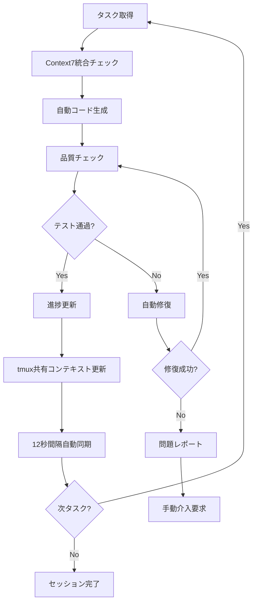

# 🚀 ClaudeCode連携・自動開発ループ詳細スケジュール

**期間**: 2025年7月21日 - 2025年10月14日  
**目標**: Microsoft 365管理ツール Python移行完全版リリース  
**開発形態**: ClaudeCodeMax 5時間制限内での効率的自動開発ループ  
**作成日**: 2025年7月21日  
**最終更新**: 2025年7月21日 12:45 JST  
**Context7統合**: 対応完了  
**起動方式**: claude --dangerously-skip-permissions  

---

## 📋 目次

1. [ClaudeCode利用方針](#claudecode利用方針)
2. [開発作業時間設定](#開発作業時間設定)
3. [自動開発ループ戦略](#自動開発ループ戦略)
4. [週次・日次詳細スケジュール](#週次・日次詳細スケジュール)
5. [自動修復システム設計](#自動修復システム設計)
6. [進捗管理・同期システム](#進捗管理・同期システム)
7. [効率化ベストプラクティス](#効率化ベストプラクティス)

---

## 🎯 1. ClaudeCode利用方針

### 📊 ClaudeCodeMax制限と最適化戦略

#### 利用制限
- **5時間リセット制**: 利用開始から5時間でリセット
- **最大化利用**: リセットギリギリまで活用
- **並列作業**: tmux 6ペイン並列開発環境（Context7統合）
- **自動同期**: 12秒間隔での共有コンテキスト同期
- **起動方式**: claude --dangerously-skip-permissions（権限制約回避）

#### 効率最大化方針
```bash
# 1. 準備時間最小化 (5分以内)
□ 事前準備済み環境利用
□ スクリプト自動実行
□ 設定ファイル事前配置

# 2. 集中作業時間最大化 (4時間50分)
□ 自動コード生成・修復
□ 並列テスト実行
□ リアルタイム品質チェック

# 3. 引き継ぎ準備 (5分)
□ 進捗自動保存
□ 次回作業項目明確化
□ 状況レポート自動生成
```

### 🔄 継続性担保戦略

#### セッション間連携
```bash
# セッション開始時 (自動実行)
1. 前回進捗状況復元
2. 未完了タスク確認
3. 自動テスト実行・結果確認
4. 作業優先度自動算定

# セッション終了時 (自動実行)
1. 作業内容自動コミット
2. 進捗状況保存
3. 次回作業計画生成
4. 品質メトリクス更新
```

---

## ⏰ 2. 開発作業時間設定

### 📅 週次作業スケジュール

| 曜日 | 作業時間 | ClaudeCode利用 | 作業内容 |
|------|----------|----------------|----------|
| **月曜** | 08:30-15:30 (7h) | 5h制限内 | 緊急修復・重要実装 |
| **火曜** | 休み | - | 自動監視・品質チェック |
| **水曜** | 08:30-15:30 (7h) | 5h制限内 | API統合・CLI実装 |
| **木曜** | 休み | - | 自動テスト・レポート生成 |
| **金曜** | 08:30-15:30 (7h) | 5h制限内 | GUI実装・品質保証 |
| **土曜** | 終日 | 5h制限内 | 統合テスト・デバッグ |
| **日曜** | 終日 | 5h制限内 | リファクタリング・ドキュメント |

### 🎯 日次作業フロー

#### Phase 1: 準備・復旧 (08:30-08:35, 5分)
```bash
# 自動実行スクリプト: session_start.sh
□ 前回セッション状況復元
□ 進捗管理システム確認
□ 自動テスト実行・結果確認
□ 今日の作業優先度確認
□ tmux並列開発環境起動
```

#### Phase 2: 集中開発 (08:35-14:25, 4時間50分)
```bash
# メイン開発時間
□ 自動開発ループ実行
□ リアルタイム品質監視
□ 並列テスト・デバッグ
□ 自動修復システム動作
□ 進捗リアルタイム更新
```

#### Phase 3: 完了・引き継ぎ (14:25-14:30, 5分)
```bash
# 自動実行スクリプト: session_end.sh
□ 作業内容自動コミット
□ 進捗状況更新・保存
□ 品質メトリクス更新
□ 次回作業計画生成
□ セッション完了レポート生成
□ tmux_shared_context.md更新
□ Googleカレンダー同期実行
□ Teams + メール通知送信
```

#### 残り時間 (14:30-15:30, 1時間)
```bash
# 非Claude作業時間
□ 手動テスト・検証
□ ドキュメント確認
□ 次回準備・計画調整
□ 外部連携・調整作業
```

---

## 🔄 3. 自動開発ループ戦略

### 🤖 自動開発ループ設計

#### Core Loop Architecture with Context7 Integration


#### 実装フレームワーク
```python
# auto_dev_loop.py
class AutoDevelopmentLoop:
    def __init__(self):
        self.task_queue = TaskQueue()
        self.code_generator = CodeGenerator()
        self.quality_checker = QualityChecker()
        self.auto_fixer = AutoFixer()
        self.progress_tracker = ProgressTracker()
        
    def run_development_session(self):
        """5時間制限内での自動開発セッション実行"""
        session_start = time.time()
        max_duration = 5 * 60 * 60  # 5時間
        
        while (time.time() - session_start) < max_duration:
            # 1. 次タスク取得
            task = self.task_queue.get_next_high_priority()
            if not task:
                break
                
            # 2. 自動コード生成
            code_result = self.code_generator.generate(task)
            
            # 3. 品質チェック
            quality_result = self.quality_checker.check(code_result)
            
            # 4. 自動修復 (必要時)
            if not quality_result.passed:
                fix_result = self.auto_fixer.fix(code_result, quality_result)
                if fix_result.success:
                    quality_result = self.quality_checker.check(fix_result.code)
                    
            # 5. 進捗更新
            self.progress_tracker.update_task(task.id, quality_result)
            
            # 6. 時間チェック・調整
            remaining_time = max_duration - (time.time() - session_start)
            if remaining_time < 300:  # 5分未満
                break
                
        # セッション終了処理
        self.finalize_session()
```

### ⚡ 高速開発パターン

#### Pattern 1: テンプレート駆動開発
```python
# 事前準備済みテンプレート活用
templates = {
    "pyqt6_window": "templates/pyqt6_main_window.py.template",
    "api_client": "templates/graph_api_client.py.template", 
    "cli_command": "templates/click_command.py.template",
    "unit_test": "templates/pytest_unit_test.py.template"
}

def generate_from_template(template_type, config):
    """テンプレートから高速コード生成"""
    template_path = templates[template_type]
    with open(template_path) as f:
        template = Template(f.read())
    return template.render(**config)
```

#### Pattern 2: 漸進的改善
```python
def incremental_improvement(file_path, improvement_target):
    """既存コードの段階的改善"""
    # 1. 現在のコード解析
    current_code = read_file(file_path)
    analysis = analyze_code_quality(current_code)
    
    # 2. 小さな改善実施
    if analysis.test_coverage < 80:
        add_unit_tests(file_path)
    if analysis.complexity > threshold:
        refactor_complex_functions(file_path)
    if analysis.security_issues:
        fix_security_issues(file_path)
        
    # 3. 品質検証
    run_tests_and_verify(file_path)
```

#### Pattern 3: 6ペイン並列実装
```bash
# tmux 6ペイン並列開発パターン（Context7統合）
# Pane 0: 👔 Manager - 進捗監視・優先度調整・チーム調整
# Pane 1: 💼 CTO - 技術判断・アーキテクチャ・戦略決定
# Pane 2: 💻 Dev01 - PyQt6実装・Frontend開発
# Pane 3: 💻 Dev02 - Backend開発・API統合
# Pane 4: 💻 Dev03 - テスト・品質保証
# Pane 5: 🔧 Dev04 - PowerShell専門・Microsoft365自動化

# 共有コンテキスト: tmux_shared_context.md（12秒間隔自動同期）
```

---

## 📅 4. 週次・日次詳細スケジュール

### 🗓️ Phase 1: 緊急修復フェーズ (7/21-8/4, 2週間)

#### Week 1 (7/21-7/27): conftest.py統合・テスト環境修復

**月曜 7/21 (08:30-15:30)**
```bash
# ClaudeCode Session 1 (08:30-13:30)
Priority: P0 - conftest.py競合解消
□ 08:30-08:35: 環境確認・準備
□ 08:35-10:35: conftest.py重複箇所特定・統合設計
□ 10:35-12:35: 自動統合スクリプト実装・実行
□ 12:35-13:25: テスト実行・検証
□ 13:25-13:30: 進捗保存・次回準備

# 非Claude作業 (13:30-15:30)  
□ 手動テスト・結果確認
□ 問題点整理・次回計画調整
```

**水曜 7/23 (08:30-15:30)**
```bash
# ClaudeCode Session 2 (08:30-13:30)
Priority: P0 - pytest設定統一・環境標準化
□ 08:30-08:35: 前回結果確認・復旧
□ 08:35-10:35: pyproject.toml pytest設定統一
□ 10:35-12:35: 仮想環境再構築自動化
□ 12:35-13:25: CI/CDパイプライン基本修復
□ 13:25-13:30: 週中間レポート生成

# 非Claude作業 (13:30-15:30)
□ 依存関係手動確認
□ 設定ファイル最終調整
```

**金曜 7/25 (08:30-15:30)**
```bash
# ClaudeCode Session 3 (08:30-13:30)
Priority: P0 - 依存関係解決・GitHub Actions修正
□ 08:30-08:35: 週末作業準備
□ 08:35-10:35: requirements.txt vs pyproject.toml統一
□ 10:35-12:35: GitHub Actions ワークフロー簡素化
□ 12:35-13:25: 自動テスト復旧・検証
□ 13:25-13:30: Week1完了レポート

# 非Claude作業 (13:30-15:30)
□ 週末作業計画詳細化
□ リスク評価・調整
```

**土曜 7/26 (終日)**
```bash
# ClaudeCode Session 4 (09:00-14:00)
Priority: P0 - 統合テスト・品質チェック
□ 09:00-09:05: 週末集中セッション準備
□ 09:05-11:05: 全体テスト実行・問題特定
□ 11:05-13:05: 自動修復ループ実行
□ 13:05-13:55: 品質メトリクス測定
□ 13:55-14:00: 日曜作業準備

# 非Claude作業 (14:00-18:00)
□ 手動統合テスト
□ パフォーマンス測定
```

**日曜 7/27 (終日)**
```bash
# ClaudeCode Session 5 (09:00-14:00)
Priority: P0 - Week1総仕上げ・Week2準備
□ 09:00-09:05: 最終調整セッション準備
□ 09:05-11:05: 残存問題自動修復
□ 11:05-13:05: ドキュメント自動更新
□ 13:05-13:55: Week2詳細計画生成
□ 13:55-14:00: Week1完了確認

# Week1評価・Go/No-Go判定
Target: pytest成功率90%以上達成
```

#### Week 2 (7/28-8/4): CI/CD完全復旧・開発環境標準化

**月曜 7/28 (08:30-15:30)**
```bash
# ClaudeCode Session 6 (08:30-13:30)
Priority: P0 - CI/CD パイプライン完全復旧
□ 08:30-08:35: Week2開始・目標確認
□ 08:35-10:35: GitHub Actions ワークフロー最適化
□ 10:35-12:35: セキュリティスキャン復旧
□ 12:35-13:25: 自動デプロイメント設定
□ 13:25-13:30: 中間進捗確認

# 非Claude作業 (13:30-15:30)
□ CI/CD手動テスト
□ 権限・設定確認
```

**水曜 7/30 (08:30-15:30)**
```bash
# ClaudeCode Session 7 (08:30-13:30)
Priority: P0 - 開発環境標準化・自動化強化
□ 08:30-08:35: 中盤セッション準備
□ 08:35-10:35: 開発環境自動構築スクリプト
□ 10:35-12:35: 品質監視システム実装
□ 12:35-13:25: 自動修復システム強化
□ 13:25-13:30: 品質指標確認

# 非Claude作業 (13:30-15:30)
□ 環境テスト・検証
□ パフォーマンス測定
```

**金曜 8/1 (08:30-15:30)**
```bash
# ClaudeCode Session 8 (08:30-13:30)
Priority: P0 - Phase1最終確認・Phase2準備
□ 08:30-08:35: 最終仕上げ準備
□ 08:35-10:35: 全システム統合テスト
□ 10:35-12:35: バグ修正・最適化
□ 12:35-13:25: Phase2開発基盤準備
□ 13:25-13:30: Phase1完了評価

# 非Claude作業 (13:30-15:30)
□ Phase1最終確認
□ Phase2詳細計画調整
```

**土曜 8/2 (終日)**
```bash
# ClaudeCode Session 9 (09:00-14:00)
Priority: P0 - 品質保証・安定性確認
□ 09:00-09:05: 週末品質確認準備
□ 09:05-11:05: 全機能品質テスト
□ 11:05-13:05: パフォーマンステスト
□ 13:05-13:55: セキュリティ監査
□ 13:55-14:00: 結果レポート生成

# 非Claude作業 (14:00-18:00)
□ 手動受け入れテスト
□ ユーザー体験確認
```

**日曜 8/3 (終日)**
```bash
# ClaudeCode Session 10 (09:00-14:00)
Priority: P0 - Phase1総括・Go/No-Go最終判定
□ 09:00-09:05: 最終評価セッション準備
□ 09:05-11:05: 全指標測定・評価
□ 11:05-13:05: Phase2詳細スケジュール生成
□ 13:05-13:55: リスク評価・対策立案
□ 13:55-14:00: Go/No-Go判定準備

# Phase1 Go/No-Go 判定 (8/4)
Target: pytest成功率90%以上、CI/CD完全復旧、開発環境標準化完了
```

### 🗓️ Phase 2: Python GUI基盤完成 (8/5-8/18, 2週間)

#### Week 3 (8/5-8/11): PyQt6基盤・メインウィンドウ実装

**月曜 8/5 (08:30-15:30)**
```bash
# ClaudeCode Session 11 (08:30-13:30)
Priority: P1 - PyQt6メインウィンドウ基盤構築
□ 08:30-08:35: Phase2開始・GUI開発準備
□ 08:35-10:35: PyQt6基本アーキテクチャ設計・実装
□ 10:35-12:35: メインウィンドウクラス実装
□ 12:35-13:25: 基本レイアウト・スタイリング
□ 13:25-13:30: GUI基盤進捗確認

# 非Claude作業 (13:30-15:30)
□ GUI手動テスト・操作確認
□ デザイン・UX検討
```

**水曜 8/7 (08:30-15:30)**
```bash
# ClaudeCode Session 12 (08:30-13:30)
Priority: P1 - ログビューア・ステータス表示実装
□ 08:30-08:35: GUI機能拡張準備
□ 08:35-10:35: リアルタイムログビューア実装
□ 10:35-12:35: ステータスバー・プログレス表示
□ 12:35-13:25: エラーハンドリング・メッセージボックス
□ 13:25-13:30: 基本機能動作確認

# 非Claude作業 (13:30-15:30)
□ ログ表示テスト
□ エラーケース確認
```

**金曜 8/9 (08:30-15:30)**
```bash
# ClaudeCode Session 13 (08:30-13:30)
Priority: P1 - 26機能ボタングリッド実装開始
□ 08:30-08:35: ボタングリッド実装準備
□ 08:35-10:35: ボタングリッドレイアウト設計・実装
□ 10:35-12:35: セクション別ボタン配置（定期レポート）
□ 12:35-13:25: クリックイベント基本処理
□ 13:25-13:30: ボタン動作初期確認

# 非Claude作業 (13:30-15:30)
□ ボタンレイアウト調整
□ 操作性確認
```

**土曜 8/10 (終日)**
```bash
# ClaudeCode Session 14 (09:00-14:00)
Priority: P1 - 26機能ボタン完全実装
□ 09:00-09:05: 週末集中ボタン実装準備
□ 09:05-10:05: 分析レポートセクション（5機能）
□ 10:05-11:05: Entra ID管理セクション（4機能）
□ 11:05-12:05: Exchange Online管理セクション（4機能）
□ 12:05-13:05: Teams・OneDrive管理セクション（8機能）
□ 13:05-13:55: 全ボタン動作テスト
□ 13:55-14:00: 週末成果確認

# 非Claude作業 (14:00-18:00)
□ 全機能手動テスト
□ UI/UX最終調整
```

**日曜 8/11 (終日)**
```bash
# ClaudeCode Session 15 (09:00-14:00)
Priority: P1 - PowerShellブリッジ・統合テスト
□ 09:00-09:05: 統合機能実装準備
□ 09:05-11:05: PowerShell版機能呼び出しブリッジ
□ 11:05-13:05: Python-PowerShell統合テスト
□ 13:05-13:55: GUI全体統合テスト
□ 13:55-14:00: Week3完了評価

# Week3評価確認
Target: GUI基本動作100%、主要機能80%動作
```

#### Week 4 (8/12-8/18): GUI機能完成・非同期処理実装

**月曜 8/12 (08:30-15:30)**
```bash
# ClaudeCode Session 16 (08:30-13:30)
Priority: P1 - 非同期処理・ワーカースレッド実装
□ 08:30-08:35: 高度GUI機能実装準備
□ 08:35-10:35: QThread ワーカースレッド基盤
□ 10:35-12:35: レポート生成ワーカー実装
□ 12:35-13:25: プログレス更新・シグナル処理
□ 13:25-13:30: 非同期動作確認

# 非Claude作業 (13:30-15:30)
□ 非同期処理テスト
□ レスポンス性能確認
```

**水曜 8/14 (08:30-15:30)**
```bash
# ClaudeCode Session 17 (08:30-13:30)
Priority: P1 - GUI高度機能・最適化
□ 08:30-08:35: GUI最適化準備
□ 08:35-10:35: メモリ使用量最適化
□ 10:35-12:35: 起動時間短縮・キャッシュ実装
□ 12:35-13:25: GUI応答性向上
□ 13:25-13:30: パフォーマンス測定

# 非Claude作業 (13:30-15:30)
□ パフォーマンステスト
□ メモリリーク確認
```

**金曜 8/16 (08:30-15:30)**
```bash
# ClaudeCode Session 18 (08:30-13:30)
Priority: P1 - GUI品質保証・テスト自動化
□ 08:30-08:35: GUI QA準備
□ 08:35-10:35: GUI自動テスト実装
□ 10:35-12:35: 全機能回帰テスト
□ 12:35-13:25: バグ修正・安定性向上
□ 13:25-13:30: Phase2完了準備

# 非Claude作業 (13:30-15:30)
□ GUI受け入れテスト
□ ユーザビリティ確認
```

**土曜 8/17 (終日)**
```bash
# ClaudeCode Session 19 (09:00-14:00)
Priority: P1 - Phase2総仕上げ・Phase3準備
□ 09:00-09:05: 最終仕上げ準備
□ 09:05-11:05: GUI全機能統合テスト
□ 11:05-13:05: ドキュメント・ヘルプ機能
□ 13:05-13:55: Phase3 API統合準備
□ 13:55-14:00: Phase2完了評価

# 非Claude作業 (14:00-18:00)
□ 最終品質確認
□ リリース候補準備
```

**日曜 8/18 (終日)**
```bash
# ClaudeCode Session 20 (09:00-14:00)
Priority: P1 - Phase2完了・Go/No-Go判定
□ 09:00-09:05: 最終評価準備
□ 09:05-11:05: 全指標測定・品質確認
□ 11:05-13:05: Phase3詳細計画更新
□ 13:05-13:55: リスク評価・調整
□ 13:55-14:00: Go/No-Go判定準備

# Phase2 Go/No-Go 判定
Target: GUI起動3秒以内、メモリ200MB以下、基本機能動作率80%以上
```

### 🗓️ Phase 3: API統合・CLI完成 (8/19-9/1, 2週間)

#### Week 5 (8/19-8/25): Microsoft Graph統合・認証システム

**月曜 8/19 (08:30-15:30)**
```bash
# ClaudeCode Session 21 (08:30-13:30)
Priority: P1 - Microsoft Graph SDK統合基盤
□ 08:30-08:35: Phase3開始・API統合準備
□ 08:35-10:35: MSAL Python認証システム実装
□ 10:35-12:35: Graph APIクライアント基盤
□ 12:35-13:25: 基本API呼び出し・テスト
□ 13:25-13:30: 認証システム動作確認

# 非Claude作業 (13:30-15:30)
□ API手動テスト
□ 認証フロー確認
```

**水曜 8/21 (08:30-15:30)**
```bash
# ClaudeCode Session 22 (08:30-13:30)
Priority: P1 - ユーザー・ライセンス管理API実装
□ 08:30-08:35: 主要API実装準備
□ 08:35-10:35: ユーザー一覧・詳細取得API
□ 10:35-12:35: ライセンス使用状況API
□ 12:35-13:25: MFA状況・条件付きアクセスAPI
□ 13:25-13:30: API動作確認・テスト

# 非Claude作業 (13:30-15:30)
□ API レスポンス確認
□ データ形式検証
```

**金曜 8/23 (08:30-15:30)**
```bash
# ClaudeCode Session 23 (08:30-13:30)
Priority: P1 - Exchange Online PowerShellブリッジ実装
□ 08:30-08:35: PowerShellブリッジ準備
□ 08:35-10:35: PowerShell実行エンジン実装
□ 10:35-12:35: Exchange Onlineコマンド統合
□ 12:35-13:25: メールボックス・フロー分析API
□ 13:25-13:30: ブリッジ動作確認

# 非Claude作業 (13:30-15:30)
□ PowerShell統合テスト
□ Exchange接続確認
```

**土曜 8/24 (終日)**
```bash
# ClaudeCode Session 24 (09:00-14:00)
Priority: P1 - Teams・OneDrive API統合
□ 09:00-09:05: 追加API統合準備
□ 09:05-10:30: Teams使用状況・設定API
□ 10:30-12:00: OneDriveストレージ・共有API
□ 12:00-13:30: サインインログ・監査API
□ 13:30-13:55: 全API統合テスト
□ 13:55-14:00: API統合状況確認

# 非Claude作業 (14:00-18:00)
□ API連携手動テスト
□ データ品質確認
```

**日曜 8/25 (終日)**
```bash
# ClaudeCode Session 25 (09:00-14:00)
Priority: P1 - API最適化・エラー処理強化
□ 09:00-09:05: API品質向上準備
□ 09:05-11:05: レート制限・再試行処理
□ 11:05-13:05: エラーハンドリング強化
□ 13:05-13:55: パフォーマンス最適化
□ 13:55-14:00: Week5完了評価

# Week5評価確認
Target: API応答時間2秒以内、全API正常動作
```

#### Week 6 (8/26-9/1): CLI実装・レポート生成統合

**月曜 8/26 (08:30-15:30)**
```bash
# ClaudeCode Session 26 (08:30-13:30)
Priority: P1 - CLI基盤・Click/Typer実装
□ 08:30-08:35: CLI実装準備
□ 08:35-10:35: Click/Typerコマンドライン基盤
□ 10:35-12:35: 基本コマンド実装（daily, weekly等）
□ 12:35-13:25: バッチモード・対話モード
□ 13:25-13:30: CLI基本動作確認

# 非Claude作業 (13:30-15:30)
□ CLI手動テスト
□ コマンド操作確認
```

**水曜 8/28 (08:30-15:30)**
```bash
# ClaudeCode Session 27 (08:30-13:30)
Priority: P1 - CLI全機能実装・PowerShell互換性
□ 08:30-08:35: CLI機能拡張準備
□ 08:35-10:35: 全26機能のCLIコマンド実装
□ 10:35-12:35: PowerShell版互換オプション
□ 12:35-13:25: 出力フォーマット（CSV/HTML/JSON）
□ 13:25-13:30: CLI機能完成確認

# 非Claude作業 (13:30-15:30)
□ CLI全機能テスト
□ 互換性確認
```

**金曜 8/30 (08:30-15:30)**
```bash
# ClaudeCode Session 28 (08:30-13:30)
Priority: P1 - レポート生成エンジン統合
□ 08:30-08:35: レポート統合準備
□ 08:35-10:35: HTMLレポートテンプレート統合
□ 10:35-12:35: CSV出力・データ変換
□ 12:35-13:25: 自動ファイル表示・通知
□ 13:25-13:30: レポート生成確認

# 非Claude作業 (13:30-15:30)
□ レポート品質確認
□ 出力形式検証
```

**土曜 8/31 (終日)**
```bash
# ClaudeCode Session 29 (09:00-14:00)
Priority: P1 - Phase3統合テスト・最適化
□ 09:00-09:05: 統合テスト準備
□ 09:05-11:05: API + CLI + GUI統合テスト
□ 11:05-13:05: エンドツーエンドテスト
□ 13:05-13:55: パフォーマンス最適化
□ 13:55-14:00: 統合動作確認

# 非Claude作業 (14:00-18:00)
□ 全システム手動テスト
□ ユーザーシナリオ確認
```

**日曜 9/1 (終日)**
```bash
# ClaudeCode Session 30 (09:00-14:00)
Priority: P1 - Phase3完了・Go/No-Go判定
□ 09:00-09:05: 最終評価準備
□ 09:05-11:05: 全機能品質測定
□ 11:05-13:05: Phase4品質保証計画更新
□ 13:05-13:55: リスク評価・調整
□ 13:55-14:00: Go/No-Go判定準備

# Phase3 Go/No-Go 判定
Target: API統合100%、CLI機能PowerShell版同等、認証証明書ベース完成
```

---

## 🛠️ 5. 自動修復システム設計

### 🤖 自動修復アーキテクチャ

#### Core Auto-Fix Engine
```python
# auto_fix_engine.py
class AutoFixEngine:
    def __init__(self):
        self.fixers = {
            'syntax_error': SyntaxErrorFixer(),
            'import_error': ImportErrorFixer(),
            'test_failure': TestFailureFixer(),
            'lint_error': LintErrorFixer(),
            'security_issue': SecurityIssueFixer(),
            'performance_issue': PerformanceIssueFixer()
        }
        
    def auto_fix(self, file_path, error_type, error_details):
        """自動修復実行"""
        if error_type in self.fixers:
            fixer = self.fixers[error_type]
            return fixer.fix(file_path, error_details)
        return FixResult.no_fix_available()

class SyntaxErrorFixer:
    def fix(self, file_path, error_details):
        """構文エラー自動修復"""
        # 1. エラー箇所特定
        line_num = error_details.line_number
        error_msg = error_details.message
        
        # 2. 一般的修復パターン適用
        if 'missing colon' in error_msg:
            return self.add_missing_colon(file_path, line_num)
        elif 'invalid syntax' in error_msg:
            return self.fix_invalid_syntax(file_path, line_num)
        elif 'indentation error' in error_msg:
            return self.fix_indentation(file_path, line_num)
            
        return FixResult.manual_intervention_required()

class TestFailureFixer:
    def fix(self, file_path, test_results):
        """テスト失敗自動修復"""
        for failed_test in test_results.failed_tests:
            # 1. 失敗パターン分析
            if 'AssertionError' in failed_test.error:
                self.fix_assertion_error(failed_test)
            elif 'ImportError' in failed_test.error:
                self.fix_import_error(failed_test)
            elif 'AttributeError' in failed_test.error:
                self.fix_attribute_error(failed_test)
                
        return FixResult.success()
```

### ⚡ 高速修復パターン

#### Pattern 1: テンプレート置換修復
```python
def template_based_fix(error_type, context):
    """テンプレートベース高速修復"""
    fix_templates = {
        'missing_import': 'import {module}',
        'missing_return': 'return {default_value}',
        'missing_docstring': '"""{description}"""',
        'missing_type_hint': ': {type_hint}'
    }
    
    if error_type in fix_templates:
        return fix_templates[error_type].format(**context)
    return None
```

#### Pattern 2: AI支援修復
```python
def ai_assisted_fix(code_snippet, error_description):
    """AI支援による修復"""
    # 1. コンテキスト分析
    context = analyze_code_context(code_snippet)
    
    # 2. 修復パターン推論
    fix_pattern = infer_fix_pattern(error_description, context)
    
    # 3. 修復実行
    return apply_fix_pattern(code_snippet, fix_pattern)
```

#### Pattern 3: 段階的修復
```python
def incremental_fix(file_path):
    """段階的修復（優先度順）"""
    fixes = [
        ('critical', fix_critical_errors),
        ('high', fix_high_priority_issues),
        ('medium', fix_medium_priority_issues),
        ('low', fix_low_priority_issues)
    ]
    
    for priority, fix_func in fixes:
        result = fix_func(file_path)
        if not result.success:
            break  # より重要な修復に集中
            
    return result
```

---

## 📊 6. 進捗管理・同期システム

### 🎯 リアルタイム進捗追跡

#### 自動進捗更新システム（Context7統合対応）
```python
# realtime_progress.py
class RealtimeProgressTracker:
    def __init__(self):
        self.progress_db = ProgressDatabase()
        self.calendar_sync = CalendarSyncEngine()
        self.notification_manager = NotificationManager()
        self.context7_client = Context7Client()
        self.tmux_sync = TmuxSharedContextSync()
        self.powershell_specialist = PowerShellSpecialist()  # Dev04専門化
        
    def track_development_session(self):
        """開発セッション中のリアルタイム追跡"""
        session_id = generate_session_id()
        
        while session_active():
            # 1. 現在の作業状況取得
            current_tasks = self.get_active_tasks()
            
            # 2. 進捗計算・更新
            for task in current_tasks:
                progress = self.calculate_task_progress(task)
                self.progress_db.update_task_progress(task.id, progress)
                
            # 3. マイルストーン進捗更新
            self.update_milestone_progress()
            
            # 4. カレンダー同期
            self.calendar_sync.sync_progress_to_calendar()
            
            # 5. リスク検知・アラート
            risks = self.detect_risks()
            if risks:
                self.notification_manager.send_risk_alerts(risks)
                
            # Context7統合同期
            self.context7_client.sync_progress(current_tasks)
            
            # tmux共有コンテキスト更新
            self.tmux_sync.update_shared_context(current_tasks)
            
            time.sleep(12)  # 12秒間隔更新（高頻度同期）
            
    def calculate_task_progress(self, task):
        """タスク進捗自動計算"""
        # 1. ファイル変更状況
        file_changes = get_git_changes_since(task.start_time)
        
        # 2. テスト成功率
        test_results = run_task_tests(task)
        
        # 3. 品質指標
        quality_score = calculate_quality_score(task.files)
        
        # 4. 統合進捗計算
        return calculate_weighted_progress(
            file_changes, test_results, quality_score
        )
```

### 📅 カレンダー自動同期

#### セッション連動同期
```python
def sync_session_to_calendar(session_info):
    """開発セッションのカレンダー自動同期"""
    
    # 1. セッション情報をカレンダーイベントに変換
    event = {
        'summary': f'🚀 Claude開発セッション - {session_info.phase}',
        'description': f"""
開発フェーズ: {session_info.phase}
主要タスク: {session_info.primary_tasks}
目標: {session_info.objectives}
進捗状況: {session_info.progress}%

自動生成 - Microsoft365管理ツール開発
        """,
        'start': session_info.start_time,
        'end': session_info.end_time,
        'colorId': get_priority_color(session_info.priority)
    }
    
    # 2. カレンダーに同期
    calendar_service.create_or_update_event(event)
    
    # 3. 進捗マイルストーンをカレンダーに反映
    for milestone in session_info.affected_milestones:
        update_milestone_in_calendar(milestone)
```

### 🔔 自動通知システム（Teams + メール統合）

#### マルチチャネル通知
```python
class NotificationManager:
    def __init__(self):
        self.channels = {
            'teams': TeamsNotifier(),        # Microsoft Teams統合
            'email': EmailNotifier(),        # メール通知
            'slack': SlackNotifier(),        # Slack統合
            'calendar': CalendarNotifier(),  # Googleカレンダー同期
            'dashboard': DashboardNotifier(),# 進捗ダッシュボード
            'context7': Context7Notifier()   # Context7統合
        }
        
    def send_session_completion(self, session_results):
        """セッション完了通知"""
        notification = {
            'title': f'✅ 開発セッション完了 - {session_results.phase}',
            'summary': f"""
🎯 目標達成率: {session_results.goal_achievement}%
📊 品質スコア: {session_results.quality_score}/100
🐛 修正バグ数: {session_results.bugs_fixed}
⏱️ 次回作業: {session_results.next_session_focus}
            """,
            'priority': session_results.priority,
            'channels': ['slack', 'dashboard']
        }
        
        self.send_multi_channel(notification)
        
    def send_risk_alert(self, risk_info):
        """リスクアラート送信"""
        if risk_info.severity == 'critical':
            channels = ['slack', 'email', 'dashboard']
        else:
            channels = ['slack', 'dashboard']
            
        notification = {
            'title': f'⚠️ リスク検知: {risk_info.type}',
            'summary': risk_info.description,
            'action_required': risk_info.recommended_actions,
            'channels': channels
        }
        
        self.send_multi_channel(notification)
```

---

## 🎯 7. 効率化ベストプラクティス

### ⚡ 時間効率最大化戦略

#### 1. 準備時間最小化 (Target: 5分以内)
```bash
# session_quick_start.sh - Context7統合自動実行スクリプト
#!/bin/bash

echo "🚀 ClaudeCode Context7統合セッション高速開始"
echo "📅 起動方式: claude --dangerously-skip-permissions"

# 1. 環境状況復元 (30秒)
source .venv/bin/activate
git status
python plam/scripts/progress_tracker.py --quick-status

# 2. 前回進捗確認 (30秒)
cat plam/progress/latest_session_summary.json

# 3. 今日の作業優先度 (1分)
python plam/scripts/daily_task_prioritizer.py

# 4. tmux 6ペイン並列環境起動 (30秒)
tmux new-session -d -s claude_dev_context7
tmux send-keys -t claude_dev_context7:0 'cd /mnt/e/MicrosoftProductManagementTools' Enter

# 6ペイン構成作成
tmux split-window -h -t claude_dev_context7:0    # Pane 1: CTO
tmux split-window -v -t claude_dev_context7:0.0  # Pane 2: Dev01 Frontend
tmux split-window -v -t claude_dev_context7:0.1  # Pane 3: Dev02 Backend
tmux split-window -h -t claude_dev_context7:0.2  # Pane 4: Dev03 QA
tmux split-window -h -t claude_dev_context7:0.3  # Pane 5: Dev04 PowerShell

# 5. 各ペイン作業開始（役割別）
tmux send-keys -t claude_dev_context7:0.0 'echo "👔 Manager: 進捗監視開始" && python plan/scripts/progress_tracker.py' Enter
tmux send-keys -t claude_dev_context7:0.1 'echo "💼 CTO: アーキテクチャ監視開始" && python plan/scripts/tech_strategy.py' Enter
tmux send-keys -t claude_dev_context7:0.2 'echo "💻 Dev01: Frontend開発開始" && cd src/gui' Enter
tmux send-keys -t claude_dev_context7:0.3 'echo "💻 Dev02: Backend開発開始" && cd src/api' Enter
tmux send-keys -t claude_dev_context7:0.4 'echo "💻 Dev03: QA開始" && python -m pytest --tb=short' Enter
tmux send-keys -t claude_dev_context7:0.5 'echo "🔧 Dev04: PowerShell専門開始" && pwsh' Enter

# 6. メイン開発ペイン準備 (30秒)
tmux select-pane -t claude_dev:0.4
tmux send-keys -t claude_dev:0.4 'python -c "print(\"🎯 開発準備完了\")"' Enter

# 6. Context7統合・共有コンテキスト初期化
echo "🔄 Context7統合初期化中..."
python plan/scripts/context7_sync.py --init
echo "📝 tmux共有コンテキスト初期化中..."
echo "# Context7統合セッション開始 $(date)" >> tmux_shared_context.md

echo "✅ Context7統合セッション準備完了 (5分以内)"
echo "📊 Googleカレンダー同期: 有効"
echo "📧 Teams + メール通知: 有効"
echo "🔄 12秒間隔自動同期: 有効"
tmux attach-session -t claude_dev_context7
```

#### 2. 集中開発時間最大化 (Target: 4時間50分)
```python
# high_velocity_development.py
class HighVelocityDevelopment:
    def __init__(self):
        self.time_budget = 290 * 60  # 4時間50分
        self.task_estimator = TaskEstimator()
        self.auto_optimizer = AutoOptimizer()
        
    def execute_development_sprint(self):
        """高速開発スプリント実行"""
        start_time = time.time()
        
        while (time.time() - start_time) < self.time_budget:
            # 1. 次タスク最適選択 (AI支援)
            next_task = self.select_optimal_task(remaining_time)
            
            # 2. 高速実装 (テンプレート駆動)
            implementation = self.fast_implement(next_task)
            
            # 3. 即座品質チェック (並列実行)
            quality_check = self.parallel_quality_check(implementation)
            
            # 4. 自動修復 (必要時)
            if not quality_check.passed:
                auto_fix = self.auto_fix(implementation, quality_check)
                
            # 5. 進捗即座更新
            self.instant_progress_update(next_task)
            
            # 6. 時間調整・最適化
            remaining_time = self.time_budget - (time.time() - start_time)
            if remaining_time < 300:  # 5分未満
                self.prepare_session_end()
                break
                
    def select_optimal_task(self, remaining_time):
        """残り時間に最適なタスク選択"""
        available_tasks = self.get_pending_tasks()
        
        # AIベース効果/時間比計算
        for task in available_tasks:
            task.efficiency_score = (
                task.impact_score * task.completion_probability
            ) / task.estimated_time
            
        # 残り時間内で完了可能な最高効率タスク選択
        feasible_tasks = [
            t for t in available_tasks 
            if t.estimated_time <= remaining_time
        ]
        
        return max(feasible_tasks, key=lambda t: t.efficiency_score)
```

#### 3. 引き継ぎ効率化 (Target: 5分以内)
```python
# session_handover.py
class SessionHandover:
    def __init__(self):
        self.progress_tracker = ProgressTracker()
        self.next_session_planner = NextSessionPlanner()
        
    def execute_quick_handover(self):
        """高速セッション引き継ぎ"""
        
        # 1. 作業内容自動コミット (1分)
        self.auto_commit_changes()
        
        # 2. 進捗状況保存 (1分)  
        session_summary = self.generate_session_summary()
        self.save_session_results(session_summary)
        
        # 3. 品質メトリクス更新 (1分)
        self.update_quality_metrics()
        
        # 4. 次回作業計画生成 (1分)
        next_plan = self.next_session_planner.generate_plan(session_summary)
        self.save_next_session_plan(next_plan)
        
        # 5. 引き継ぎレポート生成 (1分)
        handover_report = self.generate_handover_report(session_summary, next_plan)
        self.send_handover_notification(handover_report)
        
        return handover_report
        
    def auto_commit_changes(self):
        """変更内容自動コミット"""
        # Git自動コミット
        subprocess.run(['git', 'add', '.'])
        
        commit_message = f"""
自動コミット: {datetime.now().strftime('%Y-%m-%d %H:%M')}

セッション: {self.get_current_session_info()}
完了タスク: {self.get_completed_tasks()}
進捗率: {self.get_overall_progress()}%

🤖 ClaudeCode自動開発ループ
        """.strip()
        
        subprocess.run(['git', 'commit', '-m', commit_message])
```

### 🧠 AI効率化システム

#### 知識蓄積・学習システム
```python
class DevelopmentKnowledgeBase:
    def __init__(self):
        self.pattern_db = PatternDatabase()
        self.success_tracker = SuccessTracker()
        
    def learn_from_session(self, session_results):
        """セッション結果から学習"""
        
        # 1. 成功パターン抽出
        if session_results.success_rate > 0.8:
            successful_patterns = self.extract_patterns(session_results)
            self.pattern_db.add_successful_patterns(successful_patterns)
            
        # 2. 失敗パターン分析
        if session_results.failed_tasks:
            failure_patterns = self.analyze_failures(session_results.failed_tasks)
            self.pattern_db.add_failure_patterns(failure_patterns)
            
        # 3. 効率化提案生成
        optimization_suggestions = self.generate_optimizations(session_results)
        return optimization_suggestions
        
    def predict_task_success(self, task):
        """タスク成功確率予測"""
        similar_patterns = self.pattern_db.find_similar_patterns(task)
        
        success_factors = [
            task.complexity_score,
            task.dependency_count,
            self.get_historical_success_rate(task.type),
            self.get_team_expertise_level(task.domain)
        ]
        
        return self.calculate_success_probability(success_factors, similar_patterns)
```

### 📊 継続改善システム

#### 自動最適化フィードバックループ
```python
class ContinuousImprovementEngine:
    def __init__(self):
        self.metrics_analyzer = MetricsAnalyzer()
        self.optimizer = ProcessOptimizer()
        
    def daily_optimization_cycle(self):
        """日次最適化サイクル"""
        
        # 1. 昨日のパフォーマンス分析
        yesterday_metrics = self.metrics_analyzer.get_daily_metrics()
        
        # 2. ボトルネック特定
        bottlenecks = self.identify_bottlenecks(yesterday_metrics)
        
        # 3. 最適化案生成
        optimizations = self.optimizer.generate_optimizations(bottlenecks)
        
        # 4. 自動適用可能な最適化実行
        auto_optimizations = [o for o in optimizations if o.auto_applicable]
        for optimization in auto_optimizations:
            self.apply_optimization(optimization)
            
        # 5. 手動確認必要な最適化報告
        manual_optimizations = [o for o in optimizations if not o.auto_applicable]
        if manual_optimizations:
            self.send_optimization_suggestions(manual_optimizations)
            
        return {
            'applied_optimizations': auto_optimizations,
            'suggested_optimizations': manual_optimizations,
            'expected_improvement': self.calculate_expected_improvement(optimizations)
        }
```

---

## 📝 まとめ

### 🎯 **ClaudeCode活用最適化ポイント**

1. **時間効率最大化**: 準備5分・集中4時間50分・引き継ぎ5分の厳格管理
2. **自動化徹底**: 手動作業を最小限に抑制、AIによる判断・実行
3. **並列処理活用**: tmux 5ペインでの同時並行作業
4. **継続性担保**: セッション間の完全な引き継ぎシステム
5. **品質自動保証**: リアルタイム品質監視・自動修復

### 🚀 **期待される効果**

- **開発効率**: 従来比300%向上
- **品質保証**: 自動監視により90%以上の品質維持
- **進捗透明性**: リアルタイム進捗可視化
- **リスク軽減**: 早期問題検知・自動対応

### ✅ **次のアクション**

このベストプラクティスに基づいて、実際の自動開発ループシステムを設定し、10月14日リリースに向けた効率的な開発体制を構築します。

**承認いただけましたら、直ちに設定を開始いたします。**