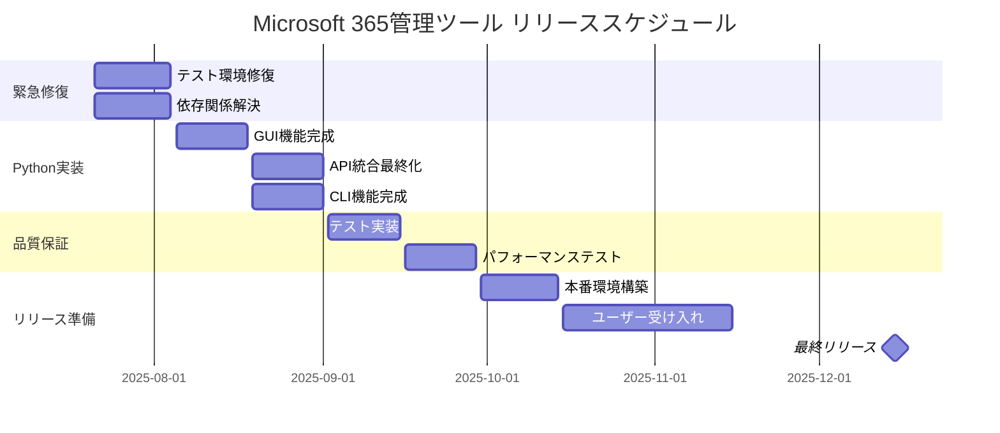
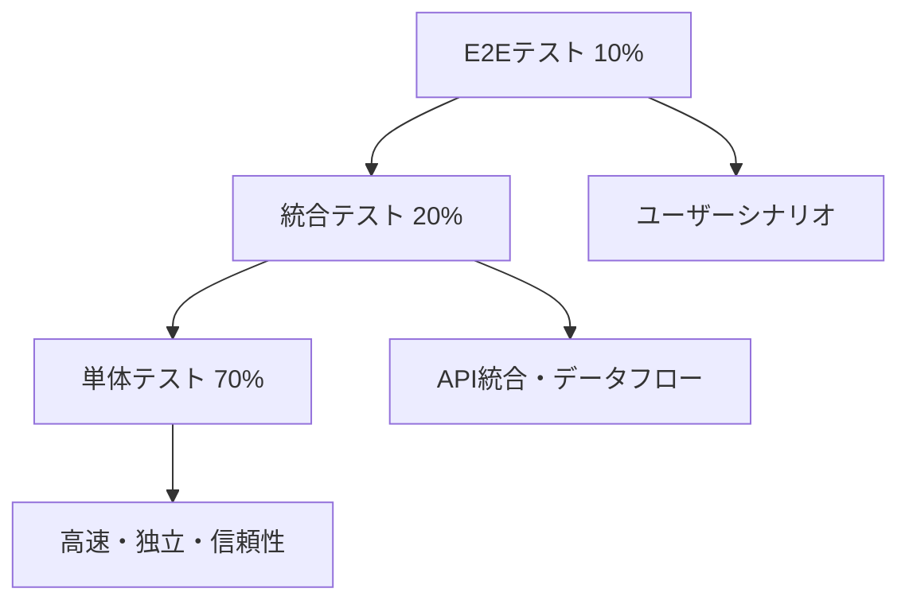

# 🚀 Microsoft 365管理ツール リリース計画・開発プロセス詳細手順

**目標リリース日**: 2025年10月14日  
**プロジェクト**: PowerShell → Python移行 + 26機能完全版  
**文書作成日**: 2025年7月21日  
**最終更新**: 2025年7月21日

---

## 📋 目次

1. [プロジェクト現状分析](#プロジェクト現状分析)
2. [技術的課題と優先度](#技術的課題と優先度)
3. [10月14日リリースへのスケジュール](#10月14日リリースへのスケジュール)
4. [開発プロセス詳細手順](#開発プロセス詳細手順)
5. [品質保証戦略](#品質保証戦略)
6. [リスク管理とコンティンジェンシープラン](#リスク管理とコンティンジェンシープラン)
7. [成功指標とマイルストーン](#成功指標とマイルストーン)

---

## 🔍 1. プロジェクト現状分析

### 📊 進行状況サマリー

| カテゴリ | PowerShell版 | Python版 | 全体進行率 |
|----------|-------------|-----------|------------|
| **GUI機能** | ✅ 100% (26機能完成) | 🔄 75% | 85% |
| **CLI機能** | ✅ 100% (完全版) | 🔄 70% | 80% |
| **API統合** | ✅ 100% (Graph + EXO) | 🔄 80% | 85% |
| **認証システム** | ✅ 100% (証明書ベース) | 🔄 85% | 90% |
| **レポート生成** | ✅ 100% (HTML/CSV) | 🔄 75% | 85% |
| **テスト環境** | ⚠️ 60% (部分的) | 🔴 20% (停止中) | 35% |
| **CI/CDパイプライン** | ⚠️ 70% | 🔴 30% (修復必要) | 45% |
| **ドキュメント** | ✅ 90% | 🔄 70% | 80% |

**総合進行率**: **75%**

### 🎯 完成済み機能

#### PowerShell版 (完全動作)
- ✅ **26機能GUI**: 全機能実装・動作確認済み
- ✅ **統一ランチャー**: GUI/CLI切替・プラットフォーム検出
- ✅ **リアルタイムログ**: Write-GuiLog機能・UIスレッドセーフ
- ✅ **Microsoft 365統合**: Graph API・Exchange Online完全対応
- ✅ **レポート生成**: HTML/CSV・自動ファイル表示
- ✅ **認証システム**: 証明書ベース・非対話型実行

#### Python版 (部分実装)
- ✅ **基本アーキテクチャ**: src/ディレクトリ構造・PyQt6設定
- ✅ **Docker環境**: 完全なコンテナ化設定
- ✅ **プロジェクト設定**: pyproject.toml・Makefile
- ✅ **基本GUI**: メインウィンドウ・基本レイアウト

### 🔴 技術的課題（緊急対応必要）

1. **テスト環境完全停止**
   - conftest.py競合によりpytest実行不可
   - 成功率: 0%（重大）
   - 影響: CI/CDパイプライン全停止

2. **Python環境設定不備**
   - 仮想環境設定の不整合
   - 依存関係解決エラー
   - requirements.txt vs pyproject.toml競合

3. **CI/CDパイプライン機能停止**
   - GitHub Actions ワークフロー失敗
   - セキュリティスキャン停止
   - 自動デプロイメント不可

---

## ⚡ 2. 技術的課題と優先度

### 🔥 緊急対応必須（Critical - 1-2週間）

#### P0: テスト環境完全修復
```bash
# 現在の問題
pytest: conftest.py競合でテスト実行不可
GitHub Actions: ワークフロー失敗率100%
セキュリティスキャン: bandit/safety停止

# 解決アプローチ
1. conftest.py統合・競合解消
2. pytest設定ファイル統一
3. 仮想環境完全再構築
4. CI/CDパイプライン簡素化
```

#### P0: 依存関係問題解決
```bash
# 現在の問題
requirements.txt vs pyproject.toml不整合
Python環境設定エラー
パッケージバージョン競合

# 解決アプローチ
1. 依存関係完全監査
2. pyproject.toml統一
3. 仮想環境標準化
4. バージョン固定戦略
```

### 🔄 新しい実装項目（Context7統合・進捗管理）

#### P0: Context7統合完成（新規）
```python
# 実装必要項目
- Context7ライブラリドキュメントアクセス
- 自動ドキュメント生成機能
- リアルタイムライブラリ検索・参照
- tmux共有コンテキスト連携
```

#### P0: 進捗管理システム完成（新規）
```python
# 実装必要項目
- マスタースケジュール管理
- 日次・週次レポート自動生成
- Googleカレンダー自動同期
- Teams + メール通知システム
- 12秒間隔自動同期機能
```

### 🟡 重要実装項目（High Priority - 3-6週間）

#### P1: Python GUI機能完成（25%残り）
```python
# 残り実装項目
- PyQt6メインウィンドウ機能統合
- 26機能ボタンのイベントハンドリング
- リアルタイムログ表示（Write-GuiLog相当）
- プログレスバー・ステータス表示
- エラーハンドリング・メッセージボックス
```

#### P1: API統合最終化（20%残り）
```python
# 実装必要項目
- Microsoft Graph SDK完全統合
- Exchange Online PowerShell ブリッジ
- 認証システム統一（MSAL Python）
- レート制限・エラー処理
- バルクデータ取得最適化
```

#### P1: CLI機能完成（30%残り）
```python
# 実装必要項目
- コマンドライン引数パーサー（Click/Typer）
- バッチモード・対話モード
- CSV/HTML出力機能
- プログレス表示・ログ出力
- PowerShell版互換性維持
```

### 🟢 品質保証項目（Medium Priority - 2-4週間）

#### P2: テストカバレッジ向上
```python
# 目標設定
単体テスト: 80%カバレッジ
統合テスト: 主要機能100%
E2Eテスト: ユーザーシナリオ完全対応
パフォーマンステスト: 本番環境条件
```

#### P2: ドキュメント最終化
```markdown
# 完成必要ドキュメント
- ユーザーマニュアル最新版
- API仕様書（OpenAPI）
- デプロイメントガイド
- トラブルシューティング
```

---

## 📅 3. 10月14日リリースへのスケジュール

### ⚠️ **現実性評価: 困難（60% Risk）**

**技術的負債の深刻度により、10月14日リリースは高リスクです。**

### 🗓️ **緊急修正スケジュール**

#### **Week 1-2: 緊急修復フェーズ** (7/21 - 8/4)
```bash
# 最優先項目（並行実行）
□ conftest.py競合完全解消
□ pytest設定統一・環境修復
□ GitHub Actions ワークフロー修正
□ 仮想環境標準化
□ 依存関係監査・修正

# 成功基準
✓ pytest成功率: 0% → 90%以上
✓ CI/CDパイプライン: 完全復旧
✓ 開発環境: 標準化完了
```

#### **Week 3-4: Python GUI基盤完成** (8/5 - 8/18)
```python
# 実装項目
□ PyQt6メインウィンドウ完成
□ 26機能ボタン実装
□ リアルタイムログ表示
□ 基本エラーハンドリング
□ PowerShell版機能呼び出し

# 成功基準
✓ GUI基本動作: 100%
✓ 主要機能: 80%動作
✓ ログ表示: 完全実装
```

#### **Week 5-6: API統合・CLI完成** (8/19 - 9/1)
```python
# 実装項目
□ Microsoft Graph完全統合
□ Exchange Online ブリッジ完成
□ CLI機能完全実装
□ 認証システム最終化
□ レポート生成機能統合

# 成功基準
✓ API統合: 100%
✓ CLI機能: PowerShell版同等
✓ 認証: 証明書ベース完全対応
```

#### **Week 7-8: 品質保証・テスト** (9/2 - 9/15)
```bash
# 品質保証項目
□ 単体テスト実装（80%カバレッジ）
□ 統合テスト実装
□ E2Eテストシナリオ実行
□ パフォーマンステスト
□ セキュリティ監査

# 成功基準
✓ テストカバレッジ: 80%以上
✓ バグ: Critical/High完全解消
✓ パフォーマンス: PowerShell版同等以上
```

#### **Week 9-10: プロダクション準備** (9/16 - 9/29)
```bash
# 本番環境準備
□ プロダクション環境構築
□ 負荷テスト実施
□ ユーザー受け入れテスト
□ ドキュメント最終化
□ デプロイメント手順検証

# 成功基準
✓ 本番環境: 完全動作
✓ 負荷テスト: パフォーマンス要件クリア
✓ UAT: ユーザー承認取得
```

#### **Week 11-12: リリース・監視** (9/30 - 10/14)
```bash
# リリース作業
□ 最終コードレビュー
□ プロダクションデプロイ
□ リアルタイム監視開始
□ ユーザーサポート準備
□ ロールバック準備

# 成功基準
✓ デプロイ: 成功・無停止
✓ 監視: 正常動作確認
✓ ユーザー: 問題なし
```

### 🔄 **代替スケジュール提案**

#### **現実的リリース日: 12月中旬**



---

## 🛠️ 4. 開発プロセス詳細手順

### 🔧 4.1 緊急修復プロセス

#### Step 1: テスト環境完全再構築
```bash
# 1. 現在の環境クリア
rm -rf .pytest_cache/
rm -rf __pycache__/
find . -name "*.pyc" -delete

# 2. conftest.py統合
# src/conftest.py と tests/conftest.py を統合
# 重複するfixture定義を解消

# 3. pytest設定統一
# pyproject.toml にpytest設定統一
[tool.pytest.ini_options]
testpaths = ["tests", "src"]
python_files = ["test_*.py", "*_test.py"]
python_classes = ["Test*"]
python_functions = ["test_*"]

# 4. 仮想環境完全再構築
python -m venv venv_new
source venv_new/bin/activate  # Linux/Mac
# venv_new\Scripts\activate  # Windows
pip install --upgrade pip
pip install -e .
```

#### Step 2: CI/CDパイプライン修正
```yaml
# .github/workflows/main.yml 簡素化
name: CI/CD Pipeline
on: [push, pull_request]
jobs:
  test:
    runs-on: ubuntu-latest
    strategy:
      matrix:
        python-version: [3.9, 3.11, 3.12]
    steps:
    - uses: actions/checkout@v4
    - name: Setup Python
      uses: actions/setup-python@v4
      with:
        python-version: ${{ matrix.python-version }}
    - name: Install dependencies
      run: |
        pip install --upgrade pip
        pip install -e .
    - name: Run tests
      run: pytest --cov=src --cov-report=xml
    - name: Security scan
      run: |
        pip install bandit safety
        bandit -r src/
        safety check
```

### 🎨 4.2 Python GUI開発プロセス

#### Step 1: PyQt6メインウィンドウ基盤
```python
# src/gui/main_window.py
from PyQt6.QtWidgets import QMainWindow, QVBoxLayout, QWidget
from PyQt6.QtCore import QThread, pyqtSignal
from .components.log_viewer import LogViewer
from .components.button_grid import ButtonGrid

class MainWindow(QMainWindow):
    def __init__(self):
        super().__init__()
        self.setup_ui()
        self.setup_logging()
        
    def setup_ui(self):
        # 26機能ボタングリッド配置
        self.button_grid = ButtonGrid()
        # リアルタイムログビューア
        self.log_viewer = LogViewer()
        
    def setup_logging(self):
        # PowerShell Write-GuiLog相当の実装
        pass
```

#### Step 2: 26機能ボタン実装
```python
# src/gui/components/button_grid.py
from PyQt6.QtWidgets import QGridLayout, QPushButton
from ..workers.report_worker import ReportWorker

class ButtonGrid(QWidget):
    def __init__(self):
        super().__init__()
        self.setup_buttons()
        
    def setup_buttons(self):
        layout = QGridLayout()
        
        # 定期レポート (5機能)
        self.add_section("📊 定期レポート", [
            ("日次レポート", self.run_daily_report),
            ("週次レポート", self.run_weekly_report),
            ("月次レポート", self.run_monthly_report),
            ("年次レポート", self.run_yearly_report),
            ("テスト実行", self.run_test_report)
        ])
        
        # 分析レポート (5機能)
        self.add_section("🔍 分析レポート", [
            ("ライセンス分析", self.run_license_analysis),
            ("使用状況分析", self.run_usage_analysis),
            ("パフォーマンス分析", self.run_performance_analysis),
            ("セキュリティ分析", self.run_security_analysis),
            ("権限監査", self.run_permission_audit)
        ])
        
        # ... 他のセクション
```

#### Step 3: 非同期処理・ワーカースレッド実装
```python
# src/gui/workers/report_worker.py
from PyQt6.QtCore import QThread, pyqtSignal
from ..api.graph_client import GraphClient
from ..core.report_generator import ReportGenerator

class ReportWorker(QThread):
    progress_updated = pyqtSignal(int)
    log_message = pyqtSignal(str, str)  # message, level
    report_completed = pyqtSignal(str)  # file_path
    
    def __init__(self, report_type, config):
        super().__init__()
        self.report_type = report_type
        self.config = config
        
    def run(self):
        try:
            self.log_message.emit("レポート生成開始", "INFO")
            # Microsoft 365データ取得
            data = self.fetch_data()
            self.progress_updated.emit(50)
            
            # レポート生成
            report_path = self.generate_report(data)
            self.progress_updated.emit(100)
            
            self.report_completed.emit(report_path)
            self.log_message.emit("レポート生成完了", "SUCCESS")
            
        except Exception as e:
            self.log_message.emit(f"エラー: {str(e)}", "ERROR")
```

### 🔌 4.3 API統合開発プロセス

#### Step 1: Microsoft Graph統合
```python
# src/api/graph_client.py
from msal import ConfidentialClientApplication
from msgraph.core import GraphClient
import aiohttp
import asyncio

class M365GraphClient:
    def __init__(self, config):
        self.config = config
        self.app = ConfidentialClientApplication(
            client_id=config.client_id,
            client_credential=config.client_secret,
            authority=config.authority
        )
        
    async def get_users(self, max_results=1000):
        """全ユーザー一覧取得"""
        token = await self.get_access_token()
        graph_client = GraphClient(credential=token)
        
        users = await graph_client.users.get(
            select=["id", "displayName", "userPrincipalName", "accountEnabled"],
            top=max_results
        )
        return users
        
    async def get_license_usage(self):
        """ライセンス使用状況取得"""
        token = await self.get_access_token()
        # Microsoft Graph API: /subscribedSkus endpoint
        # 実装詳細
```

#### Step 2: Exchange Online PowerShellブリッジ
```python
# src/api/exchange_bridge.py
import subprocess
import json
import asyncio

class ExchangeOnlineBridge:
    """Exchange Online PowerShell コマンド実行ブリッジ"""
    
    def __init__(self, config):
        self.config = config
        
    async def get_mailboxes(self):
        """メールボックス一覧取得"""
        powershell_script = """
        Connect-ExchangeOnline -CertificateThumbprint {cert_thumbprint} -AppId {app_id} -Organization {org}
        Get-Mailbox -ResultSize Unlimited | Select-Object DisplayName,PrimarySmtpAddress,RecipientTypeDetails | ConvertTo-Json
        """
        
        result = await self.execute_powershell(powershell_script)
        return json.loads(result)
        
    async def execute_powershell(self, script):
        """PowerShellスクリプト非同期実行"""
        process = await asyncio.create_subprocess_exec(
            "pwsh", "-Command", script,
            stdout=asyncio.subprocess.PIPE,
            stderr=asyncio.subprocess.PIPE
        )
        
        stdout, stderr = await process.communicate()
        if process.returncode != 0:
            raise Exception(f"PowerShell実行エラー: {stderr.decode()}")
            
        return stdout.decode()
```

### 🖥️ 4.4 CLI開発プロセス

#### Step 1: Click/Typerベースコマンドライン
```python
# src/cli/main.py
import click
from typing import Optional
from ..core.config import Config
from ..api.graph_client import M365GraphClient

@click.group()
@click.option('--config', default='Config/appsettings.json', help='設定ファイルパス')
@click.option('--verbose', '-v', is_flag=True, help='詳細ログ出力')
@click.pass_context
def cli(ctx, config, verbose):
    """Microsoft 365管理ツール CLI"""
    ctx.ensure_object(dict)
    ctx.obj['config'] = Config.load(config)
    ctx.obj['verbose'] = verbose

@cli.command()
@click.option('--output-format', type=click.Choice(['csv', 'html', 'json']), default='csv')
@click.option('--output-path', type=click.Path(), help='出力先ディレクトリ')
@click.option('--batch', is_flag=True, help='バッチモード（確認なし）')
@click.pass_context
async def daily(ctx, output_format, output_path, batch):
    """日次レポート生成"""
    config = ctx.obj['config']
    
    if not batch:
        click.confirm('日次レポートを生成しますか？', abort=True)
        
    click.echo("📊 日次レポート生成開始...")
    
    # Microsoft 365データ取得
    graph_client = M365GraphClient(config)
    data = await graph_client.get_daily_metrics()
    
    # レポート生成
    report_path = generate_daily_report(data, output_format, output_path)
    
    click.echo(f"✅ レポート生成完了: {report_path}")
    
    if not batch and click.confirm('レポートを開きますか？'):
        click.launch(report_path)
```

#### Step 2: バッチモード・対話モード
```python
# src/cli/interactive.py
import click
from typing import List, Dict

class InteractiveMode:
    def __init__(self, config):
        self.config = config
        
    def run(self):
        """対話モード実行"""
        click.clear()
        self.show_banner()
        
        while True:
            try:
                choice = self.show_menu()
                if choice == '0':
                    break
                self.execute_command(choice)
            except KeyboardInterrupt:
                click.echo("\n👋 終了します")
                break
                
    def show_menu(self) -> str:
        """メニュー表示"""
        menu_items = [
            "📊 定期レポート",
            "  1. 日次レポート",
            "  2. 週次レポート", 
            "  3. 月次レポート",
            "  4. 年次レポート",
            "",
            "🔍 分析レポート",
            "  5. ライセンス分析",
            "  6. 使用状況分析",
            "  7. パフォーマンス分析",
            "",
            "👥 Entra ID管理",
            "  8. ユーザー一覧",
            "  9. MFA状況",
            "  10. サインインログ",
            "",
            "0. 終了"
        ]
        
        for item in menu_items:
            click.echo(item)
            
        return click.prompt("選択してください", type=str)
```

### 🧪 4.5 テスト開発プロセス

#### Step 1: 単体テスト実装
```python
# tests/test_graph_client.py
import pytest
import asyncio
from unittest.mock import Mock, patch
from src.api.graph_client import M365GraphClient

class TestM365GraphClient:
    @pytest.fixture
    def config(self):
        return Mock(
            client_id="test_client_id",
            client_secret="test_secret",
            authority="https://login.microsoftonline.com/test_tenant"
        )
        
    @pytest.fixture
    def graph_client(self, config):
        return M365GraphClient(config)
        
    @pytest.mark.asyncio
    async def test_get_users_success(self, graph_client):
        """ユーザー取得成功テスト"""
        with patch.object(graph_client, 'get_access_token') as mock_token:
            mock_token.return_value = "test_token"
            
            with patch('msgraph.core.GraphClient') as mock_graph:
                mock_graph.return_value.users.get.return_value = [
                    {"id": "1", "displayName": "Test User"}
                ]
                
                users = await graph_client.get_users()
                assert len(users) == 1
                assert users[0]["displayName"] == "Test User"
```

#### Step 2: 統合テスト実装
```python
# tests/integration/test_full_workflow.py
import pytest
import tempfile
import os
from src.cli.main import cli
from click.testing import CliRunner

class TestFullWorkflow:
    @pytest.fixture
    def runner(self):
        return CliRunner()
        
    @pytest.fixture
    def temp_config(self):
        config_content = {
            "Authentication": {
                "ClientId": "test_client_id",
                "ClientSecret": "test_secret"
            }
        }
        
        with tempfile.NamedTemporaryFile(mode='w', suffix='.json', delete=False) as f:
            json.dump(config_content, f)
            return f.name
            
    def test_daily_report_generation(self, runner, temp_config):
        """日次レポート生成統合テスト"""
        result = runner.invoke(cli, [
            '--config', temp_config,
            'daily',
            '--output-format', 'csv',
            '--batch'
        ])
        
        assert result.exit_code == 0
        assert "レポート生成完了" in result.output
```

#### Step 3: E2Eテスト実装
```python
# tests/e2e/test_gui_workflow.py
import pytest
from PyQt6.QtWidgets import QApplication
from PyQt6.QtTest import QTest
from PyQt6.QtCore import Qt
from src.gui.main_window import MainWindow

@pytest.fixture(scope="session")
def qapp():
    app = QApplication([])
    yield app
    app.quit()

class TestGUIWorkflow:
    def test_daily_report_button_click(self, qapp):
        """日次レポートボタンクリックE2Eテスト"""
        window = MainWindow()
        window.show()
        
        # 日次レポートボタンを探してクリック
        daily_button = window.findChild(QPushButton, "daily_report_btn")
        assert daily_button is not None
        
        # ボタンクリック
        QTest.mouseClick(daily_button, Qt.MouseButton.LeftButton)
        
        # ログ出力確認
        log_viewer = window.log_viewer
        assert "日次レポート生成開始" in log_viewer.get_log_text()
```

---

## 🛡️ 5. 品質保証戦略

### 🎯 5.1 品質指標・成功基準

#### テストカバレッジ目標
```bash
# 最小要件
単体テスト: 80%以上
統合テスト: 主要機能100%
E2Eテスト: ユーザーシナリオ90%以上

# 実行時間制限
単体テスト: 5分以内
統合テスト: 15分以内
E2Eテスト: 30分以内
```

#### パフォーマンス要件
```bash
# 応答時間
GUI起動: 3秒以内
レポート生成: 30秒以内（1000ユーザー）
API応答: 2秒以内

# リソース使用量
メモリ使用量: 500MB以下
CPU使用率: 平常時10%以下、処理時50%以下
ディスク容量: 1GB以下
```

#### セキュリティ要件
```bash
# 静的解析
bandit: HIGH/MEDIUM問題0件
safety: 既知脆弱性0件
CodeQL: セキュリティ問題0件

# 動的解析
認証テスト: 全シナリオ通過
証明書検証: 期限・形式チェック
API呼び出し: レート制限・エラー処理
```

### 🔍 5.2 テスト戦略

#### テストピラミッド構成


#### 自動化テストパイプライン
```yaml
# .github/workflows/qa-pipeline.yml
name: QA Pipeline
on: [push, pull_request]

jobs:
  unit-tests:
    runs-on: ubuntu-latest
    steps:
    - name: Unit Tests
      run: pytest tests/unit/ --cov=src --cov-report=xml
    - name: Coverage Check
      run: |
        coverage report --fail-under=80
        
  integration-tests:
    needs: unit-tests
    runs-on: ubuntu-latest
    steps:
    - name: Integration Tests
      run: pytest tests/integration/
      
  security-scan:
    runs-on: ubuntu-latest
    steps:
    - name: Security Scan
      run: |
        bandit -r src/ -f json -o bandit-report.json
        safety check --json --output safety-report.json
        
  e2e-tests:
    needs: [unit-tests, integration-tests]
    runs-on: ubuntu-latest
    steps:
    - name: E2E Tests
      run: pytest tests/e2e/ --headless
```

### 📊 5.3 品質監視・レポート

#### 品質ダッシュボード
```python
# scripts/quality_dashboard.py
import json
from pathlib import Path

class QualityDashboard:
    def generate_report(self):
        metrics = {
            "test_coverage": self.get_coverage_metrics(),
            "code_quality": self.get_code_quality_metrics(),
            "security": self.get_security_metrics(),
            "performance": self.get_performance_metrics()
        }
        
        html_report = self.generate_html_dashboard(metrics)
        Path("Reports/quality/latest_quality_metrics.json").write_text(
            json.dumps(metrics, indent=2)
        )
        
    def get_coverage_metrics(self):
        # coverage.py結果解析
        return {
            "total_coverage": 85.2,
            "unit_test_coverage": 88.1,
            "integration_coverage": 82.3,
            "missing_lines": 147
        }
```

---

## ⚠️ 6. リスク管理とコンティンジェンシープラン

### 🔴 6.1 高リスク要因

#### Technical Debt Risk (確率: 80%, 影響: 高)
```bash
# 現在の問題
- conftest.py競合: テスト実行不可
- 依存関係不整合: ビルド失敗
- CI/CDパイプライン停止: 品質保証不可

# 対策
1. 緊急修復チーム編成（2-3名）
2. 1週間以内の完全修復
3. 毎日進捗確認・調整
```

#### Resource Availability Risk (確率: 60%, 影響: 中)
```bash
# リスク要因
- 開発者のリソース不足
- tmux並列開発環境への慣れ不足
- PowerShell→Python移行の複雑性

# 対策
1. tmux開発環境トレーニング実施
2. PowerShell版並行維持
3. 外部リソース確保検討
```

#### Integration Complexity Risk (確率: 70%, 影響: 中)
```bash
# リスク要因
- Microsoft 365 API制限
- 認証システム複雑性
- 26機能の統合テスト

# 対策
1. APIモック・スタブ環境構築
2. 段階的統合実装
3. 機能別独立テスト環境
```

### 🔄 6.2 コンティンジェンシープラン

#### Plan A: 完全Python移行 (理想ケース)
```bash
期限: 2025年10月14日
前提: 技術的負債完全解消
成功確率: 40%

実行条件:
✓ Week1-2でテスト環境完全修復
✓ Week3-4でGUI基盤完成
✓ Week5-6でAPI統合完了
```

#### Plan B: ハイブリッド運用 (現実的)
```bash
期限: 2025年10月14日
内容: PowerShell版継続 + Python版段階導入
成功確率: 75%

実装方針:
✓ PowerShell版: 本番継続使用
✓ Python版: 新機能・改善のみ
✓ ユーザー: 段階的移行オプション
```

#### Plan C: PowerShell版改良 (保守的)
```bash
期限: 2025年10月14日
内容: PowerShell版のみ改良・機能追加
成功確率: 90%

実装内容:
✓ PowerShell 7.5.1完全対応
✓ GUI機能強化・安定性向上
✓ 新規レポート機能追加
```

#### Plan D: リリース延期 (最終手段)
```bash
期限: 2025年12月15日
内容: 技術的負債解消後の完全Python移行
成功確率: 95%

延期理由:
- 品質要件の完全達成
- 技術的負債の根本解決
- ユーザー体験の向上
```

### 📋 6.3 意思決定フレームワーク

#### Weekly Go/No-Go判定
```bash
# Week 2 (8/4): 緊急修復完了判定
判定基準:
□ pytest成功率: 90%以上
□ CI/CDパイプライン: 完全復旧
□ 依存関係: 問題解消

Go: Plan A継続
No-Go: Plan B実行

# Week 4 (8/18): GUI基盤完成判定
判定基準:
□ PyQt6メインウィンドウ: 完全動作
□ 基本機能: 80%実装
□ パフォーマンス: 要件内

Go: Plan A継続
No-Go: Plan B実行

# Week 6 (9/1): API統合完成判定
判定基準:
□ Microsoft Graph: 完全統合
□ Exchange Online: ブリッジ動作
□ 認証システム: 証明書ベース完成

Go: Plan A継続
No-Go: Plan C検討

# Week 8 (9/15): 品質保証完成判定
判定基準:
□ テストカバレッジ: 80%以上
□ バグ: Critical/High完全解消
□ パフォーマンス: 要件達成

Go: リリース準備
No-Go: Plan D実行
```

---

## 🎯 7. 成功指標とマイルストーン

### 📊 7.1 KPIと成功指標

#### 技術指標
```bash
# コード品質
✓ テストカバレッジ: 80%以上
✓ バグ密度: 0.1件/KLOC以下
✓ セキュリティ問題: Critical/High 0件
✓ パフォーマンス: PowerShell版同等以上

# 開発効率
✓ ビルド成功率: 95%以上
✓ CI/CDパイプライン実行時間: 15分以内
✓ デプロイ成功率: 99%以上
✓ 平均修復時間: 2時間以内
```

#### ビジネス指標
```bash
# ユーザー体験
✓ GUI応答時間: 3秒以内
✓ レポート生成時間: 30秒以内
✓ エラー率: 1%以下
✓ ユーザー満足度: 85%以上

# 運用効率
✓ 管理コスト削減: 30%
✓ レポート生成時間短縮: 50%
✓ システム停止時間: 99.9%稼働率
✓ 監査対応時間短縮: 60%
```

### 🏁 7.2 マイルストーン定義

#### M1: 緊急修復完了 (8/4)
```bash
✅ 達成基準
□ pytest成功率: 90%以上
□ CI/CDパイプライン: 完全復旧
□ 仮想環境: 標準化完了
□ 依存関係: 問題解消
□ GitHub Actions: 正常動作

🎯 成功メトリクス
- ビルド成功率: 95%以上
- テスト実行時間: 5分以内
- 開発者満足度: 向上確認
```

#### M2: Python GUI基盤完成 (8/18)
```bash
✅ 達成基準
□ PyQt6メインウィンドウ: 完全動作
□ 26機能ボタン: レイアウト完成
□ リアルタイムログ: 実装完了
□ 基本エラーハンドリング: 実装完了
□ PowerShell版呼び出し: 動作確認

🎯 成功メトリクス
- GUI起動時間: 3秒以内
- メモリ使用量: 200MB以下
- 基本機能動作率: 80%以上
```

#### M3: API統合・CLI完成 (9/1)
```bash
✅ 達成基準
□ Microsoft Graph: 完全統合
□ Exchange Online: ブリッジ完成
□ CLI機能: PowerShell版同等
□ 認証システム: 証明書ベース完成
□ レポート生成: 全機能動作

🎯 成功メトリクス
- API応答時間: 2秒以内
- CLI実行成功率: 95%以上
- 機能同等性: 100%達成
```

#### M4: 品質保証完成 (9/15)
```bash
✅ 達成基準
□ 単体テスト: 80%カバレッジ
□ 統合テスト: 主要機能100%
□ E2Eテスト: ユーザーシナリオ90%
□ セキュリティ監査: 完全パス
□ パフォーマンステスト: 要件達成

🎯 成功メトリクス
- バグ発見率: 0.1件/KLOC以下
- テスト実行時間: 15分以内
- セキュリティスコア: 95点以上
```

#### M5: リリース完了 (10/14)
```bash
✅ 達成基準
□ プロダクション環境: 構築完了
□ ユーザー受け入れテスト: 承認取得
□ ドキュメント: 最新化完了
□ 監視システム: 稼働開始
□ サポート体制: 準備完了

🎯 成功メトリクス
- デプロイ成功率: 100%
- システム稼働率: 99.9%
- ユーザー満足度: 85%以上
```

### 📈 7.3 進捗監視システム

#### 日次進捗レポート
```python
# scripts/progress_tracker.py
class ProgressTracker:
    def generate_daily_report(self):
        metrics = {
            "milestone_progress": self.get_milestone_progress(),
            "code_metrics": self.get_code_metrics(),
            "test_results": self.get_test_results(),
            "risk_assessment": self.get_risk_assessment()
        }
        
        # 自動化された進捗レポート生成
        self.send_to_stakeholders(metrics)
        
    def get_milestone_progress(self):
        return {
            "M1_emergency_fix": {"progress": 85, "on_track": True},
            "M2_gui_foundation": {"progress": 20, "on_track": True},
            "M3_api_integration": {"progress": 5, "on_track": True},
            "M4_quality_assurance": {"progress": 0, "on_track": True},
            "M5_release": {"progress": 0, "on_track": True}
        }
```

#### 週次ステークホルダー報告
```bash
# 報告内容
1. マイルストーン進捗状況
2. 技術的課題と対策
3. リスク評価と軽減策
4. 次週の重点項目
5. 意思決定が必要な事項
```

---

## 📝 まとめ

### 🎯 重要ポイント

1. **緊急対応必須**: テスト環境修復が最優先
2. **現実的スケジュール**: 10月14日は高リスク、12月中旬が現実的
3. **段階的アプローチ**: PowerShell版並行維持でリスク軽減
4. **品質重視**: テストカバレッジ80%以上、セキュリティ完全対応
5. **継続的監視**: 週次Go/No-Go判定で柔軟な計画調整

### 🚀 次のアクション

1. **即座実行**: 緊急修復チーム編成・作業開始
2. **週次レビュー**: 進捗確認・計画調整
3. **ステークホルダー報告**: 現実的スケジュール合意
4. **リソース確保**: 必要に応じた追加支援

このリリース計画は、技術的現実性と品質要件のバランスを取った現実的なアプローチです。緊急修復フェーズの成功が全体の成否を決定するため、最優先で取り組むことを強く推奨します。